# 中国数据中心有多大、建在哪、谁在租：SemiAnalysis 中国数据中心模型精读

> 2026-10-03 | 报告精读。原文：《The Chinese AI Infrastructure Boom: Introducing the SemiAnalysis China Datacenter Model》（SemiAnalysis，2026-09-25，付费订阅）；中译：《中国AI基础设施热潮：推出SemiAnalysis中国数据中心模型》（苔藓花园·小苔花译，公众号「我有充足的时间」，2026-10-02）。**本文所有数字均为 SemiAnalysis 自建模型的估算或公司公开披露，未经独立核验**；口径分三层——「模型口径」（逐栋估算）、「披露口径」（公司财报/公告）、「媒体报道口径」（如字节 700 亿美元讨论上限），随文标注；原报告图表已随文转载（图源见各图说明）。
>
> **版权与转载说明**：原报告及文中全部图表版权归 SemiAnalysis 所有，原文为付费订阅内容；本页为学习与研究目的的引用性精读，图表随文转载并逐图标注来源，正文分析为本站原创，版权方提出异议即删除。中译参考：苔藓花园·小苔花（公众号「我有充足的时间」，2026-10-02，译者声明仅供学习交流）。

中国数据中心的公开容量估算，彼此相差 15 倍。市场长期满足于两个偷懒的假设：「中国很大」，以及「中国很空」——前者是正确的废话，后者已被反复引用的高空置率数据固化为成见。

SemiAnalysis 的做法笨得多，也贵得多：逐栋绘制 60 多家运营商的 1,000 多座设施，按租户、按季度追踪建设与租赁。得出的数是：**仅中国就拥有超过 24GW 的已交付设施容量**——比欧洲中东非洲（约 14GW）大，也比亚洲除中国外（约 15GW）大；这还没算约 20GW 有时间表的储备项目，和另约 30GW 已宣布项目。作为对照，按 2026 年底容量口径，美国以 56GW 居全球首位。

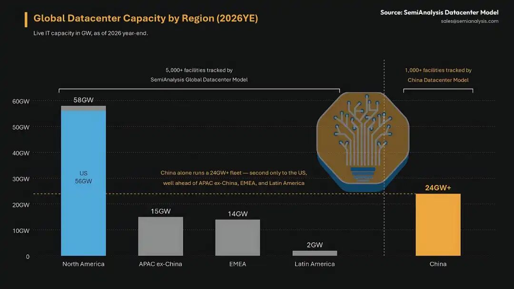
_图源：SemiAnalysis_

这篇精读按原文顺序过四件事：市场为什么长成这样（四阶段史）、「东数西算」靠什么真正改变建设流向、速度与成本账，以及需求侧五家公司的各自打法。所有数字记得看口径。

## 一、双速市场：高空置与 AI 容量短缺同时存在

> 原文：「下图预示了整个故事。2010 年至 2022 年，中国一家领先托管运营商的利用率从 70% 的中段一路降到 50% 的中段。2023 年起，它的分部披露显示出双速市场：AI 需求让批发型楼宇很快填满，利用率重新超过 70%；传统零售机柜则停留在约 60%。」

也就是说：同一个行业里跑着两种产品——电信时代留下的低密度零售机柜大量空着，按 AI 标准新建的批发整栋楼填得很快。

一个市场、两种命运。2026 年上半年，两家在美上市的房东（万国数据、世纪互联）合计签下约 **1.3GW 批发订单**，而零售订单不到 **10MW**。总体的「高空置」，是旧存量的问题；「容量短缺」，是 AI 批发需求的问题——两者同时为真，因为它们说的根本不是同一批楼。

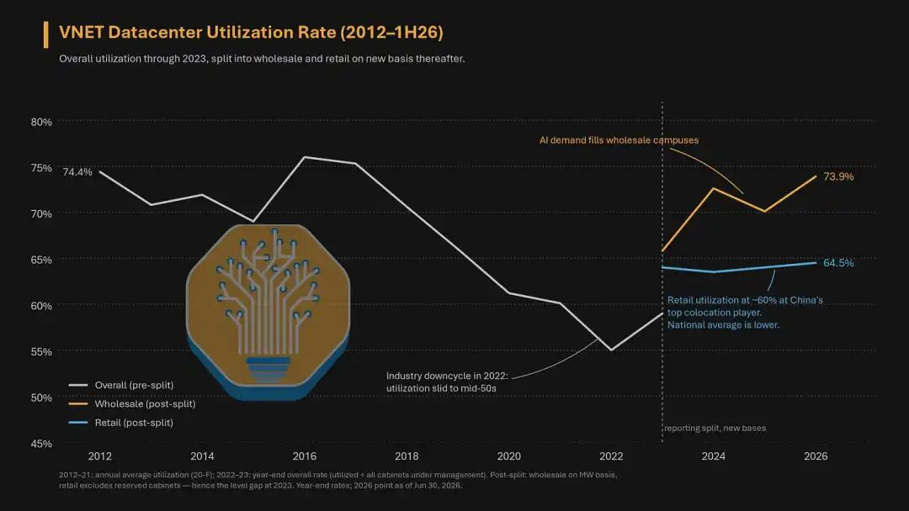
_图源：SemiAnalysis_

## 二、四个阶段：从电信地产到 AI 超级周期

理解今天的市场，要回到它怎么长成的。报告分了四段：

**第一阶段（2015 年以前）：电信地产。** 三大国有运营商合计占 60–70% 份额，最大的第三方（万国数据、世纪互联）各不足 5%。数据中心本质上是电信地产：客户是网站、网游和 CDN，卖的是低密度零售机柜——九成设施的机柜功耗不足 2kW，而且和带宽捆绑着一起卖。这段历史至今重要——它留下的设施正是今天大量空置的容量：传统零售机柜的物理条件不符合 H20 或昇腾服务器的密度需求，还有租户在里面、改造成本又高，改装不现实。

**第二阶段（2015–2021）：云竞赛。** 阿里云认定赢家通吃，2015–2019 年收入年复合增长约 110%，连续十二个月降价十七次、核心产品累计降价超 50%；腾讯同样方式跟进。超大规模云服务商的资本开支在 2021 年达到当时的峰值，第三方零售开发商则继续假设云需求会无止境地外溢。

**第三阶段（2022–2023）：消化产能。** 政策、宏观与国有云份额三重压力下，阿里云增速从 50%+ 降到 23%、再基本归零；腾讯 2022 年年中把资本开支预算砍了近半。供给过剩直接打在价格上：不含电力的市场租金从每 kW 每月约 80 美元腰斩。万国数据管理层在 2026 年 8 月的估计是：价格重置持续了几年，完全消化还需要约十八个月。

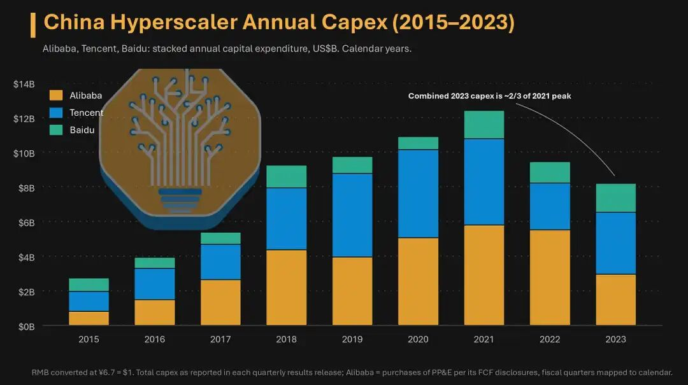
_图源：SemiAnalysis_

**第四阶段（2024 年起）：AI 超级周期。** DeepSeek 与各家自研生成式 AI 把市场重新唤醒。BATB（字节、阿里、腾讯、百度）合计资本开支从 2024 年约 350 亿美元增至 2025 年超 500 亿美元，朝 2026 年 1,000 亿美元迈进；2026 年二季度 BAT 合计 200 亿美元、同比翻倍以上，三家公司有记录以来首次同时负自由现金流。

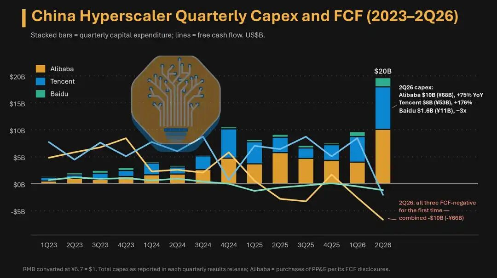
_图源：SemiAnalysis_

四个阶段叠出来的今天是这样的：一线城市周边的零售存量利用率只有 30–50%、物理条件不适合 AI 密度；AI 批发建设完全发生在别的地方（主要是西部）；运营商份额结构性下滑，但仍握有全国约三分之一的容量。

## 三、东数西算：配额才是传导机制

「东数西算」的政策报道已经很多，报告补的是大多数人没讲的部分：**它靠什么落地**。

> 原文：「在中国，开发商取得土地后申请的第一项许可，是向当地发展改革委提交节能审查。获批的能耗配额，是设施可以建多大的硬上限。任何用能超过一万吨标准煤、即超过 10MW 的项目，没有通过审查都不能合法开工。」

这是 2010 年就有的制度；2022 年「东数西算」出台后变成配给工具——发配额与落实政策的是同一批办公室，配额实际阻止了建设流向非枢纽地区。

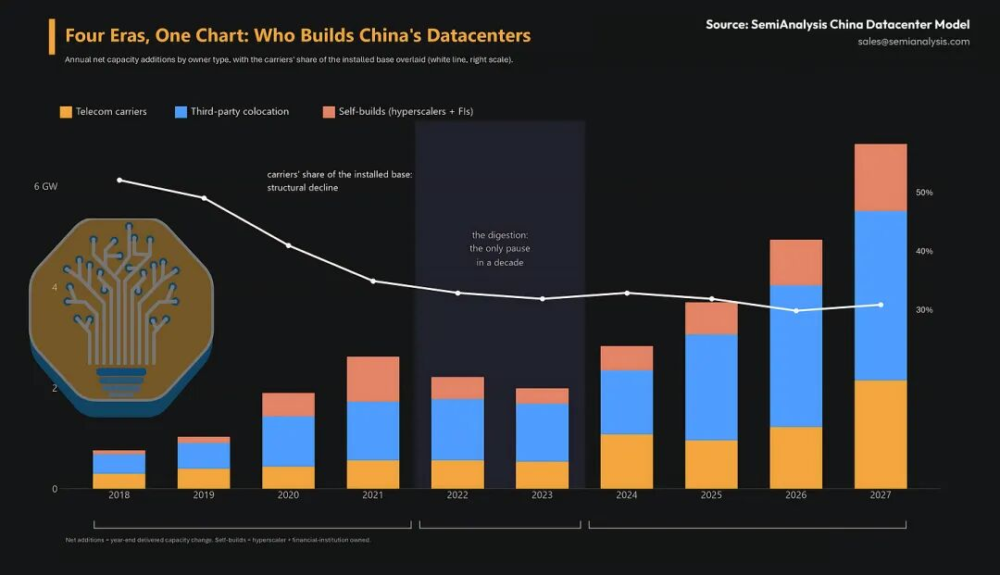
_图源：国家发展改革委、SemiAnalysis_

广东是最清楚的例子：2021–2022 年停止发放数据中心能耗配额，重新受理时只对韶关枢纽开放。执行是认真的——2023 年年中，广东省能源局检查腾讯在清远自建的两个园区，发现运行规模约为获批规模的 13–14 倍，认定为「批小建大」，要求六个月内整改、当地电网把供电限制在核准配额内。连腾讯也一样。

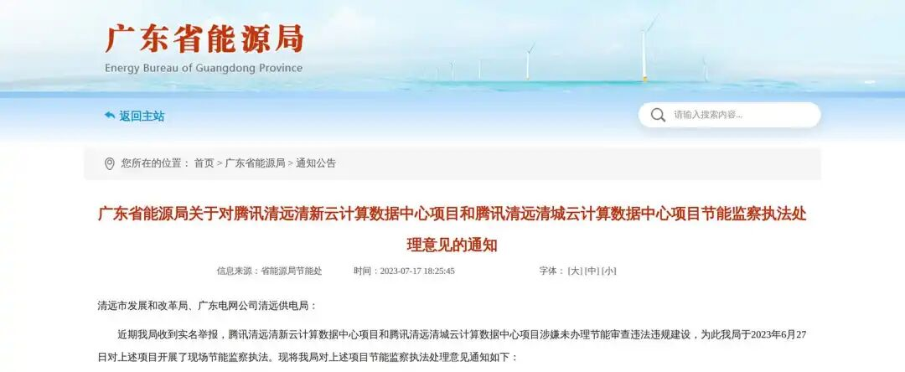
_图源：广东省能源局_

但配额只解释了「逼」，解释不了「去」。真正让西部枢纽拿到 AI 订单的是两件事：

- **光纤追上来了**。韶关自 2022 年投入约 6 亿美元（约 40 亿元人民币）建十三条覆盖大湾区的 400G 全光路由：到广州单程 1.3 毫秒、深圳 1.66 毫秒、香港不足 3 毫秒；规划中的深圳—广州—韶关空芯光纤走廊预计 2027 年起再降约 30%。到这个水平，除延迟最敏感的负载外，韶关机柜与深圳机柜在功能上已差不多。
- **AI 训练不在乎延迟、只在乎电价**。内蒙古是最好的例子：中国最大可再生能源装机，且西部由蒙西电网供电——国家电网与南方电网之外唯一的省级电网，有独立定价。能耗配额宽松、土地以平方公里计、电价约为一线城市的一半，报告直接称之为「中国的柔佛」（马来西亚柔佛，东南亚数据中心枢纽），并测算两地按成本计的收益率区间有重叠，而内蒙古的建设成本还在降。

反例同样有信息量。**山西完全在枢纽体系之外，却是体系外最大的数据中心地区**——字节跳动、百度、京东以自建加托管承诺了近 2GW，理由是便宜充足的电力（煤炭大省）、靠近北京和先发优势。结论是：配额制度引导建设方向，电力和地理条件仍决定最终选址；贵安被设计为存储枢纽（苹果 iCloud 中国数据中心是锚定租户），成渝则在电价与电网灵活性上输给内蒙古——政策把建设集中到地图之内，市场在地图内部选出赢家。

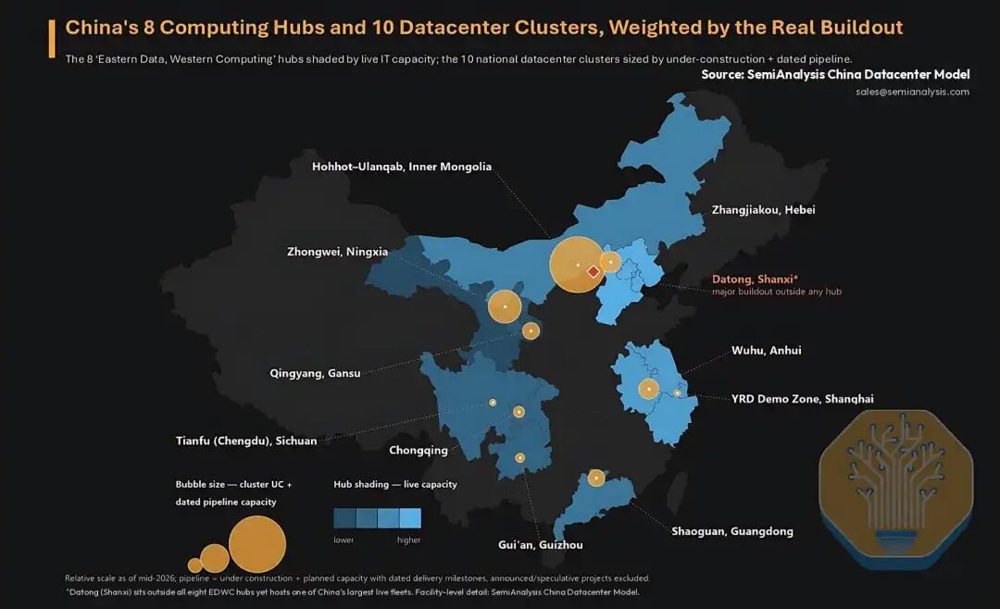
_图源：SemiAnalysis 中国数据中心模型_

## 四、速度与成本：12 个月交付 100MW

中美两侧的瓶颈是镜像的：美国卡电力（并网排队、变压器交期），中国卡芯片——发电资源充裕、国有电网把数据中心负荷当发展机会、审批是政策通道而非瓶颈。

结果：**100MW 设施的标准交付期，从云时代的约十八个月压缩到 AI 时代的约十二个月**，最先进的项目更快。对照美国：最好的全模块化项目施工要 12–18 个月，前面还有不可重叠的 12–13 个月许可期；中国开工前审批通常三至六个月，枢纽地区更快。

速度来自三个结构因素：

1. **投机性厂房**。云服务商招标要求 T+6 个月交付，托管开发商自担风险先建土建——租户竞争变成了半成品厂房之间的竞赛。万国数据 2025 年初的 152MW 大单，客户要求六个月交付，拿到了。
2. **西部绿地的施工方法升级**。离开一线城市土地约束后，从多层混凝土转向低层大跨度钢结构：挖地基的同时工厂造钢构件，卡车运来吊装。世纪互联公布的乌兰察布施工影像里，一座厂房从开挖地基到建成封顶，前后只隔了一季。

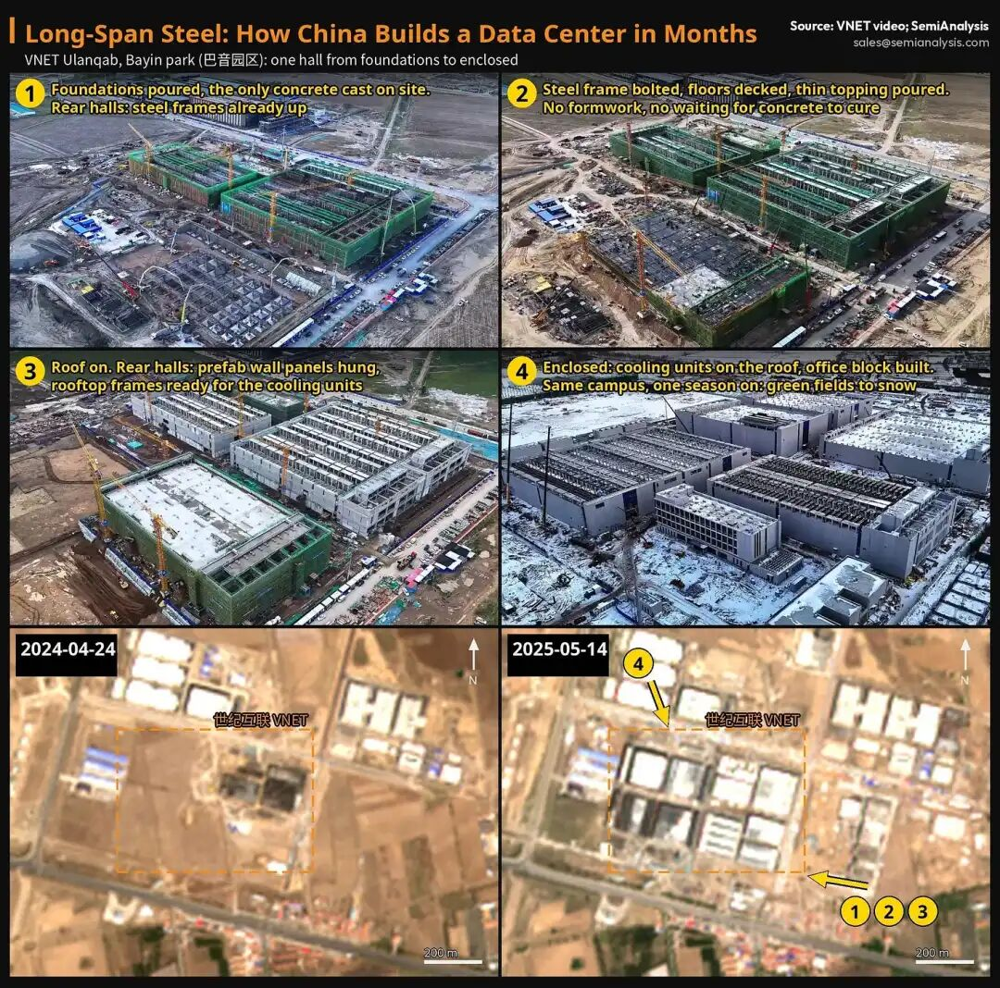
_图源：世纪互联视频、SemiAnalysis_

3. **预制化把串行变并行**。阿里 CUBE 5.0 的「百日数据中心」：厂房完成后，工厂生产与场地准备三十天、现场安装五十天、调试二十天——比常见的六个月机电加调试缩短一半，破土到调试约七至九个月；腾讯的 T-Block 更是把整个数据中心做成工厂预制模块。

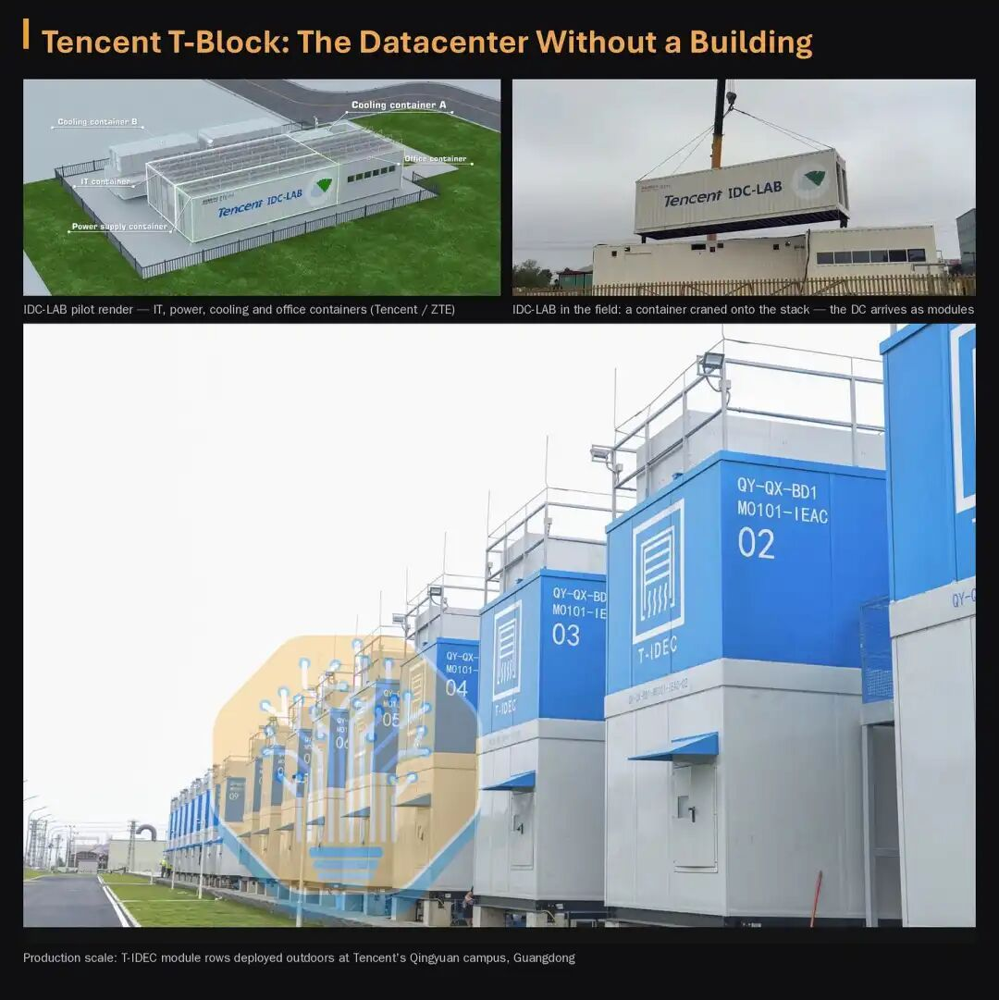
_图源：腾讯视频、SemiAnalysis_

有意思的是报告的后半问：照这个逻辑推到底，全模块化集装箱园区应该已是全国标准——事实并非如此。原文给了两个非常中国式的原因：

> 「第一，劳动力的账不同。西方模块化最有价值之处，是绕开稀缺而昂贵的熟练工。中国现场劳动力便宜且充足，所以传统钢结构加预制构件的施工已能达到很快的工期；全面集装箱化额外带来的速度提升不大。
>
> 第二，融资方式也在起作用。中国托管开发商把数据中心抵押给银行贷款。设计寿命二十年的正式建筑估值不错，一大片集装箱却估值低、残值也低。如果你的商业模式是“抵押资产借钱，再把它租给字节跳动”，你会盖真正的建筑。」

成本却在同期下降：国产部件比例提高让建筑与机电成本降到美国可比批发项目的一小部分，阿里称 CUBE 5.0 较上一代再省 10% 以上。

## 五、需求侧五家：多套打法

需求集中在五家公司，而它们的传统业务都到顶了：微信月活同比 +2%、百度收入 −3%、阿里客户管理收入 −7%、快手日活 +2.7%——消费互联网再无新增用户可争，AI 成了唯一的增长引擎。五家的打法各不相同。

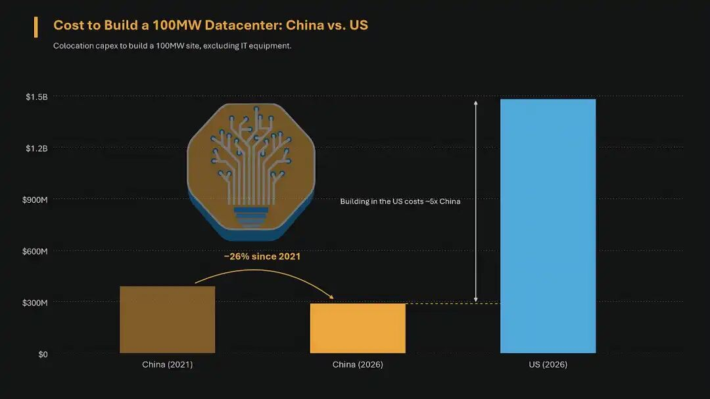
_图源：SemiAnalysis 中国数据中心模型_

**字节跳动：中国最大租户，全国批发市场的锚。** 租赁超过 4GW，占已交付容量约五分之一，几乎全靠租——它的招标日程实际决定了每家批发运营商的订单簿。供应商集中度高到危险：秦淮数据约 90% 收入来自字节；ZDATA 未上市但在运加在建规模已超秦淮；世纪互联 2026 年上半年 862MW 新批发订单、单笔约 500MW 创纪录。自建起步较晚但追赶快：三个集群在跑（山西约 500MW、安徽芜湖约 500MW、内蒙古乌兰察布与和林格尔各约 1GW、有扩至 2–3GW 空间），第四个集群在宁夏中卫成形（2026 年 7 月注册两家子公司，沿用「先注册、后宣布」模式）。资金侧：2026 年 AI 基础设施预算从约 240 亿美元上调 25% 至超 300 亿美元——媒体报道的 700 亿美元是讨论上限，不是预算。产品侧，豆包以 3.45 亿月活超过千问（1.66 亿）与 DeepSeek（1.27 亿）之和，Seedance 2.0 在两个视频生成榜单排第一（未开源），并传闻在早期训练总参数或达 10 万亿的模型。

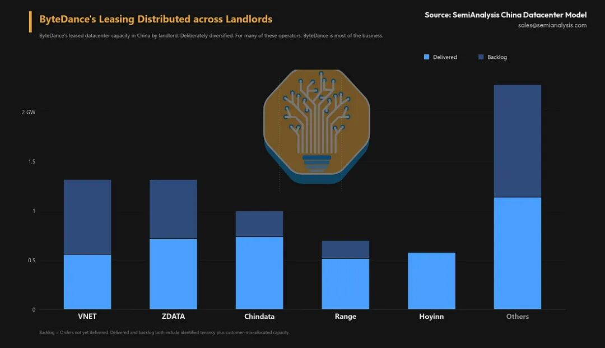
_图源：SemiAnalysis 中国数据中心模型_

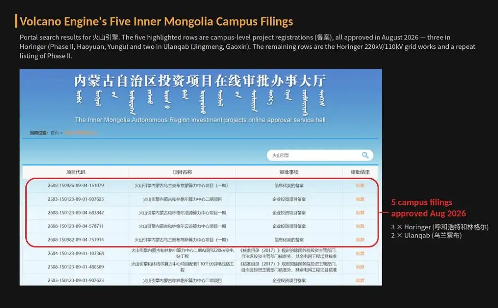
_图源：内蒙古自治区投资项目在线审批服务大厅_

**阿里巴巴：中国唯一真正执行完整超大规模打法的公司。** AI 相关产品约占阿里云对外收入 35%，指引年化接近 100 亿美元；2026 年 3 月设立 Token Hub 事业群、集团 CEO 亲自挂帅。战略的另一半是投资网络：月之暗面、MiniMax、智谱、百川、零一万物五家独角兽——月之暗面的交易是范本（约 8 亿美元取得约 36% 优先股、近半以阿里云额度支付），独角兽的训练无论走哪条路都会变成阿里云需求。千问系列累计下载超 30 亿次、衍生模型超 30 万个，是开放权重模型的领跑者。硬件上平头哥走出试点：与中国电信在韶关建成真武万卡集群、计划向十万卡扩张（电信出建筑电力与政企渠道，阿里出从芯片到模型的全栈）。张北旗舰园区则展示了资本玩法：五个园区里自建、BOT（云服务商持有土地土建、伙伴投机电层、八至十年服务合同回本）与第三方租赁混跑。

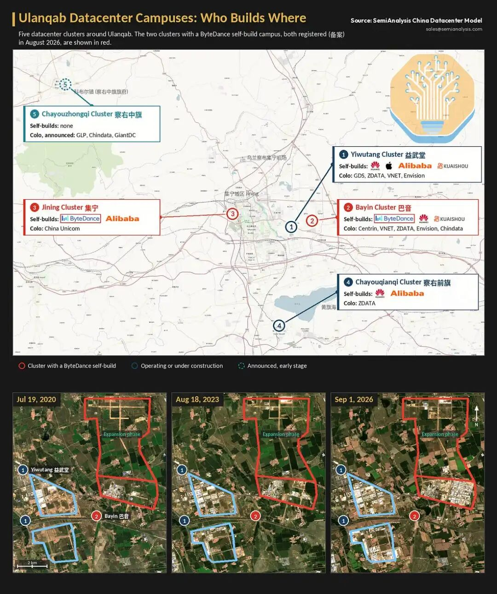
_图源：SemiAnalysis_

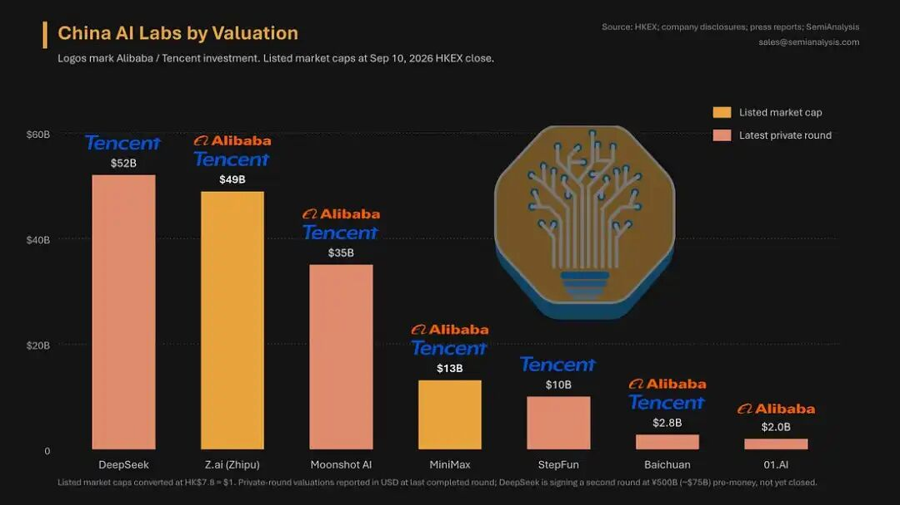
_图源：港交所、公司披露、媒体报道与 SemiAnalysis_

**腾讯：最克制的一家，2026 年出现阶跃变化。** 自认在 AI 上晚了「九个月到一年」；2026 年 7 月所有模型工作并入首席科学家领导的统一基础模型部门，混元 3（总参 2,950 亿、激活 210 亿、上下文 256K）开放。战略是掌握用户界面而非拥有模型——元宝里让自研与 DeepSeek、Kimi、GLM 同跑。数据中心动作与之同构：下行期关掉城市小型租赁站、集中到清远怀来仪征自建园区；2026 年上半年资本开支超 2025 全年、自由现金流转负，但模型追踪显示容量在稳增——差距指向新增资金投了芯片与存储预付款；新增容量大多转向批发租赁而非自建外壳。地理上留在东部（微信、游戏、视频对延迟敏感），西部例外是宁夏中卫与联通合作的首座厂房（2025 年 4 月投运）。

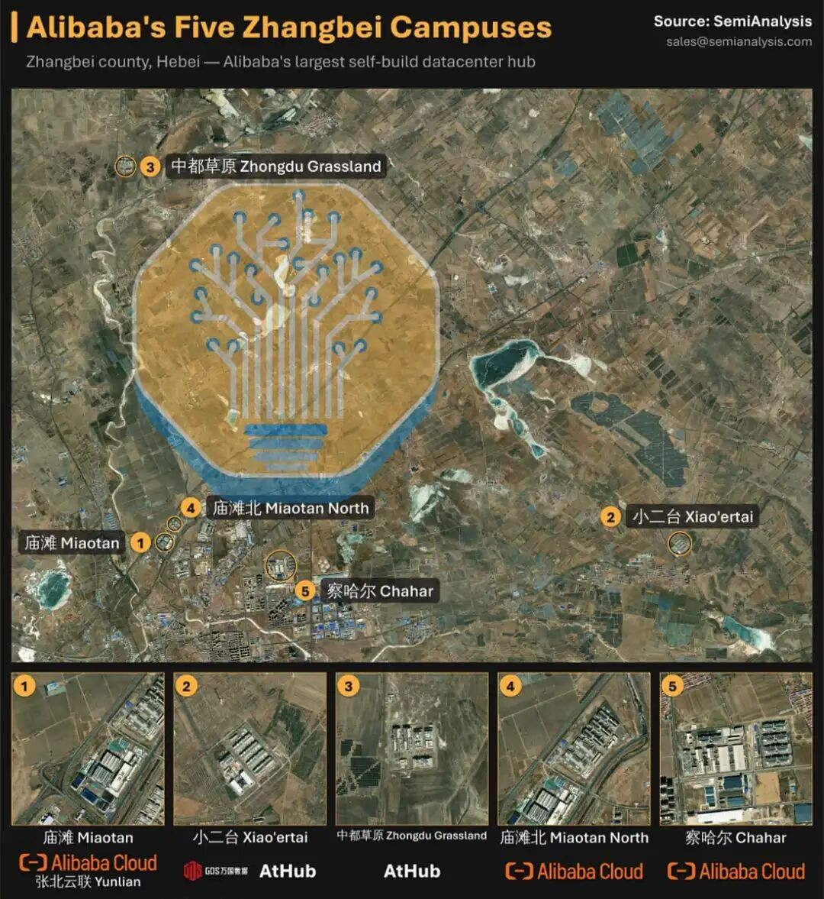
_图源：SemiAnalysis 中国数据中心模型_

**百度：先行者落后，转向芯片业务。** 四家里花钱最少——2026 年上半年资本开支大约等于阿里巴巴一个月。但垂直栈最深：昆仑芯在自有数据中心训练了文心 5.1（对照：平头哥真武多用于推理），昆仑芯对外销售并分拆寻求 A+H 上市。损益表讲的是同一个转型：GPU 云收入同比 +283%（较一季度的 184% 再加速），管理层谈的是自研芯片带来的成本优势。设施足迹五家最小、招标规模只有字节的十分之一、西部无 GW 级园区。

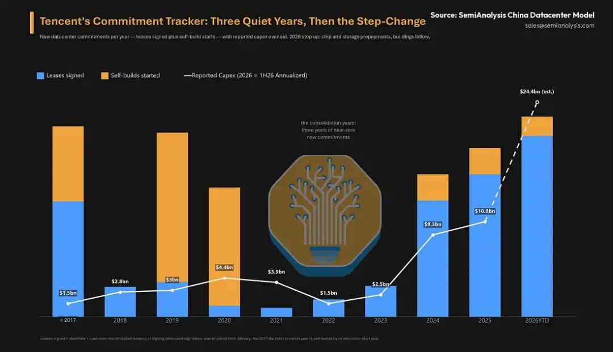
_图源：SemiAnalysis 中国数据中心模型_

**华为：也运营数据中心的芯片供应商。** 自建比例五家最高（超 90%），三个云枢纽按可容纳至少一百万台服务器设计：贵安（2021 年启动，当前最大）、内蒙古（乌兰察布 2016 年最早 + 和林格尔 2023 年破土，全部建成超百万台）、芜湖（2024 年开放，规划三百万台）。模式上的关键数字：**已运营容量与规划容量之比约 1:6**——设计容量远远领先实际部署。理解华为云的正确方式不是云业务，而是昇腾算力的分销渠道：买不起或不会运营 CloudMatrix 的客户按小时或按 token 租用。华为云收入不足集团 5%、份额仍在降，客户是政府金融国企而非互联网负载；但 2025 年 11 月起新建的国家出资数据中心被要求使用国产 AI 芯片——报告对华为云的定性（原文）：

> 「华为在五家公司的超大规模设施足迹中倒数第二，却拥有对其他所有公司建设潮最大的供货敞口。往后，国家 AI 数据中心项目每启用 1GW，都是一次向华为采购的机会。」

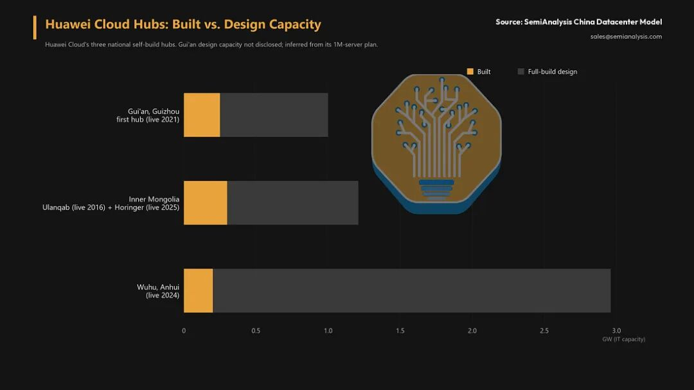
_图源：SemiAnalysis 中国数据中心模型_

## 六、越过国境：海外容量 2029 年接近 4GW

出口管制决定了另一个方向：英伟达机队在境外。按模型口径，中国超大规模云服务商的海外租赁容量预计从 2026 年到 2029 年翻倍、接近 4GW——这还没算它们向西方云厂商租用的数十万块 GPU。

字节领先：TikTok 的数据驻留要求带来 2020–2024 年的大量境外租约（北弗吉尼亚、波特兰、爱尔兰、挪威，芬兰 2025 年开工，巴西从约 200MW 起步）；当前亮点是东盟的新加坡—柔佛—巴淡岛枢纽，核心房东为 DayOne 与 Bridge DC 等把中国施工速度带出去的开发商——不到一年交付超 100MW，是成熟西方批发商通常耗时的约一半。

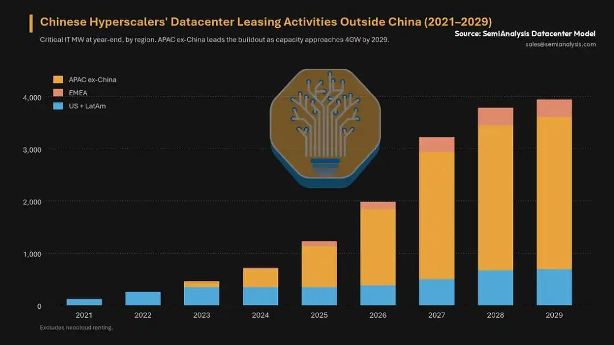
_图源：SemiAnalysis 数据中心模型_

阿里巴巴投入次之：18 个国际区域、46 个可用区，2026 年 8 月完成 100 亿美元新股配售（香港史上最大后续发行），约 60% 预留给全球算力基础设施，并希望在 2027 年底前于美国取得约 500MW 容量。腾讯规模更小：沙特、日本、马来西亚三个新区域加八个国际可用区，国际业务约占云收入 10%（同比 +40%），目标 2030 年超 30%。

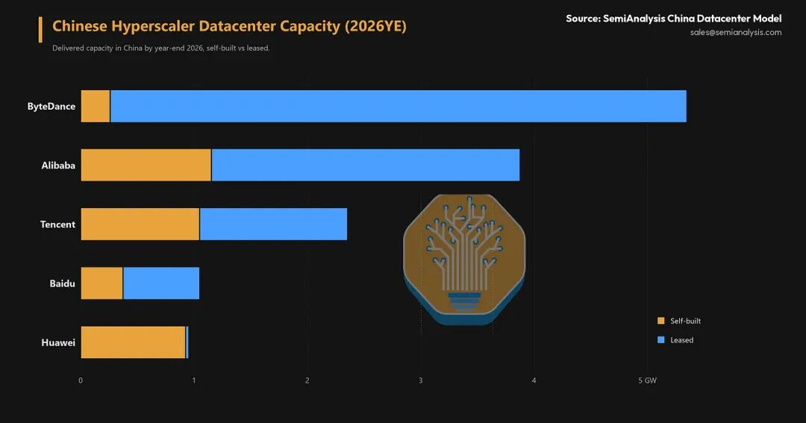
_图源：SemiAnalysis 中国数据中心模型_

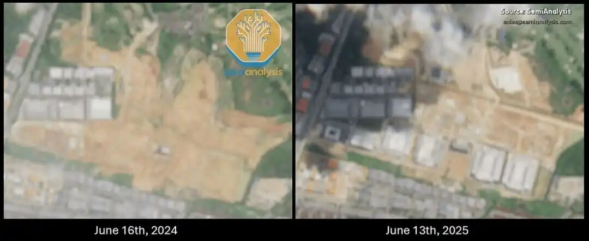
_图源：SemiAnalysis 数据中心模型_

## 七、结论与口径

报告收尾的三组数字，按口径分层记：

- 五家领先超大规模运营商的合计容量，从 2023 年底约 **6GW** 到 2030 年约 **21GW**，有望增长三倍以上；
- 年新增容量从云时代的约 **1GW** 提速到 2026–2027 年的每年 **3–4GW**；
- 它们手中还有约 **6GW** 投机性园区储备尚未开工。

支撑储备的需求被报告归为三个结构性来源：受保护的国内市场、国家引导的基础设施、以及面对出口管制仍让中国模型保持全球相关性的开源飞轮。翻译过来就是：需求有制度底、供给有政策引导、芯片受限但模型能力不掉队——这三个条件同时成立，才是这轮建设潮敢往前冲的底座。

读这份报告要始终带着译注（小苔花注）的提醒：超过 24GW、字节占五分之一、700 亿美元资本开支，这些是**模型估算**与**媒体报道的讨论上限**，不是公司披露；已运营、已签约、已规划是三种不同状态。报告的价值不在每个数字都准，而在它给了一个可以逐季度对账的框架——数字对不对得上，之后每期更新都会替你检验。

## 来源与口径

- 原文：[The Chinese AI Infrastructure Boom: Introducing the SemiAnalysis China Datacenter Model](https://newsletter.semianalysis.com/p/the-chinese-ai-infrastructure-boom)（SemiAnalysis，2026-09-25，付费订阅；作者 Everlyn、Dylan Patel、Patrick Schaabi）
- 中译：《中国AI基础设施热潮：推出SemiAnalysis中国数据中心模型》（公众号「我有充足的时间」，2026-10-02，小苔花译，含译注口径提醒）
- 产品页：[semianalysis.com/china-datacenter-model](https://semianalysis.com/china-datacenter-model)
- 政策文件：国家发展改革委「东数西算」指引（2022 年 2 月）；广东省能源局清远园区检查通报

## 本站相关阅读

- [华为 NPU 编程入门](../../02_npu_programming/README.md)——昇腾软件栈编程侧系列（文中昇腾服务器的软件层）
- [DeepSeek-V3 H20 推理优化](../../09_inference_system/deployment/deepseek_v3_h20_vllm_deep_dive.md)——「传统零售机柜不符合 H20 密度需求」里 H20 的部署侧
- [B300 上的模型部署与 KV Cache](../../09_inference_system/deployment/b300-deployment-and-kv-cache.md)——美国侧新卡（B300/Blackwell Ultra）的部署对照

> 时效性提醒：数据中心容量、资本开支与租赁数据变化极快，且本文数字为 SemiAnalysis 模型口径（非公司披露）；引用前请对照报告更新版本与公司财报复核。
