# 图解注意力算力账：从 171.7 亿格，到 2048 格

> 2026-09-22 | 图解版：十五张手绘图讲清注意力机制的**计算侧**演进。机制深挖见 [从 GPT-2 到 Kimi K3 的注意力机制演进](from_gpt2_to_kimi_k3_attention_evolution.md)；全部数字对照 [Attention 演进与 KV Cache 之变](attention_evolution_kv_cache.md) 的 17 模型 config 核对结果。
>
> 口径说明：混合模型的「每 token KV」只计全注意力层，线性层按请求计固定状态费（详见 [KV Cache 之变](attention_evolution_kv_cache.md) §九）；吞吐倍数为论文口径。

上篇《七张图讲透 KV Cache》算的是**存的账**：每个 token 背多少行李。这篇算**看的账**：要看完历史，得花多少算力。

先给结论：Kimi K3 有 93 层，其中只有 24 层是全注意力——剩下 69 层干脆不存 KV Cache；DeepSeek V3.2 和 GLM-5.3 一层不减，但每个 query 只挑 2,048 个历史 token 精确算；DeepSeek V4 更进一步，把历史压扁了再算——128 条压成 1 条，注意力在条目上做。三条路，十五张图，把这笔算力账从头算一遍。

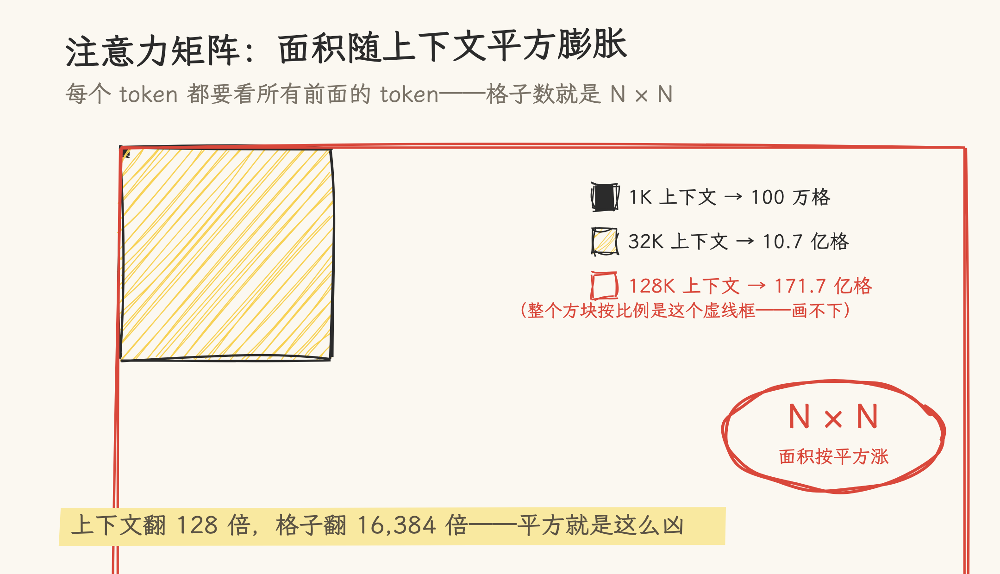

**图 1**｜注意力最原始的形态：每个 token 都要看所有前面的 token。上下文 1K 时，打分矩阵是 100 万个格子；128K 时是 171.7 亿个——上下文翻 128 倍，格子翻 16,384 倍。平方律就是这么凶。

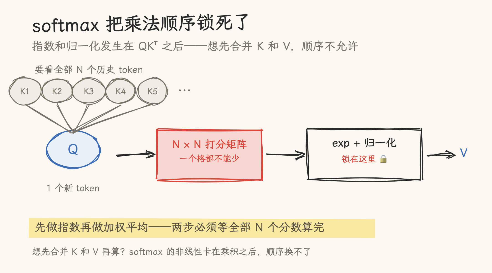

**图 2**｜有人想：先合并 K 和 V 再算，不就不平方了？顺序换不了。softmax 的指数和归一化发生在 QKᵀ **之后**——必须等全部 N 个分数出炉才能做加权平均。这个乘法顺序被锁死，锁了七年。

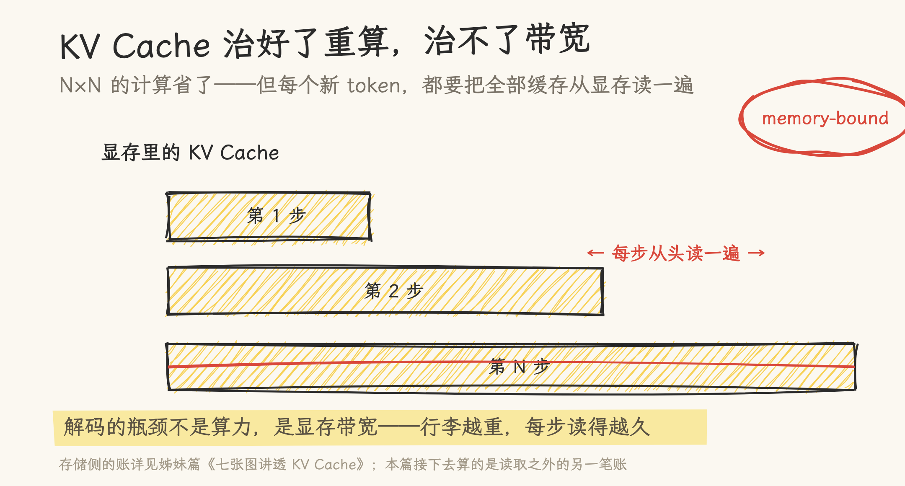

**图 3**｜KV Cache 治的是另一个病：重算。没有它，每出一个新 token 都要把全部历史的 K/V 重算一遍；有了它，算一次存起来就行。但没治本——每一步仍要把全部缓存从显存流式读一遍。解码是 memory-bound：行李越重，每步读得越久。

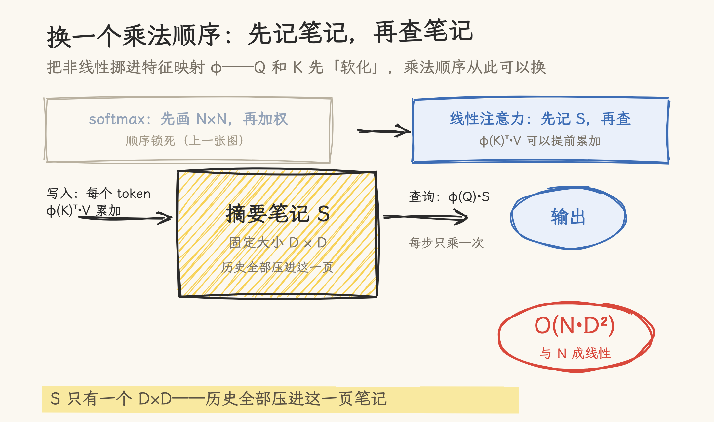

**图 4**｜2020 年的线性注意力把非线性挪进特征映射 φ，Q 和 K 先「软化」，乘法顺序就自由了——先算 φ(K)ᵀ·V，把历史压进一个 D×D 的摘要笔记 S，查询时 φ(Q)·S 一步到位。计算量从 O(N²) 掉到 O(N·D²)，与 N 成线性。

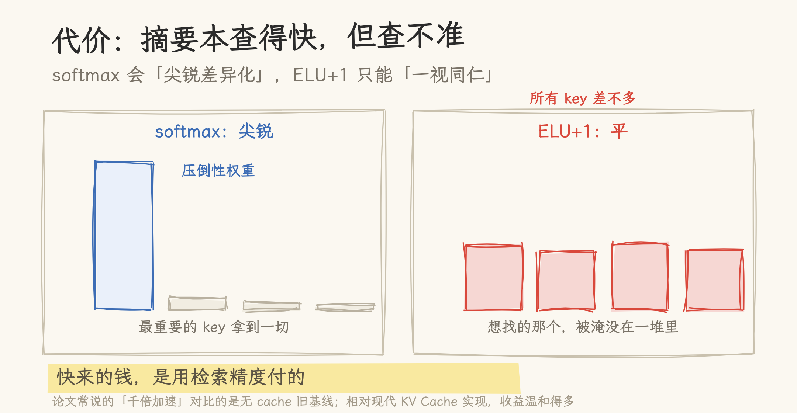

**图 5**｜代价：摘要本查得快，但查不准。softmax 会让最重要的 key 拿到压倒性权重；ELU+1 这类特征映射对所有 key 一视同仁——想找的那个，被淹没在一堆「差不多」里。论文常说的「千倍加速」，对比基准是无 Cache 的旧基线，相对现代实现收益温和得多。

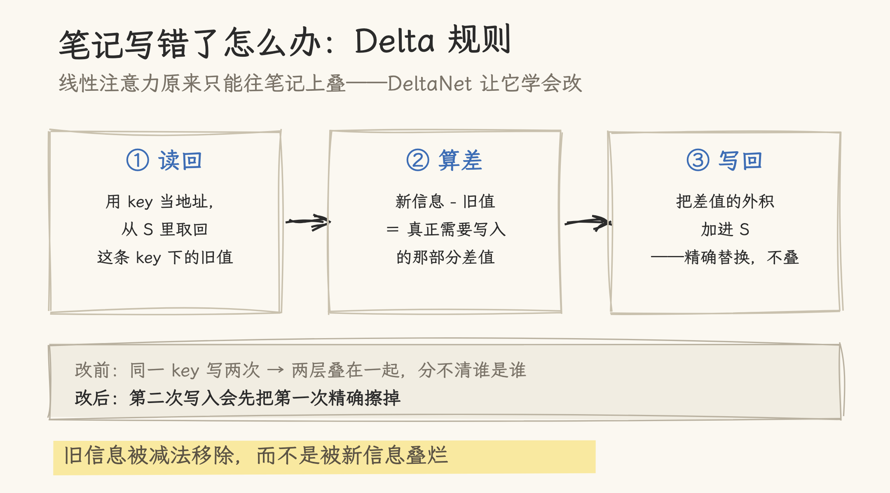

**图 6**｜更麻烦的是线性注意力这本笔记**只能加、不能改**：同一 key 写两次，两层信息叠在一起分不清谁是谁。DeltaNet 的 Delta 规则分三步——用 key 读回旧值，算出新旧之差，把差值写回。旧信息被减法移除，而不是被叠烂。

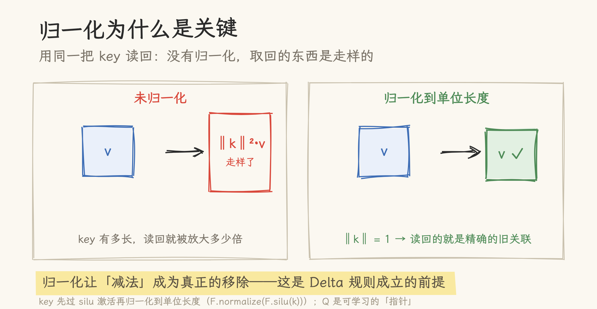

**图 7**｜Delta 规则成立有个前提：归一化。用同一把 key 读回时，没有归一化取回的是 ‖k‖²·v——key 有多长，读回就被放大多少倍；把 key 归一化到单位长度，读回的就是精确的旧关联，「减法」才成为真正的移除。

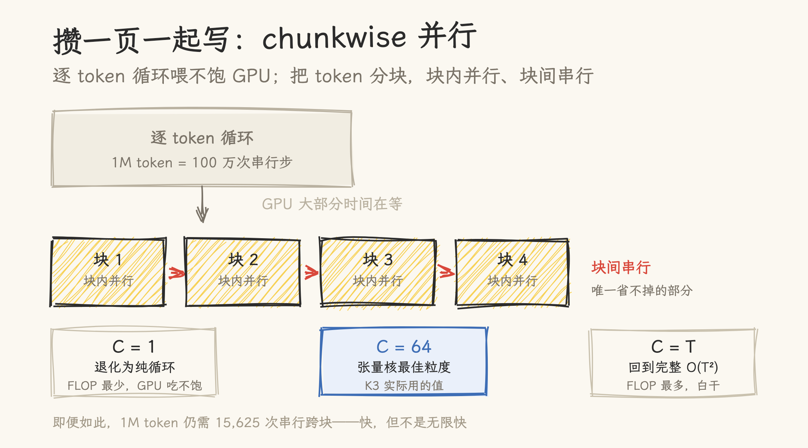

**图 8**｜逐 token 循环还喂不饱 GPU。chunkwise 把 token 分块：块内并行做矩阵乘法，块间串行传递。分块大小 C=64 是张量核的最佳粒度（K3 实际用的值）；C=1 退化成纯循环，C=T 等于白干回 O(T²)。即便如此，1M token 仍要 15,625 次串行跨块——快，但不是无限快。

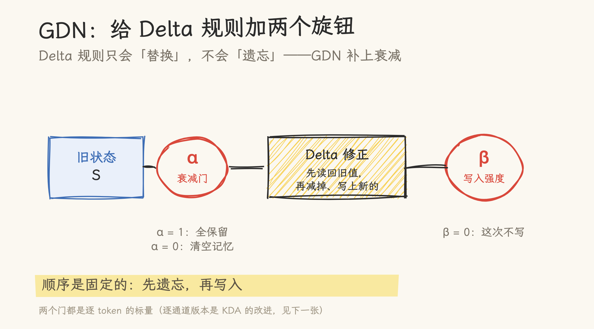

**图 9**｜Delta 规则还缺一样东西：遗忘。它只会精确替换，不会整体衰减。GDN（Gated DeltaNet）补上两个旋钮：α 管旧记忆保留多少（1 全留，0 清空），β 管这次写入多用力。顺序固定：**先遗忘，再写入**。

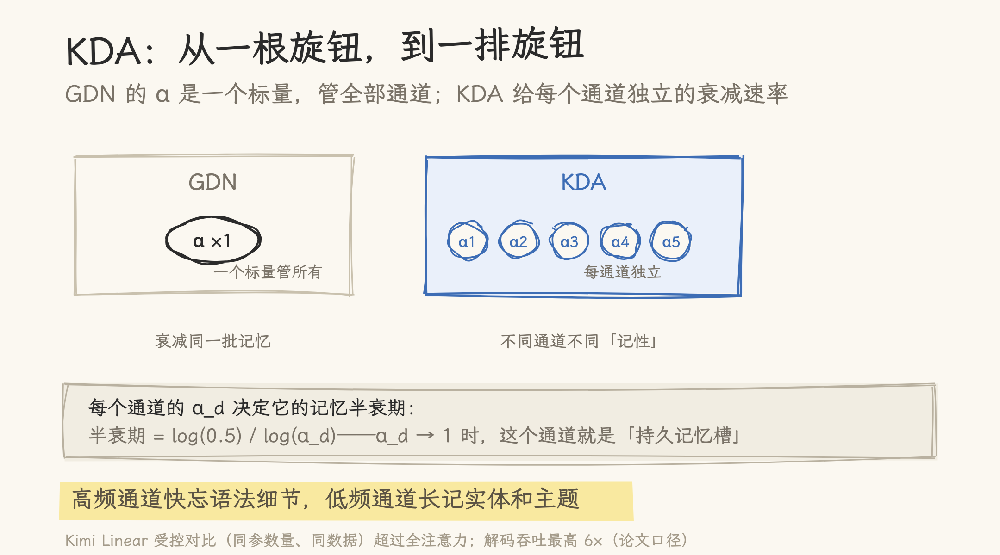

**图 10**｜GDN 的 α 是一个标量，所有通道一起衰减；KDA（Kimi Delta Attention）给每个通道独立的衰减速率——高频通道快忘语法细节，低频通道长记实体和主题。Kimi Linear 在受控对比下超过全注意力，解码吞吐最高 6×（论文口径）。

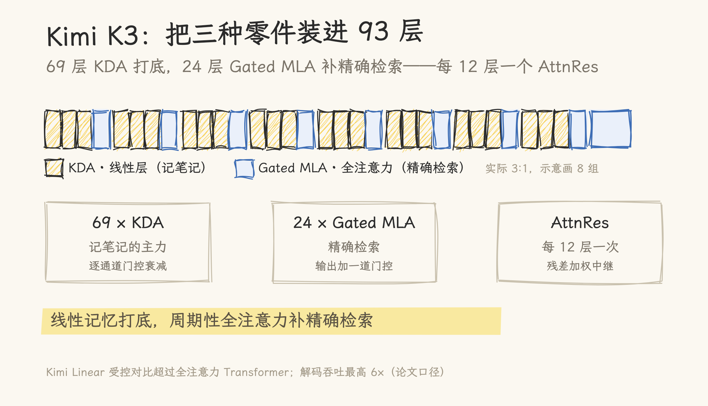

**图 11**｜Kimi K3 把这套做成 93 层的工业化混合：69 层 KDA 记笔记，24 层 Gated MLA 补精确检索——每 3 层 KDA 配 1 层 MLA，外加末层全注意力。纯线性丢掉的「精确查找」，靠这四分之一的周期性检索补回来。

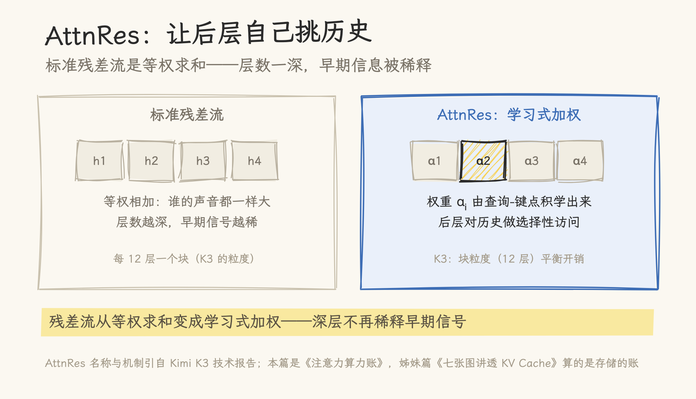

**图 12**｜K3 线的最后一件零件是 AttnRes：标准残差流对历史等权求和，层数一深早期信号就被稀释；AttnRes 让每层用学出来的权重自己挑历史（K3 每 12 层一个块）。线性混合这条线到此走通。

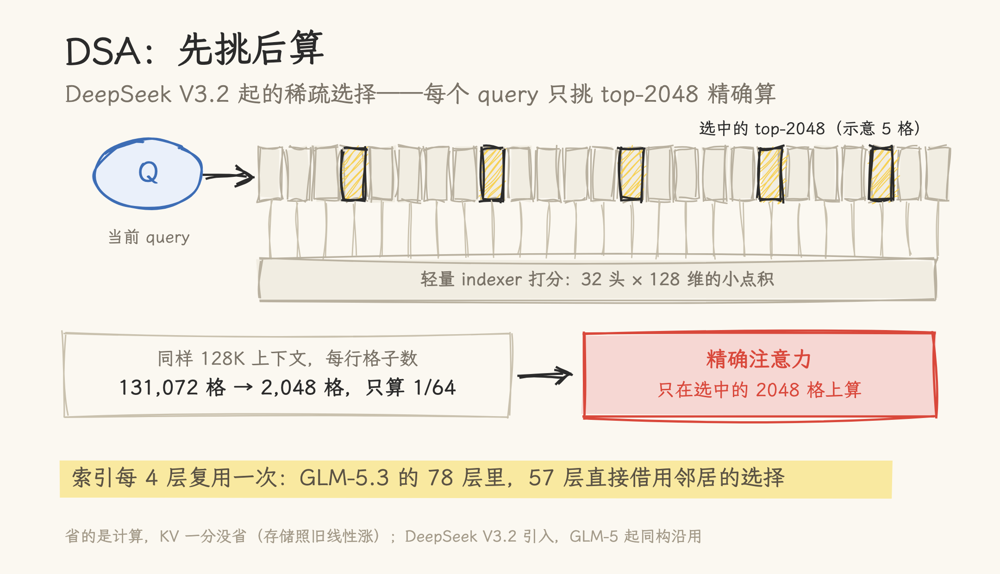

**图 13**｜线性不是唯一答案。DeepSeek V3.2 的 DSA 走「先挑后算」：轻量 indexer 给全部历史打分，每个 query 只挑 top-2048 做精确注意力——同样 128K，每行从 131,072 格降到 2,048 格，只算 1/64。索引每 4 层复用一次（GLM-5.3 的 78 层里 57 层直接借用邻居的选择），打分开销再摊薄。省的是计算，KV 一分没省。

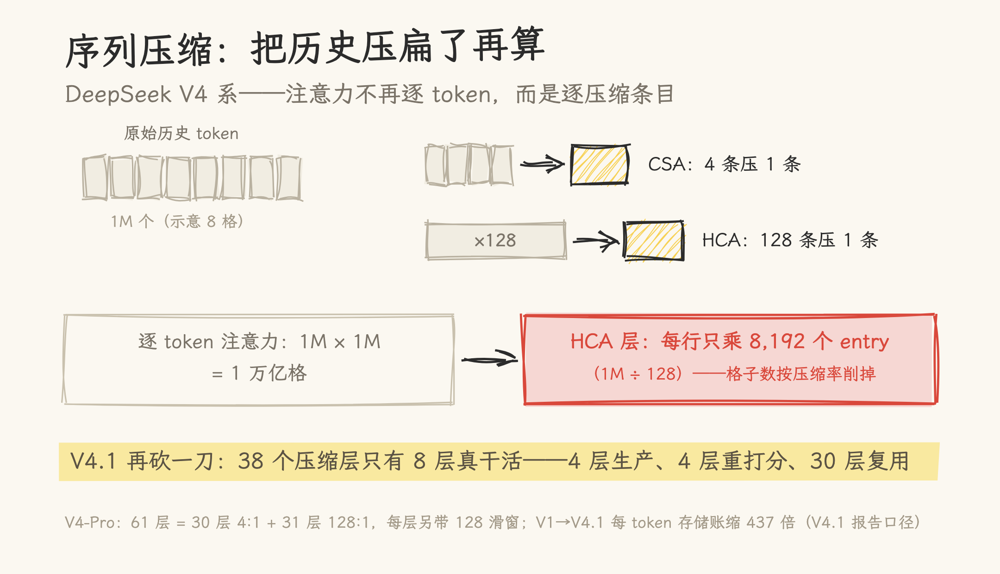

**图 14**｜DeepSeek V4 系把历史压扁了再算：CSA 4 条压 1 条、HCA 128 条压 1 条，注意力在压缩 entry 上做——1M 历史在 HCA 层每行只乘 8,192 个 entry。V4.1 再砍一刀：38 个压缩层只有 8 层真干活（4 层生产、4 层重打分、30 层直接复用），计算跟着存储一起被复用。

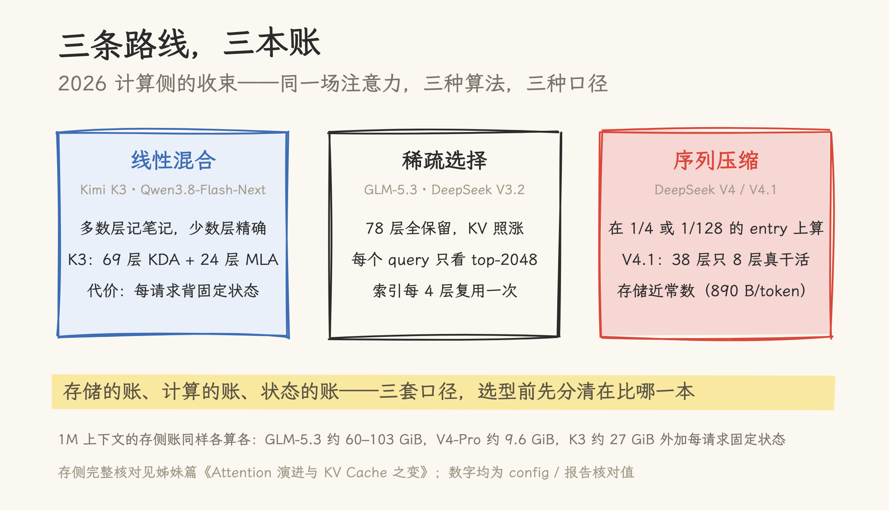

**图 15**｜三条路线三本账：线性混合多数层记笔记、稀疏选择每个 query 只看 2K、序列压缩在 entry 上算。三套口径不可直接互比——比之前，先分清比的是哪一本。

到 2026 年，计算侧分成三条路线：**线性混合管日常，稀疏选择管精确，序列压缩管极限**。存的账、看的账到这里都算完了；完整核对（17 个模型的 config 与源码验证）见《Attention 演进与 KV Cache 之变》与《从 GPT-2 到 Kimi K3》两篇长文。

## 来源与核对

- 机制叙事与代码验证：[从 GPT-2 到 Kimi K3 的注意力机制演进](from_gpt2_to_kimi_k3_attention_evolution.md)（基于 Baseten 长文翻译深注，对照 vLLM/SGLang 源码）
- 存储侧姊妹篇：[Attention 演进与 KV Cache 之变](attention_evolution_kv_cache.md)（17 模型 config 核对）
- 配图由 rough.js + 霞鹜文楷程序化生成，源文件见本目录 `assets/`
