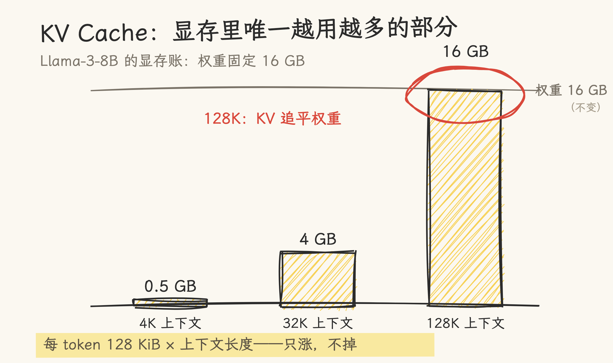
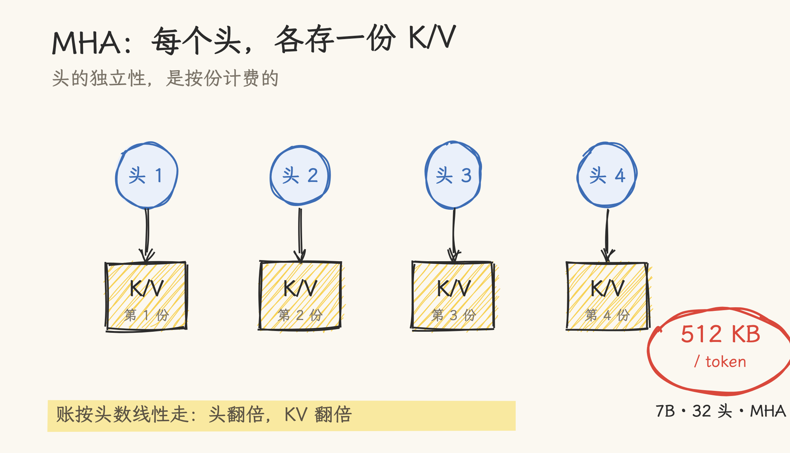
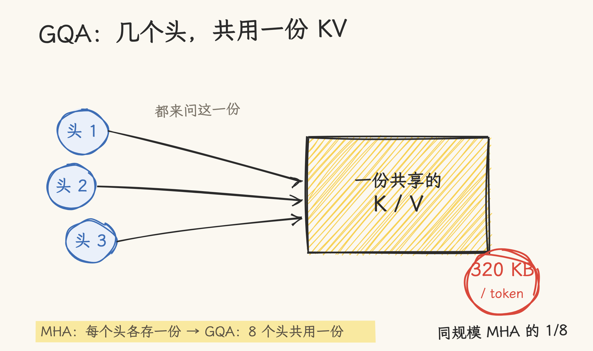
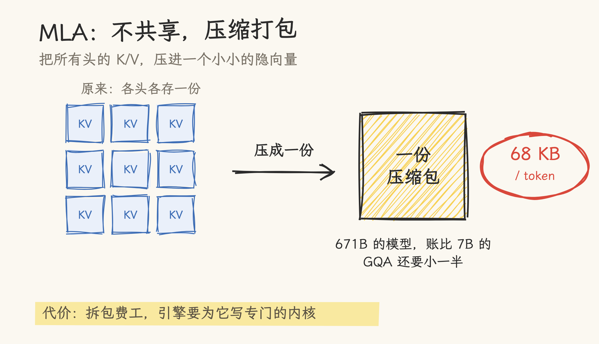
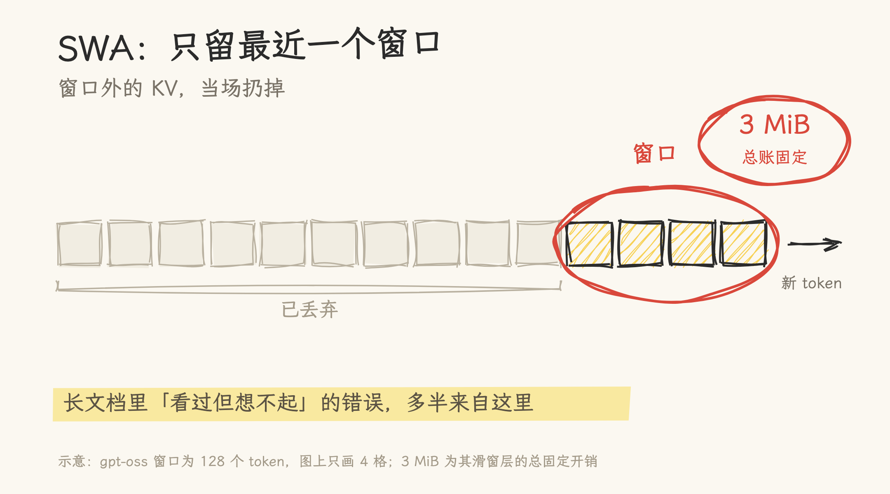
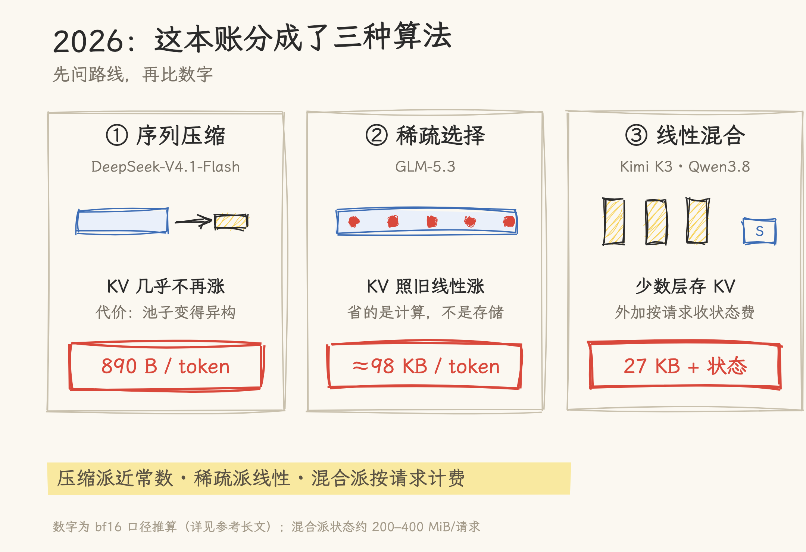
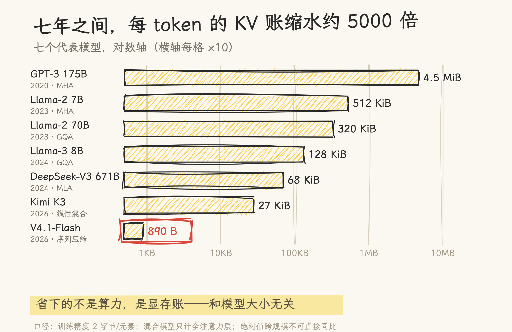

# 7 年前，AI 记住一个字要 4.5 MB；今天只要 890 B——七张图讲透 KV Cache

图解入门版：七张手绘图讲清 KV Cache 的账。技术细节与全部数字的出处，见参考长文 [Attention 演进与 KV Cache 之变：每 token 从 4.5 MiB 到 890 B](attention_evolution_kv_cache.md)——17 个代表性模型逐字段对照 config.json 与引擎源码核对。

> 严谨说明：「一个字」指一个 token；所有数字按训练精度 2 字节/元素计算，混合模型只计全注意力层。

2020 年，GPT-3 每生成一个字，要花 4.5 MB 显存去「记住」它。到今年 9 月，DeepSeek-V4.1-Flash 把这个数字压到了 890 B。七年，约 5000 倍。这篇用七张图，把 KV Cache 这笔账算清楚。

**图 1**：推理的显存里有两笔账：模型权重是固定的，KV Cache 却随上下文线性增长。拿 Llama-3-8B 算：每 token 128 KiB，4K 上下文只要 0.5 GB，到 128K 就要 16 GB——追平权重。这就是长上下文又慢又贵的根源。

**图 2**：最原始的存法叫 MHA：注意力有多少个头，就存多少份 K/V。头的独立性是好事，代价是按头数计费：7B 模型 32 个头，每 token 512 KB。

**图 3**｜第一轮省法：让几个头共用一份 K/V，这就是 GQA。70B 的大模型用上它，每 token 320 KB，反而比 7B 的老款还小。代价：头少了，能力略降。

**图 4**：第二轮更彻底：DeepSeek 的 MLA 不共享了，把所有头的 K/V 直接压进一个小小的隐向量。671B 的模型，每 token 只要 68 KB，比 7B 的 GQA 还小一半。代价：拆包费工，引擎要为它写专门的内核。

**图 5**：第三轮最简单粗暴：滑动窗口注意力（SWA）只留最近一个窗口，窗口外当场扔掉。滑窗层的账从此固定（gpt-oss 只要 3 MiB），但长文档里「看过但想不起」的错误，多半来自这里。

**图 6**：到 2026 年，这本账分成了三种算法，而且不可互相比较：DeepSeek 的序列压缩把 KV 压到几乎不涨（890 B/token）；GLM-5.3 的稀疏选择只省计算、不省存储，KV 照旧线性涨；Kimi K3 的线性混合干脆把大部分 KV 换成固定状态。

**图 7**：七个代表模型放到一根对数轴上：七年之间，每 token 的账从 4.5 MB 缩到 890 B，约 5000 倍。省下的不是算力，是显存——和模型大小无关。

这笔账还在变。下一篇讲系统侧怎么接招：PagedAttention、前缀复用与淘汰——同样的卡，为什么 vLLM 出来之后吞吐翻倍。

想往深处走：完整技术版是 [Attention 演进与 KV Cache 之变](attention_evolution_kv_cache.md)（17 个模型逐一对照 config 的长文）；2026 年序列压缩路线的深挖在 [KV 压缩推到极限三部曲](../../../09_inference_system/kv_compression/README.md)。
