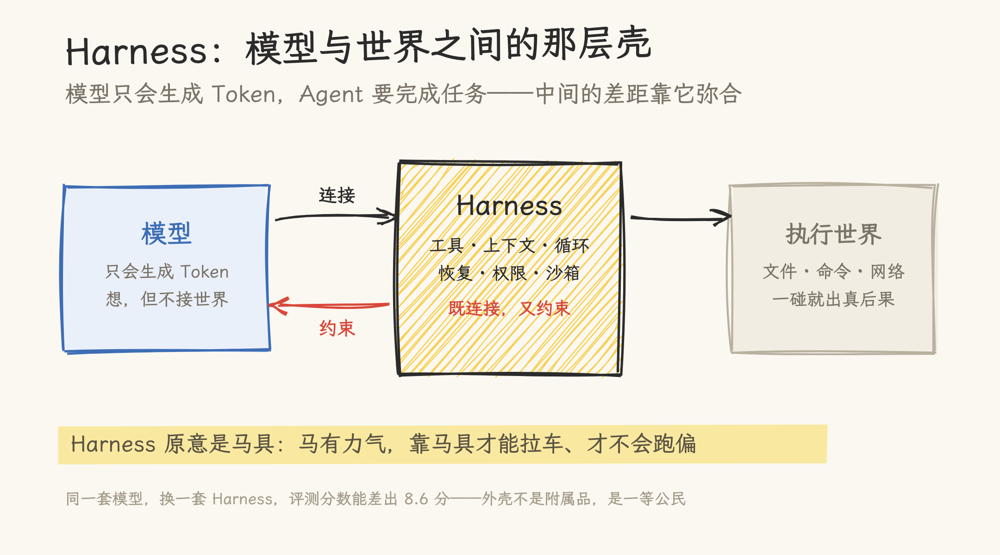
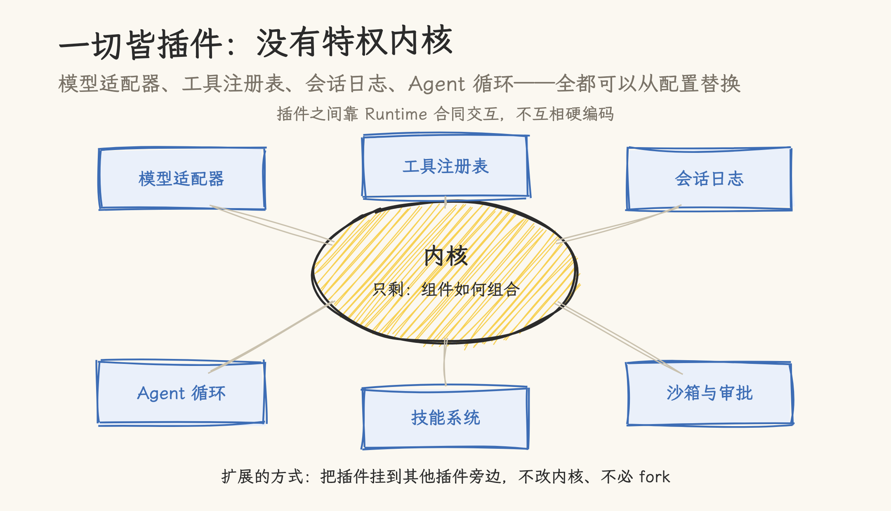
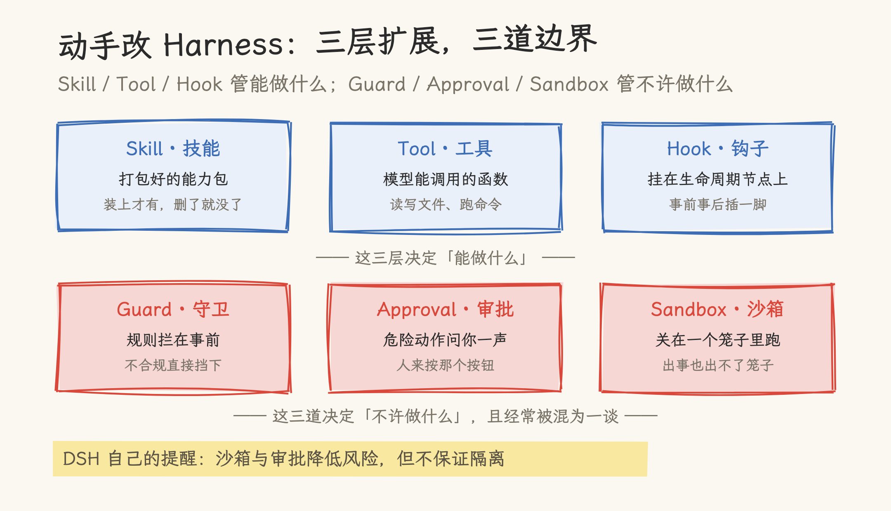
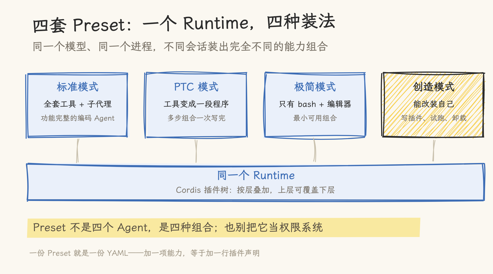
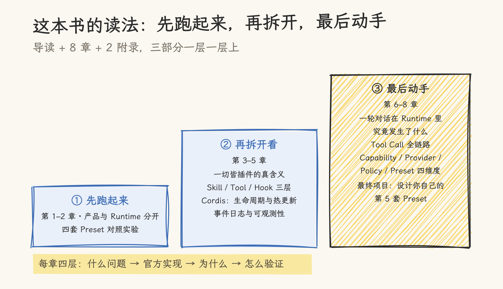

# DeepSeek Harness：一本书讲透 Agent 怎么组织

> 2026-09-23 | 书介与概念图解。对书的介绍依据出版社书目资料与公号稿（亦凯著，异步图书，2026-09 上市）；文中 DSH 概念解释基于本站此前对 `deepseek-ai/deepseek-harness`（`5dda764e`，`0.1.5-alpha.1`）的源码核对，评测数字为 V4.1 报告厂商口径。书的内容以出版实物为准。

8 月 13 日，DeepSeek 把自己的 Agent 框架 Harness 开了源：半小时 Star 破万，42 小时破 10 万，登顶 Hacker News。到 9 月上旬，这个叫 DSH 的仓库已有 21.7 万颗星，`dsh-plugin` 话题下挂着一万四千多个插件仓库。

比 Star 更实在的是一组评测数字。DeepSeek 自己的 V4.1-Flash 在 DeepSWE v1.1（Max effort）上评测，同一个模型换不同的 Harness 跑：mini-SWE 74.2 分，DSH 极简模式 72.6，Claude Code 69.8，DSH 的 PTC 模式 67.6，Codex 65.6（厂商口径）。头尾差 8.6 分——同一个脑子，装在不同的壳里，就是不同的个体。

**图 1**｜Harness 原意是马具。模型有力气，但只会生成 Token；执行世界一碰就出真后果。中间这层壳把能力接进来（工具、上下文、循环、恢复），把边界画出来（权限、审批、沙箱）。同一模型换外壳能差 8.6 分。

Star 数只会告诉你「有什么功能、怎么启动」。它不回答的是：这套系统为什么长成这样？架构决策在解决什么问题？真要部署到生产环境，该抄哪些设计、避哪些坑？

9 月上市的《DeepSeek Harness 技术入门与架构原理》回答的就是这一层。作者亦凯长期写 AI Agent 与大模型工程化（知乎商业答主影响力榜 AI 方向前十），给全书定了一句话的锚：**模型只会生成 Token，Agent 要完成任务**——两者之间的差距，就是 Harness 的地盘。

**图 2**｜DSH 最激进的决定：没有特权内核。模型适配器、工具注册表、会话日志，连 Agent 循环本身都是插件——源码里 AgentLoop 只是个声明了六个依赖的普通 Service。内核只剩「组件如何组合」的规则。扩展 = 把插件挂到别的插件旁边，不用 fork。

「一切皆插件」不是宣传语。我们此前对照 DSH 源码核实过：官方架构文档写明「产品的每一部分都是插件，包括模型适配器、工具注册表、会话日志，以及 agent loop 本身，因此每个都可以从配置替换」，并且「不存在需要打补丁的特权内核」。做到这一步，靠的是 Cordis 这个插件内核：组件挂载有生命周期可查，声明的依赖会自动重解析，卸载时副作用可逆——注册的工具、提示词片段、监听器跟着插件一起消失，热更新才得以成立。

**图 3**｜书里把最容易混的六件事拆成两排：Skill、Tool、Hook 是扩展的三层，决定能做什么；Guard、Approval、Sandbox 是三道边界，决定不许做什么。DSH 文档自己有句提醒：沙箱与审批降低风险，但不保证隔离——它们约束守规矩的代码，不约束恶意代码。

三层扩展的拆法与本站此前的 Skill 梳理能对上：Skill 是打包的能力包，Tool 是模型可调用的函数，Hook 挂在生命周期节点上。边界三件套则对应 DSH 内置的沙箱与审批策略——书里特意把它们从笼统的「安全」里拉出来分开讲，每件的执行时机和责任人都不同。

**图 4**｜四套内置 Preset 是四种组合，不是四个 Agent：标准全套、PTC 把多轮工具往返压成一段程序、极简只留 bash 和编辑器、创造模式能现场改装自己。一份 Preset 就是一份 YAML，加一项能力等于加一行声明。也别把它当权限系统。

四套 Preset 是全书第一个动手实验的落点：第 2 章让读者在不懂任何原理的情况下，先亲眼看到同一个进程装出四种能力。这个设计在评测侧还有个注脚——前面那组分数里，PTC 模式（67.6）反而低于极简模式（72.6）：把多轮工具往返压成一段程序，在需要密集交互的编码任务上并不总占优。组合有代价，这本书的价值之一就是把这类取舍摆上台面。

全书最后的落点也在 Preset 上：从权限清单、能力预算到故障注入验证，亲手设计第五套 Preset——一个 Reviewer。做完这个项目，「同一模型，不同架构，行为天差地别」就成了你自己跑出来的观察。

**图 5**｜全书按「先跑起来、再拆开、最后动手」铺：先用四套 Preset 做对照实验，再进插件体系、三层扩展与 Cordis，最后从设计者视角写你自己的第 5 套 Preset。每章四层：解决什么问题、官方实现放在哪、运行时为什么这样工作、怎么用实验验证。

## 这本书特别在哪

市面上讲 Agent 的书大致两类：提示词大全，保质期跟着模型升级走；框架入门，保质期跟着 API 重写走。这本的路数不同——DSH 只是解剖样本，锚定的问题是「Agent 软件应该如何被组织」，这个问题的保质期比任何一家框架的 API 都长。

具体到写法，有三点少见：

**陷阱预警当小标题。**「一切皆插件」不等于所有模块随便删；Preset 不是权限系统；Code Mode 不绕过安全管线。每条预警都对着一个真实会踩的坑。

**实验压到本地能跑。**主要实验用兼容的本地模型即可完成：删除一个 Skill 看能力是否消失、让依赖出现又消失再回来、从会话事件日志重建一次模型请求——几分钟见到结果，不用对着概念图想象。

**把可观测性当正经章节。**多数 Agent 书只讲调用不讲调试，而 Agent 系统的调试难度高于传统软件：输出不确定、链路长、状态藏在对话历史里。这本书用一章讲事件溯源——哪些事实必须永久保留、压缩为什么不能抹掉历史、怎么从会话日志重建模型看到的上下文。

## 和《Harness 工程实战》什么关系

两个月内的第二本 Harness 书，分工不重叠：张建飞的《Harness 工程实战》讲运行时之上的工程方法——AGENTS.md 怎么演进、遗留系统怎么让 AI 参与改造；这本讲运行时本身——插件怎么组合、状态怎么存、循环怎么换。发动机和驾驶手册，各管一段。

## 谁该读

有日常 AI 应用经验、开始把 Agent 往生产环境搬的开发者和架构师；被「十几个工具函数堆出一个不可维护的 Agent」困扰过的团队负责人也适合。前置要求只有一样：用过任意一个 Coding Agent。

读完带走的是三个提问习惯：能力边界画在哪里？什么是可替换的？生命周期由谁管理？

你认为 Agent 软件应该如何被组织？评论区聊聊。

## 参考书

- 《DeepSeek Harness 技术入门与架构原理》，亦凯 著，异步图书，2026-09；

## 参考资料

- 本站 [一切皆插件：DeepSeek Harness 是怎么把 Agent 装起来的](deepseek-harness-deep-dive.md)——DSH 源码核对深文，本文概念解释的依据
- 本站 [驾驭工程：为什么你的 AI 编程助手总在失控？](../../../98_llm_programming/Harness_Engineering.md)——Harness Engineering 方法论
- 本站 [DeepSeek-V4.1-Flash 深扒](../../../09_inference_system/kv_compression/02-deepseek-v41-flash.md)——scaffold 消融数字出处（§5.3.4，厂商口径）
- 本站 [Claude Skills 指南](../../agent_skills/docs/claude_skills_guide.md)——Skill / Tool / Hook 辨析
