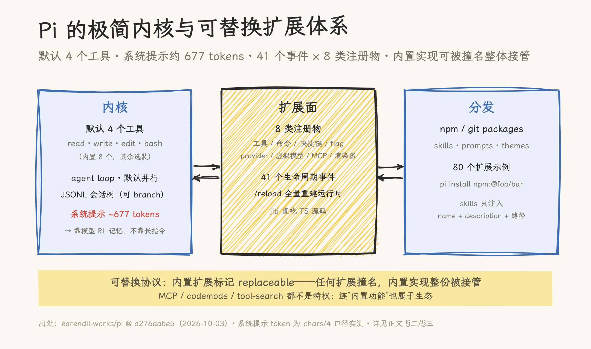
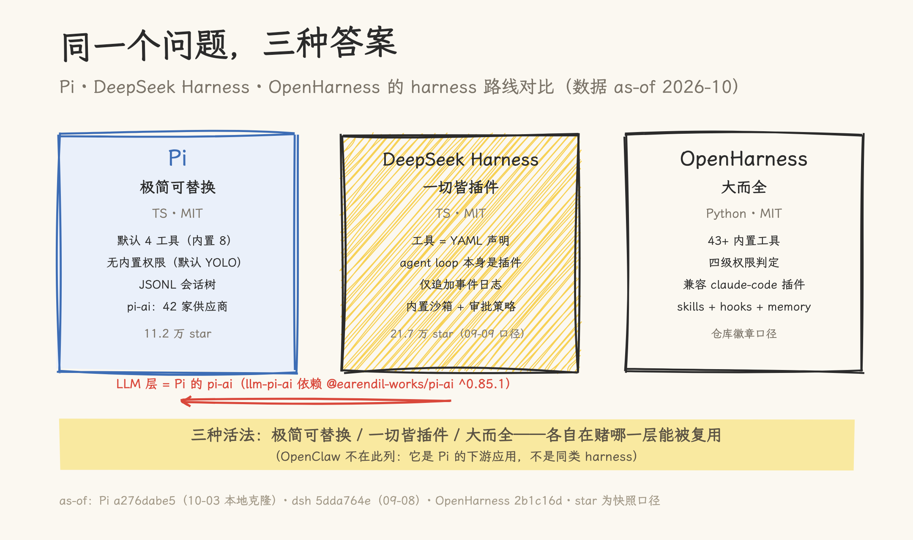

# 4 个工具、42 家供应商、11 万 star：Pi 的极简 harness，与 DeepSeek Harness、OpenHarness 的路线对比

> 2026-10-03 | 源码深读。Pi 侧基于 `earendil-works/pi` commit `a276dabe5`（2026-10-03）本地克隆逐文件核对，行号以该 commit 为准；对比侧基于本地克隆 DeepSeek Harness `5dda764e`（v0.1.5-alpha.1，2026-09-08）与 OpenHarness `2b1c16d`。星标、周下载量为 2026-10-03 快照（GitHub / npm API 实测）。未实际运行 Pi 本体，行为结论均来自源码与官方文档。

2026 年 4 月，libGDX 作者、写了 17 年开源代码的 Mario Zechner 在一场开发者大会上讲他怎么花几个月造了一个编程 agent。开场白是：「我讨厌现有的所有 coding agent，所以自己写了一个。」

他讨厌的点很具体。Claude Code 变成了「宇宙飞船」——「功能多到你可能只用过其中的 5%，了解的也就 10%，剩下 90% 全是没人知道在干什么的暗物质」；OpenCode 每轮对话都会把早期记录裁掉，顺带毁掉 prompt cache。而 Pi（发音同希腊字母 π）给出的答案是反方向的极端：**默认只给模型 4 个工具，系统提示不到 700 个 token，没有权限系统，默认不确认直接执行**。

六个月后，这个「反方向」长成了：111,804 个 star、477 万次/周的 npm 下载、v1.0.0 于 2026-10-01 发布。更大的反差在下游——39 万 star 的个人助手 OpenClaw 建在它的 SDK 上；连另一条路线上的明星 DeepSeek Harness，多供应商层用的也是 Pi 的 `pi-ai` 包（`packages/llm/llm-pi-ai/package.json` 依赖 `@earendil-works/pi-ai ^0.85.1`）。

这篇分三段：先源码级拆 Pi 怎么做的（二、三、四），再把它和 DeepSeek Harness、OpenHarness 放在一起对比（五），最后给一份诚实清单（六）。

## 一、Pi 是什么

官方 README 的定义：「a minimal, extensible agent harness that you can make your own」——极简、可扩展、属于你自己。

| 硬指标（2026-10-03） | 值                                                                                                                                     |
| -------------------- | -------------------------------------------------------------------------------------------------------------------------------------- |
| 仓库                 | [github.com/earendil-works/pi](https://github.com/earendil-works/pi)（由 `badlogic/pi-mono` 迁移而来），**111,804 star** / 14,180 fork |
| 许可与语言           | MIT，TypeScript 单仓 13 包，`src/` 约 17 万行（coding-agent 85k、ai 26k、tui 19k、durable 18k…）                                       |
| 版本与节奏           | v1.0.0 发布于 2026-10-01；6,703 个提交，近 30 天 467 个（约 15.6/天）；release 累计 267 个（近 30 天 10 个）                           |
| 分发                 | npm `@earendil-works/pi-coding-agent`，477 万次/周；另有 install.sh 与 Nix                                                             |

三个奥地利人构成了它的上下文。**Mario Zechner** 2025 年 8 月写下第一个提交（3,916 次提交至今）；**Armin Ronacher**（Flask/Jinja2 作者）的公司 Earendil 于 2026 年春收购 Pi，他本人贡献了 966 次提交——**近 30 天 168 次，比 Mario 的 112 次还多**，方向集中在 chord/durable 这些「运行时地基」上；**Peter Steinberger**（PSPDFKit 创始人）用 Pi 的 SDK 做出了个人助手 OpenClaw，OpenClaw 的第三方声明栏原话：「Portions of OpenClaw were adapted from Pi / pi-mono, and OpenClaw also depends on `@earendil-works/pi-tui`」。收购之后，这个引擎从一个人的作品变成了小团队的产品。

## 二、极简内核：4 个默认工具与 677 个 token

### 2.1 内置 8 个工具，默认启用 4 个

工具名联合类型一共 8 个成员（`packages/coding-agent/src/core/tools/index.ts:137-146`）：

```ts
export type ToolName =
  | "read"
  | "bash"
  | "powershell"
  | "edit"
  | "write"
  | "grep"
  | "find"
  | "ls";
```

而默认启用集合是四个（`packages/coding-agent/src/core/settings-manager.ts:215`）：

```ts
export const DEFAULT_TOOL_NAMES: readonly string[] = [
  "read",
  "bash",
  "edit",
  "write",
];
```

另外四个是选装：`grep`/`find` 包装 `rg`/`fd`（缺失时自动下载二进制），`ls` 列目录，`powershell` 是 Windows 上替换 `bash` 的同构实现。默认四工具的设计意图写在系统提示里：选了 bash 又没选 grep/find/ls 时，追加一条规则「用 bash 做文件操作」（`packages/coding-agent/src/core/system-prompt.ts:95-109`）。

两个工具的工程细节，决定了「极简」是不是「简陋」：

- **`edit` 用三段式匹配：精确 → NFKC 模糊 → 保字节回写**（`tools/edit-diff.ts:207-245`）。模糊层会把智能引号、Unicode 破折号、特殊空格归一化后再找；但写回时只重写被改动的整行，其余行逐字节从原文件拷贝（`edit-diff.ts:132-172`）——不会因为一次编辑把全文件的引号风格悄悄改成 ASCII。重复匹配在归一化文本上判重、命中两次即拒绝执行（`edit-diff.ts:329-333`）。它还带两处模型兼容垫片：某些模型（注释点名 Opus 4.6、GLM-5.1）会把 `edits` 发成 JSON 字符串（`tools/edit.ts:101-131`）。
- **`bash` 默认没有超时**（参数描述原文 "optional, no default timeout"，`tools/bash.ts:42`），stdin 直接设为 `ignore`（交互式命令立即拿到 EOF 而不是挂起，`tools/bash.ts:116`），超时触发时杀整棵进程树，输出按 2000 行 / 50KB 尾部截断并落临时文件。兜住「agent 卡死」的唯一机制是模型自己传 timeout——这是一条明确的「信任模型」取舍。

### 2.2 系统提示是拼出来的，实测约 677 个 token

系统提示由多个按名分区的 section 拼成（`system-prompt.ts:121`），顺序为 `preamble → tools → rules → docs → [addendum] → [project_context] → [skills] → cwd`；除 preamble 外每段被同名 XML 标签包裹。**下发方式**更少见：每次请求前与 transcript 里已有的 sections 做 diff，**只发变化的那段**（`system-prompt.ts:204-216`，调用点 `core/agent-session.ts:1689-1703`）——对 prompt cache 命中率极友好。

深读时按仓库自带的 chars/4 估算器（`packages/ai/src/utils/estimate.ts:15`）账算了一遍默认形态（无 context files / skills / 自定义 prompt）：

| 组成                                             | 字符数    | ≈ tokens |
| ------------------------------------------------ | --------- | -------- |
| preamble（内联常量，`system-prompt.ts:146-147`） | 169       | 43       |
| tools（只有名字 + 一行说明，不含 schema）        | 339       | 85       |
| rules（若干短规则）                              | 839       | 210      |
| docs（告诉模型去哪读 Pi 的文档）                 | 1,319     | 330      |
| cwd                                              | 31        | 8        |
| **系统提示合计**                                 | **2,705** | **~677** |
| **加 4 个工具定义（schema 单独随请求发送）**     | 2,717     | **~680** |

也就是说，「系统提示 + 工具定义 < 1000 tokens」的说法只对一半：**系统提示本身 677，加上工具定义约 1,357**。而这 677 里最大的一段（330）还是「去哪读文档」的索引。Zechner 演讲里的解释是：「frontier models 已经通过大量 RL 训练，早就『知道』什么是 Coding Agent 了。反复告诉它'你是一个 Coding Agent'，其实没有必要。」

### 2.3 agent loop：默认并行，错误即结果

通用运行时在 `packages/agent/src/agent-loop.ts`（940 行，不依赖任何 provider）。结构是外层 while + 内层 while 的双循环：内层处理工具调用与 steering 消息，外层等 follow-up（`agent-loop.ts:176-310`）。几个关键行为：

- **工具默认并行执行**：8 个内置工具无一标记 `sequential`，同一批工具调用走 `Promise.all`（`agent-loop.ts:508-522`，默认值 `packages/agent/src/agent.ts:253`）；参数准备仍顺序做，写文件的并发冲突由 `file-mutation-queue` 按 realpath 串行化兜底。
- **错误不抛穿循环**：工具不存在、校验失败、执行异常、`beforeToolCall` 拦截，四类失败全部转成 `isError: true` 的工具结果消息（`agent-loop.ts:922-935`）。
- **截断保护**：`stopReason === "length"` 时**拒绝执行任何工具调用**，全部返回错误让模型重发（`agent-loop.ts:267-270`）——因为流式 tool call 的参数是「尽力 salvage」出来的，截断消息可能产出能通过校验但内容不完整的参数。
- **steering 与 follow-up 是两个概念**：steering 在工具执行期间就能注入，follow-up 只在 agent 本要停下时唤醒；默认 one-at-a-time 投递（`packages/agent/src/agent.ts:143-174`）。

### 2.4 会话是树，压缩自带「检查点」

会话持久化为 JSONL 文件，每行一个条目、`id`/`parentId` 构成树，共 11 种条目类型（`packages/coding-agent/src/core/session-manager.ts:57-194`）。`branch` 是纯内存移动 leaf 指针、不写盘（`:1579-1584`）；`fork/clone` 从根到指定叶抽一条路径另存新文件。

压缩（compaction）有两个少见的实现细节。其一，触发阈值是「上下文 tokens > 窗口 − 16K」，保留最近 20K（`core/compaction/compaction.ts:126-130`）；其二，写压缩条目时会**顺手把当前完整的 system prompt 快照进去**（`session-manager.ts:1270`），replay 时它直接插在摘要之前作为前导消息（`:461-464`），而它覆盖区间内的 system 消息全部丢弃。这意味着压缩后不需要重新推导 prompt 状态——整个会话（含提示词与工具声明）是可精确 replay 的。

一个文档没写的行为：**leaf 指针不落盘**。重开会话时 leaf 被重算为文件里最后一条条目（`:1103-1113`），所以「用 /tree 切到别处但不发消息就退出」，下次打开会回到原来的位置。

## 三、可扩展性：内置的一切都可被替换

### 3.1 一个扩展就是一个 TypeScript 工厂函数

```ts
export type ExtensionFactory = (pi: ExtensionAPI) => void | Promise<void>;
```

（`packages/coding-agent/src/core/extensions/types.ts:1990`）扩展能注册 8 类东西：工具、斜杠命令、快捷键、CLI flag、模型供应商、虚拟模型、MCP server、渲染器；另有事件订阅与会话控制。加载用 `jiti` 直接吃 TS 源码，无需预编译（`core/extensions/loader.ts:552-583`）；`/reload` 的实现是**整体丢弃并重建扩展运行时**（`core/agent-session.ts:3612-3650`），旧 `ctx` 再用即报错。全仓唯一带文件监听的热重载只给了主题 JSON（`modes/interactive/theme/theme.ts:808-884`）——演讲里说的「改完扩展 `/reload` 即刻生效」指的是全量重建这条路。

生命周期事件共 **41 个**（完整清单只存在于源码，`extensions/types.ts:1545-1612`；官方文档没有事件表，明确指向源码）。工具拦截的钩子名是 `tool_call` / `tool_result`（`beforeToolCall` 是 agent-core 的内部名，桥接在 `agent-session.ts:625-626`）；`tool_call` 的 handler 失败会**阻断工具执行**，是 41 个事件里唯一的 fail-safe 例外。

### 3.2 skills、packages 与分发

skills 是目录 + `SKILL.md`（frontmatter：name ≤64 字符、description ≤1024、可标 `disable-model-invocation`）。**注入时只给 `name + description + location` 三样**（`core/skills.ts:355-383`），全文按需 `read`——这与本仓「渐进式披露」的实践是同一个思路。prompt templates 支持 `$1`/`$@`/`${@:N:L}` 参数替换；主题是 JSON + schema。

分发走包：`pi install npm:@foo/bar` 装到 `~/.pi/agent/npm/node_modules/`（项目 scope 则 `.pi/npm/`），按 `package.json` 里的 `pi` 清单或约定的 `extensions/ skills/ prompts/ themes/` 目录收录（`core/package-manager.ts:1036-1058`、`:2214-2248`）。宿主包约定以 `peerDependencies: "*"` 声明，避免重复实例。

### 3.3 「可替换协议」：内置实现可被生态整体接管

这是 Pi 扩展体系里最有野心的一条规则。内置扩展（MCP、codemode、tool-search、llama.cpp）都标记 `replaceable: true`；任何**非 replaceable** 的第三方扩展，只要在工具名 / 命令名 / flag 名上撞名，内置的那份就**整份不加载**并给出警告（`core/resource-loader.ts:120-151`）。它不是 MCP 专用逻辑，而是一种通用的「内置实现可被生态替换」协议——连错误提示都会引导用户去 `pi config` 的 Built-in 分组。

配套的是官方示例库：仓库里 `examples/extensions/` 有 **80 个扩展示例**，包括 `permission-gate.ts`（危险命令弹窗确认）、`protected-paths.ts`（保护 `.env`/`.git/`）、sandbox 示例。演讲里提到的社区玩法包括：多个 Pi agent 的聊天室 pi-messenger、在 agent 运行时打游戏的 pi-nes、把网页标注原地喂回 agent 的 pi-annotate——「这些都不是内置功能，全都是 extension」。

顺带一个与开源治理有关的细节：因为 OpenClaw 带来的 issue/PR 洪水，仓库做了两层「人类验证」——`issue-gate` 自动关闭新人的 issue/PR、`approve-contributor` 需要维护者 lgtm 才放行；Zechner 演讲里管这叫 OSS Vacation：「真正重要的问题，总会有人在之后重新提出来。」



**图 1**｜极简内核与可替换扩展体系：4 个默认工具 + 41 个事件 + 8 类注册物构成扩展面，内置实现可被生态撞名整体接管。

## 四、42 家供应商的统一层

`packages/ai`（26k 行）是 Pi 的多供应商抽象层：把不同 transport protocol 的差异抹平，让同一个 session 里随时切换模型。实测口径（`packages/ai/src/providers/all.ts` 与 `KnownProvider` 联合类型）：**42 个 provider、10 种 wire API**（`openai-completions`、`anthropic-messages`、`bedrock-converse-stream`、`google-generative-ai`、`openai-responses`、`pi-messages` 等，`src/types.ts:17-29`）。

凭证只有两种类型：`api_key` 与 `oauth`（`src/auth/types.ts:37`）。34 个 provider 走标准环境变量；9 个有 OAuth 订阅路径（Anthropic、OpenAI、GitHub Copilot、OpenRouter、xAI 等）；Bedrock/Vertex/Cloudflare 走云上 ambient 凭证链。解析顺序有一条清晰的所有权规则（`src/auth/resolve.ts:46-93`）：_「stored credential owns the provider」_——只有没存凭证时才查环境变量，刷新失败也**不做静默回退**。

**会话中途切模型**是这套抽象最有含量的部分（`src/api/transform-messages.ts:93-117`）：以 `provider && api && model.id` 三元组判断是否同模型；跨模型时，带签名的 thinking 块降级为**无标签纯文本**、redacted thinking 直接丢弃、tool call ID 按目标厂商规则重写（注释原文：OpenAI Responses 会生成 450+ 字符带 `|` 的 ID，而 Anthropic 要求 `^[a-zA-Z0-9_-]+$`），孤儿 tool call 补一条「No result provided」的结果。计价函数 `calculateCost` 支持阶梯价（含 cache 读写计入阈值），并把 Anthropic 1 小时缓存写的 2 倍溢价单独计算（`src/models.ts:1193-1213`）。

谁在用这层？前面说过的 DeepSeek Harness：其 `llm-pi-ai` 包的原话是 "Generic pi-ai-backed implementation of the Harness LLM seam"，导入 `createModels, getSupportedThinkingLevels`（`packages/llm/llm-pi-ai/src/adapter.ts:29`）——把 Pi 的 42 家供应商直接变成了自己的 LLM 底座。

## 五、三种路线：同一个问题，三种答案

「怎么给模型配一个运行时」这个问题，2026 年给出了三种很不一样的答案。下面的事实分别出自 Pi 源码（本文核对）、本仓已发布的 [DeepSeek Harness 深读](deepseek-harness-deep-dive.md)（基于 `5dda764e`）与 [OpenHarness 深读](openharness-deep-dive.md)（基于 `2b1c16d`），以及 [Claude Code 沙箱解析](claude-code-sandbox.md)。

| 维度          | **Pi**                                   | **DeepSeek Harness**                          | **OpenHarness**                               | **Claude Code**                        |
| ------------- | ---------------------------------------- | --------------------------------------------- | --------------------------------------------- | -------------------------------------- |
| 形态          | 开源 CLI + SDK                           | 开源（开发者预览）                            | 开源                                          | 闭源商业产品                           |
| 语言 / 许可   | TypeScript / MIT                         | TypeScript / MIT                              | Python 3.10+ / MIT                            | 未公开 / 闭源                          |
| 工具模型      | 默认 4、内置 8                           | YAML 声明，工具即插件                         | 43+ 内置（仓库徽章口径）                      | 文章未覆盖                             |
| 扩展机制      | 扩展/技能/包三件套；**内置可被撞名替换** | Cordis 插件树；**agent loop 本身是插件**      | hooks + plugins，兼容 claude-code 插件生态    | hooks（演讲批评：每次事件起进程）      |
| 会话形态      | JSONL 会话树，可 branch/fork             | 仅追加事件日志，「模型可见即已记录」          | 文章未覆盖                                    | 文章未覆盖                             |
| 权限模型      | **无内置**，依赖容器                     | 内置沙箱（bwrap/Landlock/Seatbelt）+ 审批策略 | 四级权限判定（黑名单/glob/只读放行/二次确认） | OS 级沙箱（Bubblewrap/Seatbelt）+ 审批 |
| LLM 层        | `pi-ai`（42 provider）                   | 自有 seam，**默认实现即 pi-ai**               | 自有多协议适配                                | 单供应商                               |
| 量级（as-of） | 11.2 万 star（10-03）                    | 21.7 万 star（09-09 口径）                    | 仓库徽章 43+ 工具                             | —                                      |

三条路线的取舍可以各用一句话概括：

**Pi 赌「模型已经知道怎么做 agent」，所以内核能多小就多小**——默认四工具、系统提示 677 token、无权限系统（README 原话：「Pi does not include a built-in permission system…By default, it runs with the permissions of the user and process that launched it.」）。它的答案是把扩展面做到极致，连内置功能都允许被生态替换掉。

**DeepSeek Harness 赌「一切皆插件」**——它的插件内核 Cordis 承载一切，「不存在需要打补丁的特权内核」，连 agent loop 都是 `extends Service` 的一个插件（`packages/core/agent-loop/src/index.ts:359-360`）；会话是仅追加事件日志，硬约束是「模型可见即已记录」。它甚至预留了把任务委托给 Claude Code / Codex 的子代理工具（默认禁用）——而它自己的 LLM 层用的正是 Pi 的 pi-ai（第四节）。

**OpenHarness 赌「开箱即用」**——43+ 核心工具、内置四级权限判定、记忆（`MEMORY.md` 跨会话持久）、多智能体调度、完全兼容 claude-code 插件生态；能力等式是 `Harness = Tools + Knowledge + Observation + Action + Permissions`。与 Pi 的「极简内核 + 用户自建」正好相反。

（补一个容易混淆的点：OpenClaw 不在这个对比里。它是 Pi 的**下游应用**——39.1 万 star 的个人助手，不是 harness 竞品；本仓已有文章写的是第三方为它写的 K8s Operator，那是部署层，与 Pi 无代码关系。）



**图 2**｜三种路线：极简可替换（Pi）/ 一切皆插件（DeepSeek Harness）/ 大而全（OpenHarness）；红笔标注的关键关系是「DeepSeek Harness 的 LLM 层 = Pi 的 pi-ai」。

## 六、代价与边界

源码读下来，Pi 有几处必须明说的边界：

- **无权限系统、无内置沙箱是设计取舍，不是遗漏**。README 与 SECURITY.md 都写明「intentionally does not have a sandbox」，容器化只有一份文档（教用户自建 Dockerfile 与挂载），没有任何内置容器运行时代码。project trust 只门控项目资源（settings/extensions/skills 等）的加载，官方文档明确：「Project trust does not limit what tool calls can access or affect.」
- **`bash` 无默认超时**，环境变量全量继承。兜底全靠模型自觉——这在「信任模型」路线里自洽，但要清楚这是把风险放在了容器/用户的边界上。
- **durable 尚未随产品发布**：1.0 把旧 harness 从 `pi-agent-core` 里整体移除并指向 `pi-durable`，但 `pi-coding-agent` 的依赖里并没有它、`files` 也排除了 experimental 目录——形成「旧运行时已删、新运行时未发」的空窗。同理 chord 是正式依赖却无公开入口可达。
- **leaf 指针不落盘**（见 2.4），文档未提示。
- **文档与实现有两处出入**：pi-ai README 说跨 provider 的 thinking 会带 `<thinking>` 标签转文本，代码明确不加（另一处注释写 "no tags to avoid model mimicking them"）；模型目录数据被 gitignore，裸检出无法编译（需 `hydrate:model-data`）。
- **迭代速度本身就是代价**：release 累计 267 个（近 30 天 10 个）、近 30 天 467 个提交；版本策略是锁步版本 +「No major releases」（patch=修复+新增，minor=破坏性变更）——v1.0.0 是这条规则的唯一例外。想跟版本的人需要习惯这种节奏。

## 七、收尾

回到 Zechner 演讲里给的那个验证：TerminalBench（约 82 个任务的 agent 基准）上，「pi 紧跟在 Terminus 2 后面，使用的是 Claude Opus 4.5——而那还是在去年 10 月，当时 pi 甚至还没有 compaction。」（作者口径，非独立复现）

三种路线都还在跑：Pi 用 4 个工具赌模型已经知道怎么做 agent；DeepSeek Harness 用插件树赌一切都能替换；OpenHarness 用 43 个工具赌开箱即用。而它们之间还互相借力：DeepSeek Harness 的 LLM 层用着 Pi 的包，自己又能把任务委托给 Claude Code 和 Codex。

## 源文件索引

Pi（`earendil-works/pi` @ `a276dabe5`，路径省略 `packages/coding-agent/src/` 与 `packages/ai/src/` 前缀）：

| 文件                                                                               | 关键内容                                                                                               |
| ---------------------------------------------------------------------------------- | ------------------------------------------------------------------------------------------------------ |
| `core/tools/index.ts` / `core/settings-manager.ts`                                 | 8 个工具名联合类型（:137-146）；默认四工具集合（:215）                                                 |
| `core/tools/edit-diff.ts` / `core/tools/bash.ts`                                   | edit 三段式匹配（:207-245）、保字节回写（:132-172）；bash 无默认超时（:42）、stdin ignore（:116）      |
| `core/system-prompt.ts` / `core/agent-session.ts`                                  | sections 装配（:121）、增量 diff 下发（:204-216 / :1689-1703）                                         |
| `packages/agent/src/agent-loop.ts` / `agent.ts`                                    | 双循环（:176-310）、并行分派（:508-522）、截断保护（:267-270）、队列（:143-174）                       |
| `core/session-manager.ts` / `core/compaction/compaction.ts`                        | 11 种条目（:57-194）、branch 内存语义（:1579）、压缩检查点（:1270、:461-464）、leaf 重算（:1103-1113） |
| `core/extensions/types.ts` / `loader.ts` / `core/resource-loader.ts`               | 41 事件（:1545-1612）、jiti 加载（:552-583）、可替换协议（:120-151）                                   |
| `providers/all.ts` / `api/transform-messages.ts` / `auth/resolve.ts` / `models.ts` | 42 provider；跨模型转换（:93-117）；凭证解析（:46-93）；计价（:1193-1213）                             |

对比对象（本地克隆）：

| 仓库                                | 关键内容                                                                                                                                           |
| ----------------------------------- | -------------------------------------------------------------------------------------------------------------------------------------------------- |
| `deepseek-harness` `5dda764e`       | `packages/llm/llm-pi-ai/`（依赖 `@earendil-works/pi-ai ^0.85.1`，`adapter.ts:29`）；`packages/core/agent-loop/src/index.ts:359-360`（loop 即插件） |
| `OpenHarness` `2b1c16d`             | `src/openharness/permissions/checker.py`（四级权限）；`tools/`（43+ 工具）                                                                         |
| `claude-code-source-code` `de14c0a` | 沙箱适配器 `src/utils/sandbox/sandbox-adapter.ts`（经本仓 [Claude Code 沙箱解析](claude-code-sandbox.md) 整理）                                    |

## 参考资料

- [Pi 官网 pi.dev](https://pi.dev) 与 [GitHub 仓库](https://github.com/earendil-works/pi)（commit `a276dabe5`，2026-10-03）
- Mario Zechner 演讲整理稿（InfoQ 编译，[36Kr 转载](https://eu.36kr.com/zh/p/3784634069277961)）——设计动机与「反臃肿」论证的出处
- 本站 [DeepSeek Harness 源码深读](deepseek-harness-deep-dive.md)（基准 `5dda764e`）与 [OpenHarness 深入浅出](openharness-deep-dive.md)（基准 `2b1c16d`）
- 本站 [Claude Code Sandbox 安全隔离机制解析](claude-code-sandbox.md)
- [OpenClaw 仓库](https://github.com/OpenClaw/OpenClaw)（Pi 的下游应用，39.1 万 star，2026-10-03 快照）

> 时效性提醒：Pi 迭代极快（累计 267 个 release，近 30 天 10 个），文中所有数字与行为均以 2026-10-03 的 `a276dabe5` 为准；引用前建议对目标 commit 重新核对。
