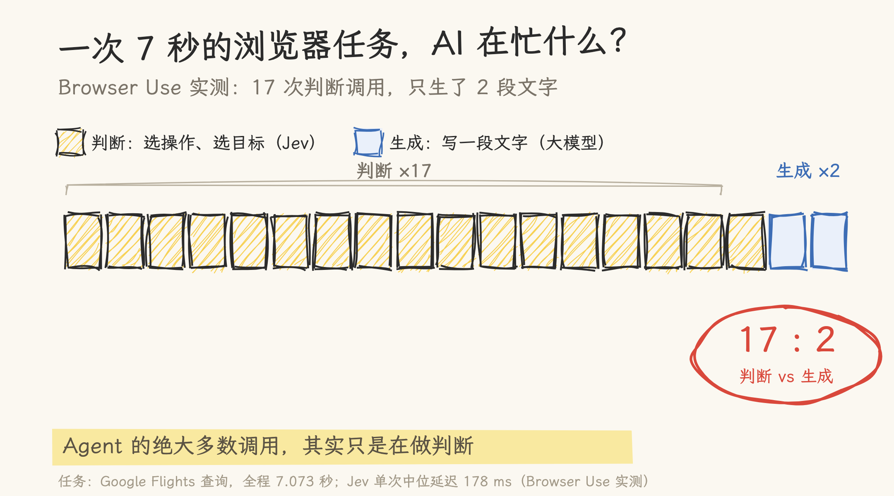
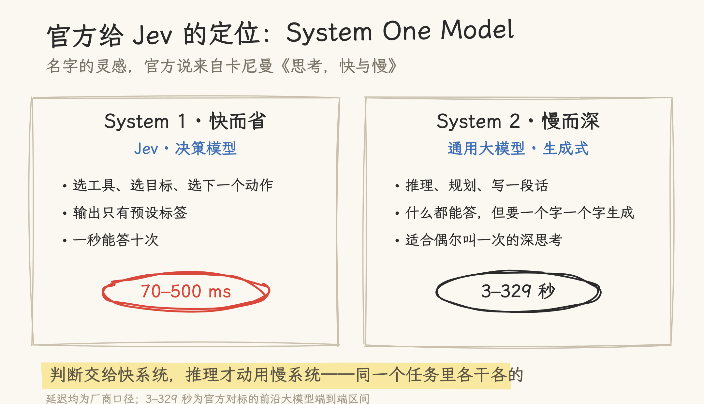
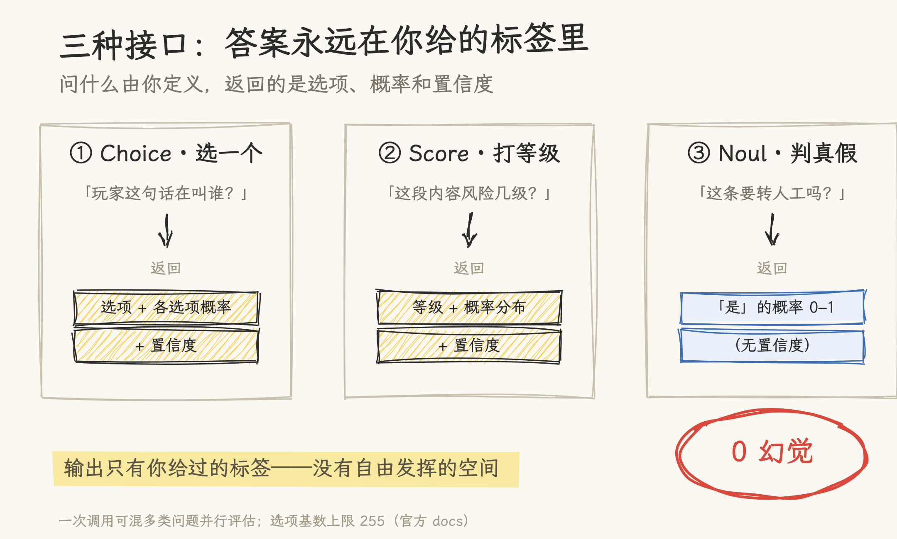
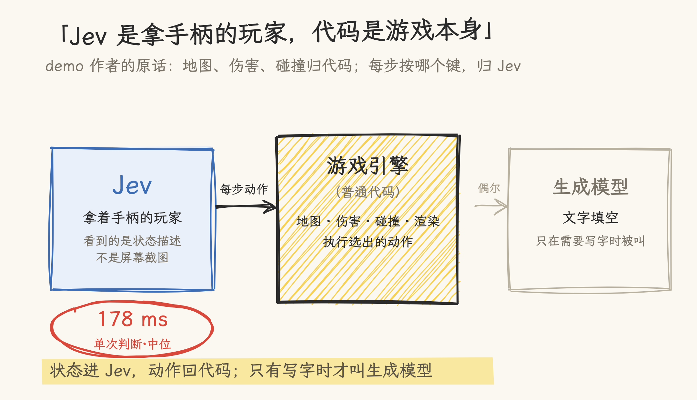
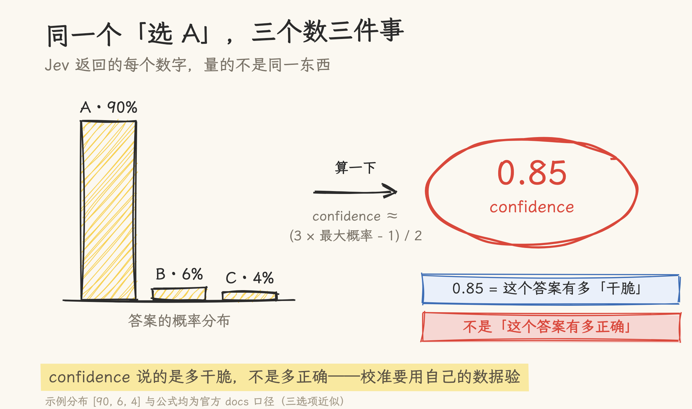
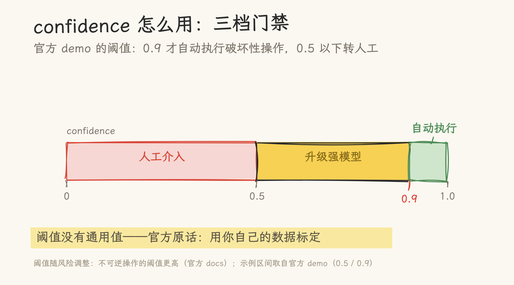
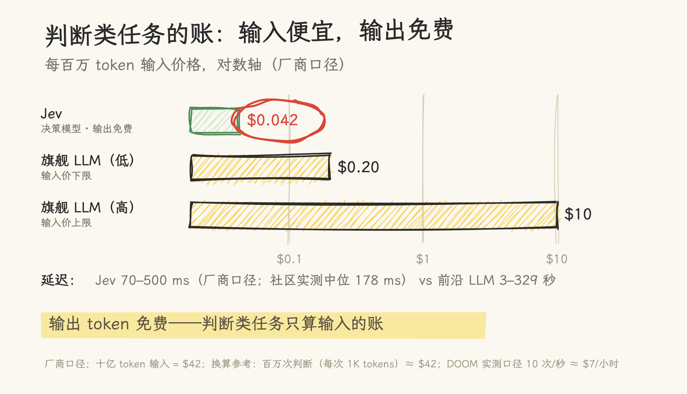

# Agent 的每一步，都需要大模型吗？七张图看懂刚爆火的决策模型 Jev

> 说明：「一个字」指一个 token；延迟与价格均为厂商口径，实测数字单独标注。

2026 年 9 月，TypeSafe AI 发布了决策模型 Jev，创始人是前 OpenAI 研究者 Diogo Almeida。发布没几天，社区就拿它玩起了 DOOM 和 Mario——模型每秒做十次判断，选出「前进、开枪还是跳」，游戏画面照样由游戏引擎渲染。Reddit 上刷了屏。

Jev 自己不生成任何文字。你给它当前状态和一组预设标签，它返回选中的选项、概率和置信度——本质是一个高速分类器，官方管这类模型叫 System One Models（系统一模型）。发布后问得最多的问题是：GPT 不也能干这个吗？腾讯技术工程的工程师拿它做了个浏览器 demo 之后，把问题问得更准了：我们现在搭 Agent，让大模型反复决定下一步——这里面有多少调用，真的需要大模型的完整推理能力吗？

**图 1**：Browser Use 的实测把账摆了出来：一次 7 秒的浏览器查票任务，AI 被调用了 19 次——17 次是「判断」（点哪个、选哪个），只有 2 次是真正的「写文字」（填城市名）。Agent 的绝大多数调用，其实都是在做判断。

**图 2**：两类活的分工：System 1 快而省，管反射式的判断；System 2 慢而深，管推理和生成。Jev 一次判断 70–500 毫秒；官方对标的前沿大模型端到端区间是 3–329 秒（均为厂商口径）——同样答一次题，延迟最多差出两三个数量级，高频调用时这笔差距会乘上去。

**图 3**：快是有代价的——它只会做选择题。三种接口：Choice 从你给的选项里选一个，返回选项加概率和置信度；Score 按你定的等级打分，返回等级加概率；Noul 判断真假，只返回一个 0–1 的概率。答案永远在预设标签里，没有自由发挥——所以也没有幻觉。（选项基数上限 255。）

**图 4**：所以它不替代大模型，是分工。腾讯技术工程 demo 作者的原话：「Jev 是拿手柄的玩家，普通代码是游戏本身」——状态整理好交给 Jev，它选动作，代码执行；地图、伤害、碰撞、渲染全归游戏引擎，只有要填「城市名」这种文字时，才叫一次生成模型。社区实测里，Jev 单次判断的中位延迟只有 178 毫秒。

**图 5**：但有一个概念最容易用错：置信度不是准确率。Jev 返回的 0.85，量的是「答案分布有多集中」——官方公式是 (3×最大概率−1)/2；它不是「这个答案有多大概率正确」。想拿 0.9 当自动执行的门槛？官方原话：阈值没有通用值，用你自己的数据标定。

**图 6**：正确用法是三档门禁：高置信直接自动执行；中置信升级给强模型再想一遍；低置信转人工或追问。阈值画在你自己的数据上，随风险调整——不可逆操作的门槛更高。你的代码，编码了你的风险容忍度。

**图 7**：最后算账。输入 $0.042/百万 token，输出免费——判断类任务的账只有输入这一项，十亿 token 才 $42。DOOM 那个每秒 10 次判断的玩法，厂商口径约 $7/小时。省下的不是算力，是每一次判断的延迟和钱。

判断与生成的分工，可能是 Agent 架构的下一层。Jev 能不能成为这个方向的主要选择还不确定——大模型厂商的结构化输出在推进，传统分类器在另一侧挤压，它的位置在两者之间：任务需要语义理解、标签变化频繁、又不值得为每个判断单独训模型。

## 参考资料

- [Introducing System One Models and Jev（TypeSafe 官方博客）](https://typesafe.ai/blog/introducing-system-one-models-and-jev)：定位、RLCD、并行采样、价格与延迟、DOOM 口径、限制声明
- [TypeSafe 官方文档](https://docs.typesafe.ai/introduction)：三接口定义、[confidence 的计算与标定](https://docs.typesafe.ai/confidence)、[智能家居 demo](https://docs.typesafe.ai/demos/smart-home)
- [Browser Use 实测记录](https://github.com/browser-use/jev-ultrafast/blob/main/docs/performance.md)：17 次 Jev 请求、178 ms 中位延迟、7.073 秒任务
- [腾讯技术工程《聊聊最近爆火的 Jev 模型到底是个啥》](https://mp.weixin.qq.com/s/w4kDVSF_beVA7CVhL_Xohw)
