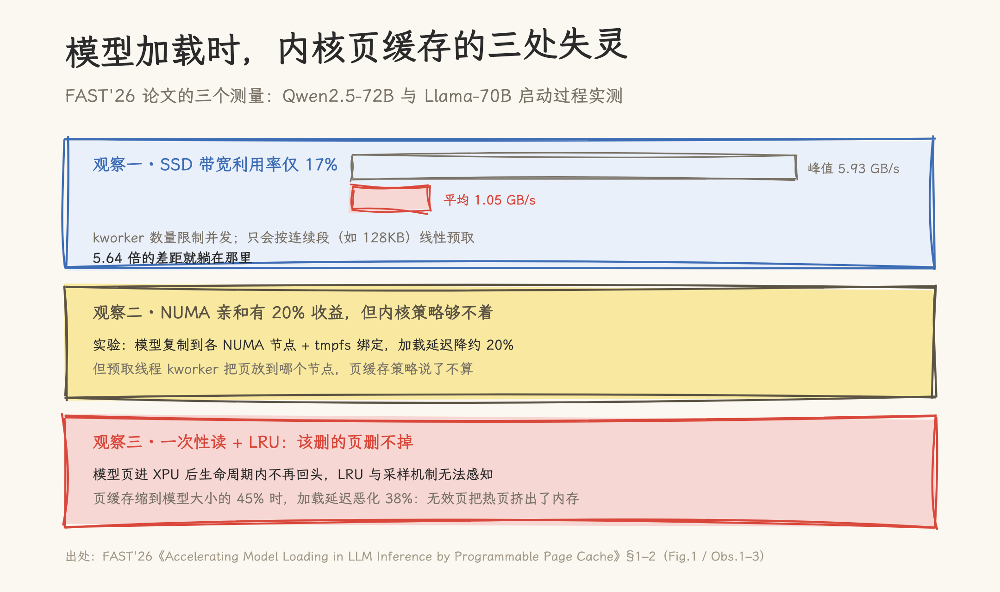
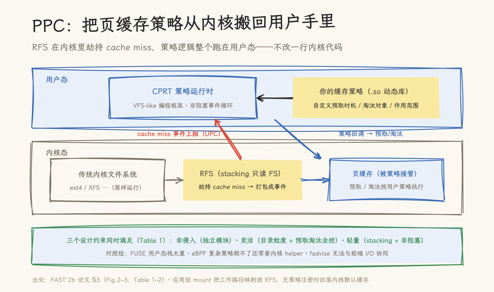
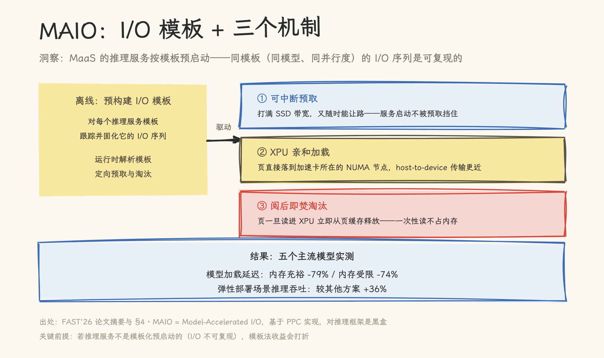

# 大模型启动，七成时间花在加载权重上：FAST'26 论文用可编程页缓存把延迟砍了 79%

> **元信息**：论文 *Accelerating Model Loading in LLM Inference by Programmable Page Cache*，Yubo Liu 等 8 人，Huawei Technologies，FAST '26（24th USENIX Conference on File and Storage Technologies，2026-02-24~26，Santa Clara）。正式论文集 Article No. 8，pp. 117–132；[USENIX 页面](https://www.usenix.org/conference/fast26/presentation/liu-yubo)公开 PDF 为 6 页版（本文分析基于此版本，完整评估见论文集第 5 节）。文中提到的 ModelFS 是该技术在 openEuler 侧的开源实现名，论文本身无此名。阅读日期 2026-10-09。

把一个 MaaS 推理服务拉起来要多久？论文给的数字：启动 DeepSeek-R1-671B，从对象存储加载模型占启动时间的 70% 以上；Qwen2.5-72B 的加载是分钟级的，占掉启动开销的一半以上。推理引擎的初始化、KV Cache 分配这些环节都被压缩得很好，唯独「把几百 GB 的权重从盘上读进加速卡」这一步，多年来基本靠内核默认行为硬扛。

这篇论文换了个问法：**内核页缓存的预取和淘汰策略，能不能像应用一样被编程？** 答案是 PPC（Programmable Page Cache）框架：文件系统层劫持 cache miss，策略逻辑整个跑在用户态。基于它实现的 MAIO 缓存策略，把模型加载延迟最多砍了 79%。

## 一、三个测量：内核页缓存为什么帮不上忙

论文的动机部分是典型的测量驱动，三个观察各对应一处内核机制的失灵。

**观察一：SSD 带宽远没用满。** 实测 Qwen2.5-72B 和 Llama-70B 的启动过程，模型加载期间的平均带宽只有 1.05 GB/s，而这块盘的峰值是 5.93 GB/s——利用率 17%，5.64 倍的差距。原因是内核预取机制的两处先天不足：kworker 线程数量有限，并发打不满 SSD；预取精度低，只会按连续段（如 128KB）做线性预取，而模型加载的 I/O 形态比这复杂得多。

**观察二：NUMA 亲和有收益，但策略够不着。** 作者做了一个实验：把模型复制到各个 NUMA 节点、用 tmpfs 绑定，让每张 XPU 从自己的节点加载——延迟降了约 20%。但这个优化没法放进内核页缓存策略，因为预取线程 kworker 把页放到哪个节点，页缓存策略说了不算。

**观察三：一次性读 + LRU = 该删的页删不掉。** 模型页被读进 XPU 之后，在推理服务的生命周期里基本不会再回头——这是典型的「读一次就扔」。但内核的页缓存回收靠采样加 LRU，识别不出这种时序局部性：该立刻释放的页赖在内存里。页缓存缩到模型大小的 45% 时，加载延迟恶化 38%，无效页把热页挤了出去。

三个观察指向同一个根源：**缓存策略对「模型加载」这个负载是盲的**。它不知道 I/O 从哪来、要到哪去、读完还要不要再读。自然的方向是让策略看见负载特征，但约束比想象中苛刻。

## 二、约束先行：为什么不是 FUSE、eBPF、fadvise

论文给「可感知模型加载 I/O 特征」定了三条硬约束，每条都来自生产环境的现实：

1. **对推理软件栈透明**。LLM 推理栈又多又杂（vLLM、SGLang……），基础设施厂商不可能替每个框架做选型，推理软件在策略眼里必须是黑盒；
2. **非侵入内核**。生产环境出于稳定性往往只允许用户态改动，改内核文件系统、加 eBPF helper 或 kfunc 都要过漫长的安全审查——论文的原话是，在生产集群里升级内核「以年计」；
3. **无硬件依赖**。不绑 NVLink、不绑特定加速卡特性，否则技术无法广泛落地。

拿这三把尺子量现有方案（论文 Table 1）：**FUSE 系**（如 XFUSE）灵活性最好——整个文件系统跑在用户态——但软件栈太重，前端 I/O 的开销躲不掉；**eBPF 系**（PageFlex、FetcheBPF）能把定制策略注入内核，但表达力不足：解析 I/O 特征文件、策略动态切换、目录级策略都做不了，还常需要加内核 helper，侵入性破功；**内核原生**的 `fadvise` 允许应用显式预取/淘汰，但它只是个孤立提示，无法与前端 I/O 深度协同。

PPC 填的就是这个空位。

## 三、PPC 设计：一个 stacking 文件系统加一个用户态运行时

PPC 由两个组件构成（论文 §3，Fig.2–3）。

**RFS（Routing File System）**：内核里的 stacking 只读文件系统。stacking 是个成熟的内核机制（OverlayFS 就是这么做的）——通过覆写 VFS 接口劫持操作，不需要改动原生文件系统的一行代码。RFS 把文件命名空间镜像一遍，应用挂载后用 RFS 的路径替换原路径；读操作发生时，RFS 检查页缓存：命中直接读，未命中就把 I/O miss 信息封装成事件，经 UPC（用户态过程调用）非阻塞地抛给用户态，再调底层文件系统拿数据。

**CPRT（缓存策略运行时）**：用户态的 VFS-like 编程框架。用户把缓存策略编译成动态链接库注册进来，CPRT 非阻塞地消费 RFS 抛上来的事件，在用户态执行预取和淘汰逻辑。策略挂载按目录粒度进行——`mount -t PPC` 建路径、`reg_policy` 注册策略库，没注册策略时回落内核默认行为，卸载即还原。

这个设计把三条约束逐个兑现：RFS 是独立内核模块，不碰任何既有组件（非侵入）；策略以目录为粒度、预取淘汰的时机与范围全可编程（灵活）；stacking 机制加非阻塞事件，前端 I/O 开销低（轻量）。**只读是刻意取舍**：模型加载天然只读，这让 RFS 的实现收敛到极小（论文说明了 read/mmap 两条路径，并指出写支持可扩展）。目前的 RFS 不修改 VFS 预取/淘汰机制，而是通过系统配置将其关闭，完全由用户策略接管。

## 四、MAIO：I/O 模板与三个机制

框架是通用的，策略才是针对模型加载的。MAIO（Model-Accelerated I/O）建立在一个洞察上：**MaaS 平台的推理服务是按模板预启动的**——模板描述模型、并行策略等参数，同一个模板（同模型、同张量并行度）在加载期的 I/O 序列是可复现的。既然可复现，就可以离线跟踪每个服务模板的 I/O 序列、预构建成 I/O 模板；运行时 MAIO 解析目标模板，做定向优化。这绕开了「内核策略必须是通用启发式」的死结——策略只需要对这一类负载聪明就够了。

模板驱动之下，三个机制各对一个问题：

**可中断预取**，对应观察一。预取打满 SSD 带宽，但随时可以让路——推理框架初始化、数据后处理这类非 I/O 阶段不再「饿死」预取窗口，I/O 与计算重叠得更充分，又不会挡住服务启动。

**XPU 亲和加载**，对应观察二。页直接落到加速卡所在的 NUMA 节点，host-to-device 传输走更近的路。

**阅后即焚淘汰（Burn-after-Reading）**，对应观察三。页一旦读进 XPU 立即从页缓存释放——一次性读不占内存，热页不再被挤出。

效果（摘要口径）：与现有兼容方案相比，模型加载延迟在内存充裕场景最多降 **79%**、内存受限场景降 **74%**；弹性部署的真实应用中，推理吞吐较其他受测方案最高提升 **36%**。五个主流模型实测，Qwen2.5-72B、Llama-70B 在公开版中可见。

## 五、效果之外：这是一笔「兼容性换性能」的赌注

论文在引言里反复对比的方案有两类：ServerlessLLM 的多级并行加载、BlitzScale 的跨 GPU 模型共享（NVLink/RDMA）。这些方案性能很强，但各有依附条件——改推理框架、或依赖特定互联硬件。PPC/MAIO 的赌注是：**生产环境里，兼容性的价值高于极致性能**——不能动内核、不能绑硬件、不能要求推理框架配合，在这样的约束下还能拿走大部分收益（79%），才是真正可部署的优化。

这个赌注对不对，取决于场景。如果你控制全栈（自研推理框架 + 自建集群），专门化的加载方案上限更高；如果你是基础设施/OS 团队，要服务千差万别的推理软件栈，PPC 这条「内核机制可编程化」的路线几乎是目前唯一同时满足三约束的选择。

公开版的局限也要说清楚：USENIX 官方 PDF 为 6 页，完整评估（五个模型的完整列表、基线对比细节、开销分析）在正式论文集第 5 节，本文未覆盖；RFS 当前只支持只读场景；MAIO 的模板法依赖「服务模板化预启动」这一 MaaS 前提，I/O 不可复现的场景收益会打折。

## 六、从论文到落地：openEuler 的 ModelFS

论文之外，这套技术已经以 **ModelFS** 的名字开源在 [openEuler](https://gitee.com/openeuler/ModelFS)（论文正文没有 modelFS 这个名字；宣传文案里的 modelFS 指 openEuler 实现）。openEuler 24.03 LTS SP3 起引入该特性，其文档把结构讲得很直接：

- **ModelFS**：整体特性名，基于 PPC（可编程页缓存）机制，对文件系统缺页做透明转发；
- **ModelFS-U**：用户态模块，即论文里 CPRT 的落地，提供一套 VFS-like 编程框架——模型实现者或 I/O 优化者实现 `init()`、`exit()`、`prefetch()`、`evict()` 四个回调，就能定制自己的缓存策略。

想在 openEuler 上把论文的思路用到自己的模型加载，入口就是实现这四个回调；PPC 的内核能力则随 openEuler 24.03 LTS SP4 的内核（Linux 6.6）分发。对于推理服务的弹性部署、故障迁移、一体机与嵌入式 AI 等启动延迟敏感的场景，这是一个可以实际试起来的路径。

## 论文结构索引

| 论文位置 | 内容 |
|---|---|
| Abstract / §1 | 问题规模（R1-671B 加载占 70%+）、三约束、PPC/MAIO 概述、79%/36% 结果 |
| §2 / Fig.1 | 三大观察：带宽 17%（5.64 倍差距）、XPU 亲和 20%、缓存 45% 时恶化 38% |
| Table 1 | FUSE / eBPF / 内核原生 / PPC 四路线对比（非侵入·灵活·轻量） |
| §3 / Fig.2–3 / Table 2 | RFS 架构与 mount/open/close/read/mmap 实现；CPRT 与策略 API |
| §4 | MAIO：I/O 模板、可中断预取、XPU 亲和、Burn-after-Reading 淘汰 |
| §5（正式版） | 完整评估（公开 6 页版未含，本文未覆盖） |
| openEuler | [gitee.com/openeuler/ModelFS](https://gitee.com/openeuler/ModelFS)；ModelFS-U 四回调接口见 openEuler 24.03 LTS SP4/26.09 文档 |

## 参考资料

- Yubo Liu et al., *Accelerating Model Loading in LLM Inference by Programmable Page Cache*, FAST '26, Article 8. [USENIX 页面](https://www.usenix.org/conference/fast26/presentation/liu-yubo) · [PDF（6 页公开版）](https://www.usenix.org/system/files/fast26-liu-yubo.pdf)
- openEuler ModelFS：[gitee.com/openeuler/ModelFS](https://gitee.com/openeuler/ModelFS)；特性需求单 [ID5W1P](https://gitee.com/openeuler/release-management/issues/ID5W1P)（24.03 LTS SP3）
- 对比方案：ServerlessLLM（多级并行加载）、BlitzScale（NVLink/RDMA 模型共享），见论文 §1 引文
