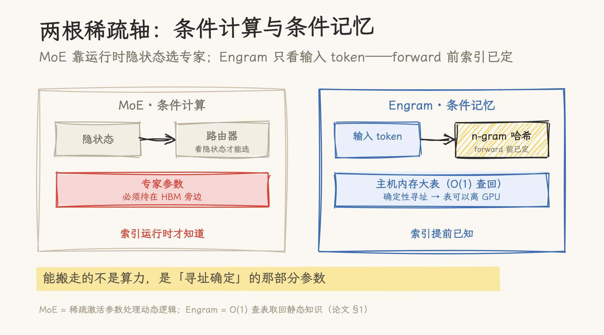
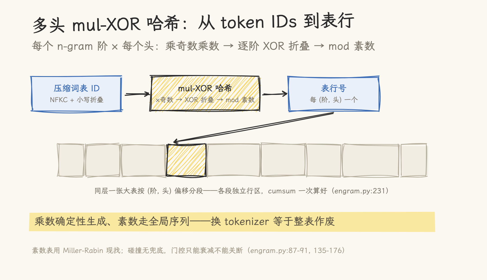
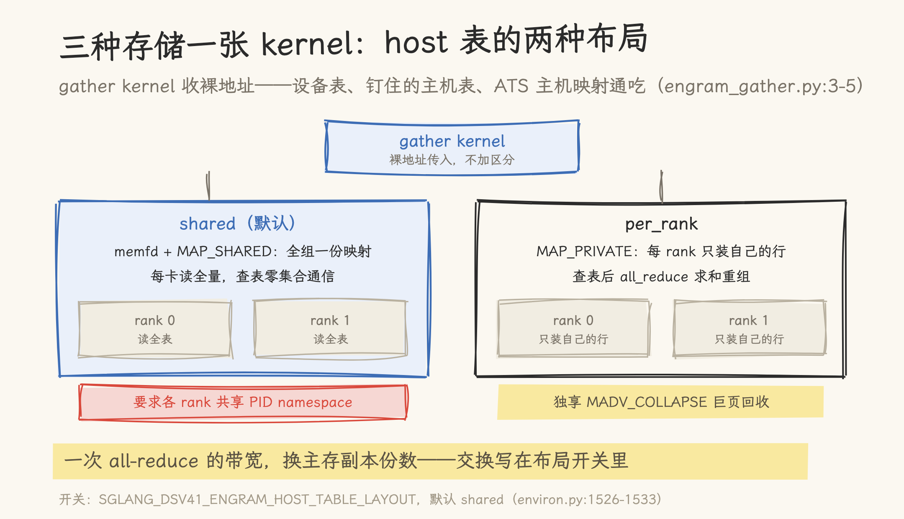
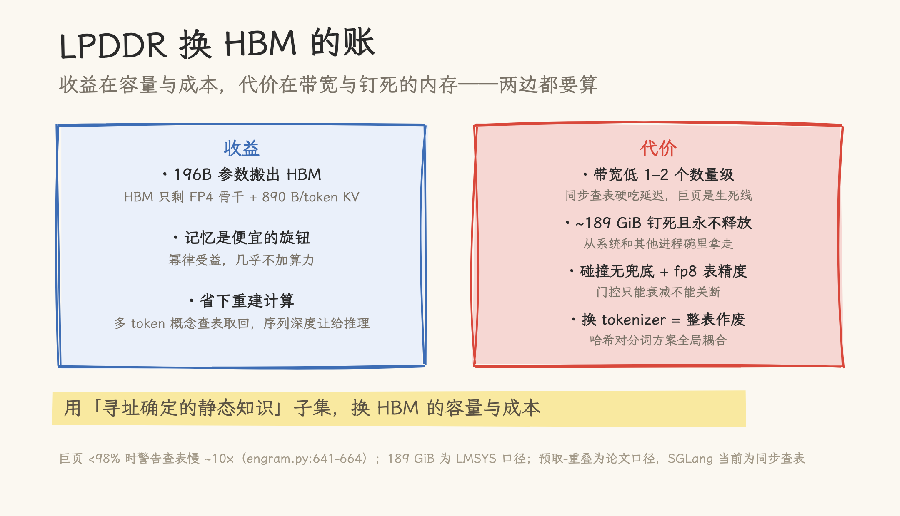

# 条件记忆：DeepSeek V4.1 Engram 如何用 O(1) 查表换掉一层计算

> 2026-09-26 | 源码深读。机制出处：DeepSeek 论文 _Conditional Memory via Scalable Lookup_（arXiv:2601.07372，2026-01）；实现出处两份——官方参考实现 [deepseek-ai/Engram](https://github.com/deepseek-ai/Engram)（`fb7f84a`，422 行 demo）与 SGLang 推理侧实现（main `0967a013c2`，2026-09-26 拉取）。全部行号以本地代码为准；V4.1-Flash 的层号与参数为 checkpoint config 口径（核对见 [02 篇](../kv_compression/02-deepseek-v41-flash.md)）；「189 GiB」为 LMSYS 博客口径，代码中无此数。

DeepSeek V4.1-Flash 有四分之一的参数不在 GPU 上：552B 骨干驻留 HBM，196B 的 Engram 记忆表驻留主机内存。舆论都在讲跑分，但这张表才是这代架构里最反直觉的决定——把参数从最快的显存搬到便宜的主存，性能反而没掉。

本站此前只在 V4.1-Flash 精读和分层缓存文里带过 Engram 的参数与内存账。这篇把源码拆开：Engram 到底是什么、官方 422 行 demo 怎么实现论文机制、SGLang 推理侧的 1400 多行代码为「从主机内存查表」做了哪些工程手术，以及用 LPDDR 换 HBM 这笔账的优势和代价各在哪里。

## 一、为什么需要第二根稀疏轴

论文的出发点是把语言建模拆成两类性质相反的子任务：**组合推理**需要深层、动态的计算；**知识检索**——命名实体、固定搭配、模板化句式——是局部的、静态的、高度刻板的。标准 Transformer 没有原生的「查表」原语，解析一个常见的多 token 实体要消耗好几层 attention 和 FFN，本质是在运行时昂贵地重建一张静态查表。

MoE 已经提供了一根稀疏轴：**条件计算**——按隐状态稀疏激活参数处理动态逻辑。Engram 补上另一根：**条件记忆**——对静态知识做 O(1) 查表。两者的分工由一条 U 型缩放律约束（第六节），V4.1-Flash 的答案是 552B 骨干 + 196B 记忆。

**图 1**｜MoE 的路由看运行时隐状态，专家参数必须待在 HBM 旁边；Engram 的索引只看输入 token，forward 前已定——这是记忆表能搬去主机内存的全部前提。

## 二、机制四件套

### 2.1 分词器压缩

标准子词分词器按「无损重建」优先，给语义等价的词形分配不同 ID（`Apple` 与 `␣apple`）。Engram 在哈希之前加一层规范化投影：NFKC → NFD → 去音调 → 小写 → 空白折叠（`engram.py:101-112`），再把全词表映射成压缩 ID（`engram.py:116-129`）。论文口径：128k 词表实际有效压缩约 23%。SGLang 用 assert 强校验压缩词表与 config 一致，不符直接拒绝启动（`engram.py:223-226`）——这不是可选项，是哈希正确性的前提。

### 2.2 多头乘法-XOR 哈希

给所有 N-gram 组合空间参数化不现实。Engram 对每个 n-gram 阶用多个哈希头，每头用「乘奇数乘数 + 逐阶 XOR 折叠 + 取模」把压缩后的上下文映射到一张**素数大小**的表里（torch 参考实现 `engram.py:200-206`，Triton kernel `engram_hash.py:176-183`）。素数表用确定性 Miller-Rabin 现找（`engram.py:87-91`），素数按 (layer, 阶， 头) 从同一条升序序列里顺序抽取（`engram.py:166-176`）。

每个 (阶， 头) 并不各建一张表，而是共用本层一张 `num_embeddings` 大小的表，靠偏移量分段（`engram.py:153, 231`）——段内偏移在加载时用 cumsum 一次算好。

**图 2**｜压缩词表 ID 经「乘奇数乘数 → 逐阶 XOR 折叠 → mod 素数」得到表行号；同层一张大表按 (阶, 头) 偏移分段。乘数与素数序列都是确定性生成的——换 tokenizer 等于整表作废。

### 2.3 上下文门控 + 单次 GEMM 融合

查表回来的记忆向量怎么和当前上下文结合？SGLang 的做法（`engram.py:896-902`）：一个 `ReplicatedLinear` 把 n-gram 哈希列一次投影出 **hc 份 key + 一份共享 value**——多分支各拿各的 key 做门控，共享同一个 value。门控是「归一化 → 点积 → 符号平方根 → sigmoid」的签名门（`engram.py:869-875`），Triton kernel 全程 FP32（`engram_gate.py:27-38`）。权重是 block-FP8（`deepseek_v4.py:5275-5276` 的 scale 改名可证），表内容本身是 fp8 e4m3 载荷 + e8m0 块 scale，查表输出 bf16（`engram_gather.py:46`）。

### 2.4 确定性寻址

这是整篇最重要的设计约束：**n-gram 索引只依赖输入 token IDs，在进入层循环之前就完全确定**。SGLang 在模型 forward 的层循环开始前一次算完全部哈希（`deepseek_v4.py:4396-4417`），随后切片分发给各 Engram 层（`:4452-4454`）——hidden state 全程不参与。MoE 的路由依赖运行时隐状态，专家参数必须待在 GPU 旁边；Engram 的检索目标 forward 前已知，这是它能把表搬到主机内存的前提。

## 三、官方 demo：422 行的最小可读实现

[deepseek-ai/Engram](https://github.com/deepseek-ai/Engram) 是论文的官方参考实现（README 自述），核心是 422 行的 `engram_demo_v1.py`：压缩 tokenizer、mul-XOR 哈希、素数表头、按偏移分段的 MultiHeadEmbedding、逐头「norm → 点积 → signed-sqrt → sigmoid」门控（`:366-374`）——上面四件套它全有，而且多一样 SGLang 里没有的东西：**ShortConv 分支**（`:123-179`），在记忆之上叠一层短卷积：`output = value + self.short_conv(value)`。

demo 也如实标注了自己的边界（README）：Attention、MoE、mHC 都是 mock。FP8 表、host 内存、decode/verify/history 机制、TP 分片、融合 gate kernel——这些产品级的东西要看 SGLang。

## 四、SGLang 推理侧：1400 行代码的工程手术

模块地图：`srt/layers/engram.py`（925 行，层与主机表）+ 三个 kernel（`engram_hash.py` 哈希、`engram_gather.py` 查表、`engram_gate.py` 门控）+ `model_executor/model_runner_components/ngram_embedding_manager.py`（n-gram 历史管理）+ `models/deepseek_v4.py` 接入点（`:2683-2690` 按 `layer_id in engram_layout.layer_ids` 逐层条件插入）。

### 4.1 三种存储，一张 kernel

`engram_gather.py` 的文档字符串写得很直白：table pointers 以裸地址传入，**同一个 kernel 可以服务设备表、钉住的主机表、乃至（Grace-Blackwell 上经 ATS 的）普通主机映射**（`:3-5`，实现 `:35-36` 把指针转 int64 再转回指针类型）。

由此派生出两种主机表布局，这是一组显式的 tradeoff（`engram.py:554-594`）：

| 布局             | 内存                                                    | 通信                                                    | 约束                                             |
| ---------------- | ------------------------------------------------------- | ------------------------------------------------------- | ------------------------------------------------ |
| `shared`（默认） | `memfd_create` + `MAP_SHARED`，全组一份映射，每卡读全量 | 查表**零集合通信**（`:743-755` 直接返回）               | 要求 TP 各 rank 共享 PID namespace（`:608-611`） |
| `per_rank`       | `MAP_PRIVATE` 匿名映射，每 rank 只装自己的行            | 非 本 rank 行清零 + `all_reduce` 求和重组（`:771-779`） | 独享 `MADV_COLLAPSE` 巨页回收（`:613-633`）      |

用一次 all-reduce 的带宽，换每卡 HBM 占用或主存副本份数——通信与冗余的交换写在了布局开关里。

host 表默认是关闭的：`SGLANG_ENABLE_DSV41_ENGRAM_HOST_TABLE` 默认 False，不开时表按行分片驻留 HBM（`environ.py:1526-1533`）——「196B 驻留主机内存」是 Flash 产品侧的选择。

**图 3**｜gather kernel 收裸地址，设备表、钉住的主机表、ATS 主机映射通吃。shared 每卡读全量、查表零通信，但要求共享 PID namespace；per_rank 只装自己的行、靠 all-reduce 重组，换来独享巨页回收。

### 4.2 巨页手术：主机查表快不快的生死线

「表放主存」和「表放主存且真能被 2 MiB 巨页覆盖」是性能差一个数量级的两件事。`_HostTable` 为此做了一整套 OS 级操作：

- 建表不用 `cudaHostAlloc`，而是 `memfd_create` + `ftruncate` + `madvise(MADV_HUGEPAGE)`，再 `cudaHostRegister` 注册成 CUDA 可访问内存（`engram.py:547, 581, 592, 599`）；
- 加载 checkpoint 前先 `posix_fadvise(DONTNEED)` 丢掉 page cache（`:511-530`）——缓存住的旧页会让 512 MiB 巨页 fault 回退（per_rank 路径）；
- `per_rank` 布局注册前用 `np.frombuffer(...)[::PAGESIZE] = 0` 逐页 touch（`:586-587`），确保物理页按巨页粒度分配；
- 然后用 `ctypes` 直调 `libc.madvise(MADV_COLLAPSE=25)` 同步折叠巨页（`:613-633`，Python 的 mmap 模块没有这个常量，注释标明要求 Linux ≥ 6.1），EAGAIN 重试三次；
- 最后读 `/proc/self/smaps` 实测 `AnonHugePages/ShmemPmdMapped` 占比，低于 98% 就丢缓存重折一次；仍为 0 时直接警告「预计查表慢约 10 倍（每行一次 TLB miss）」（`:641-664`）。这套重折与验证是 per_rank 路径专属——shared 是 shmem，`MADV_COLLAPSE` 对它直接拒绝。

把巨页占比当成必须验证的运行时指标，而不是默默祈祷，是这一段最值得学的地方。

### 4.3 数值一致性是硬约束，tokenizer 是全局耦合点

Triton kernel 与 torch 参考实现**必须逐位一致**（`engram_hash.py:10-11`）——decode 路径只有 Triton、ROCm/CPU 只有 torch，两条路径产出的 hash id 不同就无法共享一张表。为此整条链路被做成强确定的：乘数由 `np.random.default_rng(10007 * layer_id)` 生成、上界按 `int64max // vocab_size // 2` 防溢出（`engram.py:135-146`）；素数按全局序列顺序抽取，vocab_size、layer_ids、n_heads、max_ngram_size 任一改动都会整表重排（`:158-160` 文档写明）；压缩词表大小「进入每一个哈希乘数」，与 checkpoint 不符直接 assert。

推论：**换 tokenizer 等于整张表作废**。哈希全链路对分词方案是全局耦合的。

### 4.4 确定性行为的三处细节

decode 路径的哈希与 n-gram 历史 commit 融合在同一次 kernel launch（`engram_hash.py:160-169`），用 `out_cache_loc == 0` 识别 CUDA-graph padding 行防止污染历史（`engram.py:322-324`）；图像 token 会对更老的 n-gram 窗口做级联封堵（`engram.py:429-435`）；BCG 场景强制 eager、注释写明不能进 CUDA graph（`deepseek_v4.py:734-740`）。

## 五、用 LPDDR 换 HBM：优势和代价

Engram 的表可以离开 GPU，根本原因是 2.4 节的确定性寻址——索引在 forward 前已知，参数放哪都能算。但「能搬」不等于「白搬」，这笔账两边都要算。

**图 4**｜LPDDR 换 HBM 的收益与代价。巨页折叠失败时最坏警告查表慢约 10 倍；189 GiB 为 LMSYS 口径；预取-重叠是论文口径，SGLang 当前为同步查表。

**收益侧**：

- **省下最贵、最缺的资源**。196B 记忆表从 HBM 挪到主机内存（每 token 只检索常数个槽位），HBM 只剩骨干和 FP4 全局 KV（890 B/token）。对 HBM 受供应约束的硬件路线，这是结构性松绑；
- **记忆是便宜的扩展旋钮**。论文的「无限记忆」实验显示，固定骨干、只加 Engram 槽位，验证损失随记忆规模按幂律下降——加记忆几乎不加算力，且可预测；
- **顺带省了计算**。多 token 概念的「重建」被查表替代，省下的序列深度让给组合推理。

**代价侧**（源码与部署口径）：

- **带宽鸿沟是真的**。主机查表走 PCIe 与 LPDDR，带宽比 HBM 低一到两个数量级。SGLang 当前实现的对策不是论文说的预取-重叠，而是**同步查表 + 巨页把每次访问做到可用**——`ngram_embedding_manager.py` 全文没有 prefetch、没有独立 stream（哈希在层循环前同步完成，见 §2.4）。也就是说：预取-重叠目前是论文口径，代码里靠巨页硬吃延迟，巨页折叠失败就是警告里那个 10 倍；
- **主机内存被钉死一大块**。LMSYS 口径约 189 GiB 钉住内存，且进程生命周期内永不释放（`engram.py:550-552`）——这笔占用直接从系统和其他进程碗里拿走；
- **布局是二选一的 tradeoff**。`shared` 省通信但要求共享 PID namespace 且每卡读全量；`per_rank` 省副本但每次查表多一次 all-reduce（§4.1 的表）；
- **精度做了裁剪**。表内容 fp8 e4m3 + e8m0 scale，门控权重 block-FP8——记忆查的是「够用」而非「精确」；
- **哈希碰撞没有兜底**。碰撞直接读到别的行，门控的 sigmoid 只能衰减不能关断该分支；越界与非本 rank 行输出零行。论文赌的是素数表 + 多头把碰撞压到极低，但没有运行时检测；
- **tokenizer 是全局耦合点**。换分词方案 = 整表作废（§4.3）。

一句话：LPDDR 换 HBM 的本质，是用「确定性能预取的静态知识」这个子集，去换 HBM 的容量与成本——代价是带宽、钉住的主存、和一串必须在工程上逐一关掉的坑。

## 六、U 型缩放律与行业横向

论文把「固定总参数预算下，MoE 专家和 Engram 槽位怎么分」形式化为稀疏分配问题，得到一条 U 型缩放律：Engram 占比太低，模型缺静态记忆，被迫用深度重建模式；占比太高，损失条件计算能力——记忆替代不了推理。中间的最优点在不同规模下位置稳定。V4.1-Flash 的 552B/196B 就是这条律上的一个工作点。

这条路线不是 DeepSeek 独有（以下为各模型卡口径）：美团 LongCat-2.0 明确列出 135B 的 N-gram Embedding 参数，并给出与论文同构的表述——「MoE 的稀疏度已越过甜点，N-gram 嵌入的比例被约束在最优区间内」；阿里 Qwen3.8-Flash-Next 的模型卡称 N-gram Embedding 是「比 MoE 更易于卸载的参数扩展轴」。三家同代旗舰同时把参数搬向主机内存，「用 LPDDR 换 HBM」已经不是权宜之计。

## 七、边界与诚实声明

- 本文机制描述以论文为准（预取-重叠、Zipf 多级缓存含 NVMe 层、U 型缩放律均为论文口径）；SGLang 代码中未见 prefetch 与 NVMe 层，巨页 + 同步查表是当前的工程答案；
- V4.1-Flash 的 `engram_layer_ids=[1, 14]`、`max_ngram_size=4`、`n_heads=8`、196.6B = (384,006,168 + 384,016,682) × 256 为 checkpoint config 口径（核对见 [02 篇](../kv_compression/02-deepseek-v41-flash.md)）；官方 demo 的默认是 `[1, 15]`、3-gram、8 头（`engram_demo_v1.py:41-45`），那是教学配置——论文记载的 Engram-27B 实配为第 2、15 层、3-gram、8 头、维度 1280。两套数字都不要与 Flash 的混用；
- 「189 GiB 钉住内存」为 LMSYS 博客口径，代码中只能读到加载后的 resident/huge-page 日志（`engram.py:649-652`）；
- SGLang 的 Engram 路径强制 eager、不支持 CUDA graph（BCG 场景，`deepseek_v4.py:734-740`），吞吐代价未量化；
- host 表是 opt-in：`SGLANG_ENABLE_DSV41_ENGRAM_HOST_TABLE` 默认 False，默认布局下表按行分片驻 HBM。

---

## 源文件索引

| 文件                                                                | 关键内容                                                | 引用点                                                                                                                                   |
| ------------------------------------------------------------------- | ------------------------------------------------------- | ---------------------------------------------------------------------------------------------------------------------------------------- |
| `srt/layers/engram.py`                                              | 层、`_HostTable`、布局、门控、规范化                    | :87-91, :101-129, :135-176, :200-206, :223-231, :268-278, :322-324, :429-435, :511-664, :689-697, :743-779, :810-839, :864-902, :919-920 |
| `kernels/ops/embeddings/engram_hash.py`                             | mul-XOR 哈希 kernel、bit-identical 约束、history commit | :10-11, :160-169, :176-183                                                                                                               |
| `kernels/ops/embeddings/engram_gather.py`                           | 裸地址查表、fp8→bf16                                    | :3-5, :29-46                                                                                                                             |
| `kernels/ops/embeddings/engram_gate.py`                             | FP32 签名门控                                           | :1, :27-38                                                                                                                               |
| `model_executor/model_runner_components/ngram_embedding_manager.py` | n-gram 历史管理                                         | :94-105, :107-168, :170-205                                                                                                              |
| `models/deepseek_v4.py`                                             | 逐层插入、层前哈希、BCG eager、scale 改名               | :2683-2690, :4396-4417, :4452-4454, :5275-5276, :734-740                                                                                 |
| `configs/deepseek_v4.py` / `deepseek_v41.py` / `model_config.py`    | engram config 字段与开关                                | :112-119 / :54-61 / :718                                                                                                                 |
| `srt/environ.py`                                                    | host 表开关与布局 env                                   | :1526-1533                                                                                                                               |
| `Engram/engram_demo_v1.py`（官方仓库）                              | 论文最小参考实现、ShortConv                             | :41-45, :68-110, :123-179, :305-324, :366-374                                                                                            |

## 参考资料

- 论文：Cheng et al., [Conditional Memory via Scalable Lookup: A New Axis of Sparsity for Large Language Models](https://arxiv.org/abs/2601.07372)（arXiv:2601.07372）
- 官方实现：[deepseek-ai/Engram](https://github.com/deepseek-ai/Engram)（demo 参考实现，`fb7f84f`）
- 本站 [DeepSeek-V4.1-Flash 精读](../kv_compression/02-deepseek-v41-flash.md)——Engram 参数与配置的 checkpoint 核对
- 本站 [多级缓存](../kv_compression/03-multilevel-cache.md)——Engram 内存不进池清单的上下文
- LMSYS 博客（2026-09-10，SGLang 团队）——189 GiB 与两种 host 布局的部署取舍（转引，代码中无该数字）
- 智猩猩AI 转载文《用 LPDDR 取代 HBM》（2026-09-11）——本文写作的线索来源；行业横向部分的模型卡表述为二手转引
