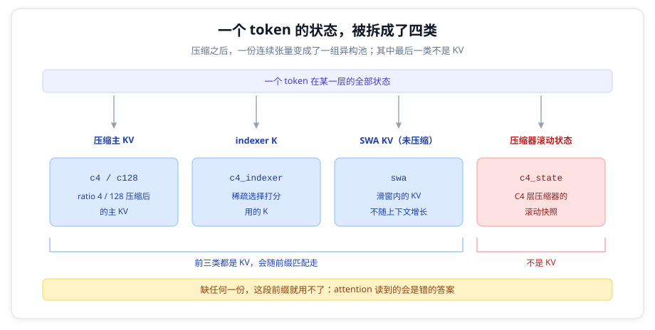
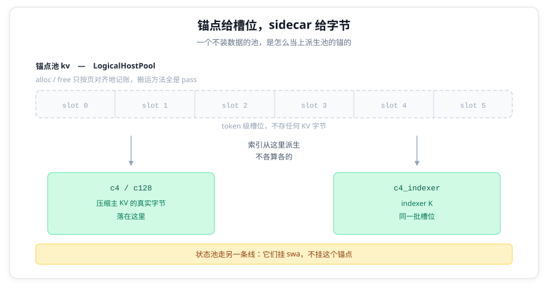
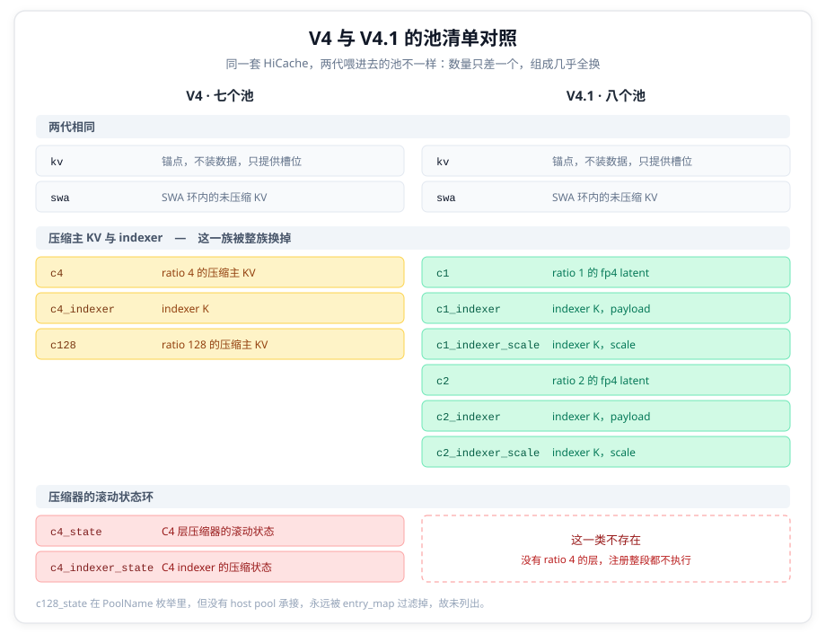
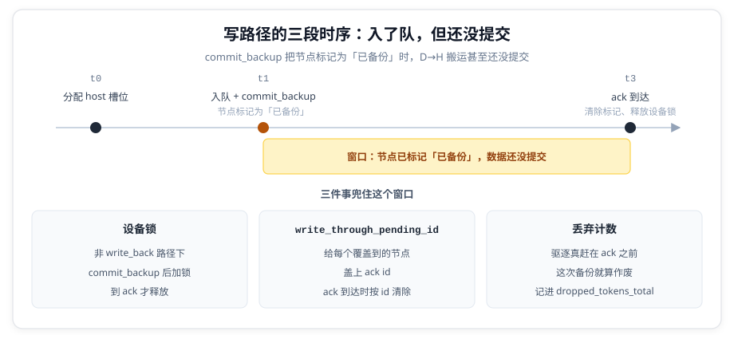

# 七池与八池：HiCache 支持 DeepSeek V4 与 V4.1 的不同接法

> [上篇 - 把 KV Cache 压缩推到极限：DeepSeek-V4.1-Flash 技术报告精读](deepseek-v41-flash-kv-compression.md) 读的是 V4.1-Flash 的技术报告，算的是每 token 的体积账：常驻 HBM 的 global KV 压到 890 字节/token，比 V4-Flash 小 3.9 倍。但压缩改掉的不只是体积，还有 KV 的**形态**：一个 token 的状态不再是一段连续张量，而是散在一组异构池里。
>
> **先纠正一个概念。** KV Cache Offloading 这个词已经不够用了：V4 要下推的不只是 KV，还有一整类压缩器的滚动状态（state）。它们同样占显存，同样要下推到 host，恢复时也得找回来，但在匹配语义、备份单位、能否备份这三件事上跟 KV 并不一样。本文说的「池」，KV 与 state 都算。
>
> 本文读源码。SGLang 把分层缓存叫 HiCache，L1 是 GPU 显存、L2 是 host 内存、L3 是远端存储，本文只看 L1 与 L2 之间的那一段。两代 DeepSeek V4 的池形态不同，HiCache 得为它们各搭一套挂接：池的数量只差一个，组成却几乎全换了。
>
> 2026-09 | 源码：SGLang `c475ac5eaf`（2026-09-19）。引用点标注为 `文件:行号`，相对仓库根；默认的 tree core 后端是 Python 实现（`tree_core_registry.py:1-6`），所以正文以 Python 为准，Rust 侧的实现只在关键处并列。

---

## 一、从七个池到八个池

V4 的每一层产出不止一种状态。压缩后的主 KV、稀疏选择要用的 indexer K、压缩器的滚动状态，各自有独立的内存池。



SGLang 把这些池的名字收在同一个枚举里（`hicache_storage.py:60-92`），V4 相关的有十五个取值，实际注册进 host pool group 的是其中一部分。

### 1.1 V4：C4/C128 压缩 KV，加两个状态环

注册全在 `build_deepseek_v4_hicache_stack`（`hybrid_pool_assembler.py:719-1013`）里。**V4（CUDA、FP8 配置）最终是七个**：

| 池                             | 装什么                | 索引来源 | 注册处                             |
| ------------------------------ | --------------------- | -------- | ---------------------------------- |
| `kv`（锚点）                   | 不装数据，纯槽位      | 自身     | `hybrid_pool_assembler.py:786-793` |
| `swa`                          | SWA 环内的未压缩 KV   | 自身     | `:811-824`                         |
| `deepseek_v4_c4`               | C4 压缩主 KV          | `kv`     | `:842-850`                         |
| `deepseek_v4_c4_indexer`       | indexer K             | `kv`     | `:851-869`                         |
| `deepseek_v4_c128`             | C128 压缩主 KV        | `kv`     | `:951-975`                         |
| `deepseek_v4_c4_state`         | C4 层压缩器的滚动状态 | `swa`    | `:884-924`                         |
| `deepseek_v4_c4_indexer_state` | C4 indexer 的压缩状态 | `swa`    | `:884-924`                         |

`DEEPSEEK_V4_C128_STATE` 在枚举里，但**故意不注册**（`hybrid_pool_assembler.py:949-950`）：

```text
        # C128 state pool is intentionally not registered with hicache.
        # page_size=256 % 128 == 0, so state pool is not consumed on load.
```

`page_size`（256）能被 C128 的压缩比（128）整除，注释给出的理由是 `state pool is not consumed on load`：恢复时用不到它，所以不必占一份 host 侧注册。这个推理为什么只写给 C128 而不写给 C4，源码里没有第二处解释。

### 1.2 锚点池不装数据

注册表里最反直觉的一项是 `kv`。它的 host 侧是一个专门为此写的类（`memory_pool_host.py:56-175`）：

```text
class LogicalHostPool:
    """Pure-logical anchor pool for V4 HiCache.

    The pool manages page-aligned token slots but holds no KV tensor. V4
    compressed side pools use these logical FULL indices as stable page anchors.
    """
```

它的搬运方法全是空操作：`backup_from_device_all_layer` 与 `load_to_device_per_layer` 都是 `pass`（`:145-148`、`:150-160`），`get_data_page` 返回空张量（`:162-163`）。`alloc` 与 `free` 还额外强制按页对齐（`:117`、`:134` 两条 `must be page-aligned` 断言）。

换句话说，V4 在 host 上的真实字节全部落在别的池里，锚点只提供索引空间和「是否已备份」的记账。



### 1.3 V4.1：ratio 1/2 的 latent，状态环消失

两代的差别不在池的数量上，在压缩比的取值域上。`compress_ratio` 允许 `{0, 1, 2, 4, 128}`（`models/deepseek_v4.py:784-792`），其中 **ratio 1 和 2 只有 V4.1 用**（`configs/deepseek_v41.py:44` 的注释：the native V4 config rejects 1/2）：

> `docs/cookbook/autoregressive/DeepSeek/DeepSeek-V4_1.mdx:89`
>
> ```text
> **compressed latents**, produced only at source layers and shared forward,
> collapsing 2 positions into 1 in layers 2–19 and 1-to-1 from layer 20 on
> ```

V4.1-Flash 的 40 层（cookbook `:87`）里没有一层是 ratio 4 或 128，它用的是 ratio 1 与 2 的 latent（一个 latent 就是每个位置压出来的一条 512 宽 KV 向量，同时当 key 和 value 用；cookbook 同页说这代只有四个 KV source 层，另有八个 index source 层）。这带来两个连锁后果。

**第一，C1/C2 是另一族池，由另一个函数注册。** 它们不在 `build_deepseek_v4_hicache_stack` 的主体里，而在 `_dsv4_low_ratio_entries`（`hybrid_pool_assembler.py:588-664`），由主体在 `:989-991` 调用：

```python
    for ratio, names in (
        (1, (PoolName.DEEPSEEK_V4_C1, PoolName.DEEPSEEK_V4_C1_INDEXER, PoolName.DEEPSEEK_V4_C1_INDEXER_SCALE)),
        (2, (PoolName.DEEPSEEK_V4_C2, PoolName.DEEPSEEK_V4_C2_INDEXER, PoolName.DEEPSEEK_V4_C2_INDEXER_SCALE)),
    ):
```

低比例的 indexer 一律 `force_fp4=True`（`deepseek_v4_memory_pool.py:1416`），走 `uses_aiter_fp4_layout` 分支，于是 `index_k_with_scale_buffer` 被置为 `None`、拆成 payload 与 scale 两份。所以每个 ratio 出三个池而不是两个。

**第二，两个状态环消失了。** 注册 C4 状态池的那段（`hybrid_pool_assembler.py:884` 的 `if not is_unified_kv:`）缩进是 8，**嵌在 `if c4_layer_mapping:`（`:826`，缩进 4）里面**。V4.1 没有 ratio 4 的层，`c4_layer_mapping` 为空，整段都不执行。

于是 V4.1 是八个：

| 池                             | 装什么                        | 索引来源 | 注册处     |
| ------------------------------ | ----------------------------- | -------- | ---------- |
| `kv`（锚点）                   | 不装数据，纯槽位              | 自身     | 同 V4      |
| `swa`                          | SWA 环内的未压缩 KV           | 自身     | 同 V4      |
| `deepseek_v4_c1`               | ratio 1 的 fp4 latent         | `kv`     | `:588-664` |
| `deepseek_v4_c1_indexer`       | ratio 1 的 indexer（payload） | `kv`     | 同上       |
| `deepseek_v4_c1_indexer_scale` | ratio 1 的 indexer（scale）   | `kv`     | 同上       |
| `deepseek_v4_c2`               | ratio 2 的 fp4 latent         | `kv`     | 同上       |
| `deepseek_v4_c2_indexer`       | ratio 2 的 indexer（payload） | `kv`     | 同上       |
| `deepseek_v4_c2_indexer_scale` | ratio 2 的 indexer（scale）   | `kv`     | 同上       |

**七变成八，装的东西几乎全不一样。** V4 的压缩主 KV 与压缩器状态被换成了 V4.1 的低比例 latent 与其 fp4 indexer，状态环这一类干脆不存在。



枚举里还有几个池名实践中不出现：

- `deepseek_v4_c4_rope` / `deepseek_v4_c128_rope` 只在 ROCm 的 unified KV 布局下注册。unified KV 会把一行拆成 fp8 的 nope 池与 bf16 的 rope 池两份（`hicache_storage.py:81-82`），而 `_dsv4_rope_sibling` 在非 unified_kv 时直接返回 `None`（`hybrid_pool_assembler.py:667-686`），所以 CUDA 上不建这两个池。
- `draft` / `draft_indexer` / `draft_swa` 属于 DSpark，V4.1 自带的三阶段投机草稿（cookbook `:87`），不属于主干。

V4.1 还有两样东西同样不进池清单：Engram 的 n-gram 记忆表走独立的 pin 内存（`layers/engram.py:547` 的 `_HostTable` 自己 `memfd_create` 加 `cudaHostRegister`，整个文件不 import `mem_cache`），SWA bounded replay 改的是层的计算范围，不新增池。

### 1.4 单池时代留下的三条假设

不管 L2 是 host DRAM 还是别的介质，分层缓存在单池 KV 时代攒下的实现都建立在这三条上：

1. 一个池。备份一个节点等于把它的 KV 搬下去，恢复等于搬回来。
2. 节点粒度是天然的备份边界。radix tree 的一个节点就是一段前缀。
3. 备份状态是二元的。数据要么在 L2，要么不在。

下面三条冲突对应这三条假设。

---

## 二、三个结构性冲突

### 2.1 一个前缀的恢复，要求所有池同时就位

分层缓存的读路径有个硬约束：某个前缀能用，前提是**属于它的每种状态都能拿到**。单池 KV 下这条天然成立，因为 KV 是一个张量，搬就整体搬。

多池下不成立。一个 token 的可用状态分布在七个（V4.1 是八个）池里，缺任何一个，attention 读到的就不是这段前缀。而驱逐的粒度是树节点：host 侧有一套独立的 LRU 与叶子集合（`evictable_host_leaves`、`host_lru_lists`，`unified_tree_core.py:519-520`），和 device 侧那套是分开的，所以「host leaf」指的是 host 侧 LRU 上的叶子节点，不是 device 侧的叶子。

如果一个节点的多个池能被独立驱逐，就会出现「主 KV 还在、状态已经没了」的中间态，而树上仍然认为这个前缀可用。

所以节点粒度的备份边界，在多池下必须升级成**跨池的原子单元**。上游的答案是让驱逐本身原子化。`_evict_host_leaf` 的文档字符串第一句就是「Atomically evict all components on a host leaf」（`unified_tree_core.py:1831`）。

### 2.2 状态池不在树的匹配语义里

树的匹配边界由各 component 的 validator 决定。SGLang 的 `ComponentType` 只有四个取值（`unified_cache/component_type.py:6-12`）：`FULL`、`SWA`、`MAMBA`、`C128`。而 CUDA 路径上 V4 只注册了两个（`registry.py:164-181`，V4 命中 `is_hybrid_swa`）：

```python
    tree_components = [ComponentType.FULL]
    if ctx.is_hybrid_swa:
        tree_components.append(ComponentType.SWA)
```

也就是说，压缩状态池**都没有对应的 component**，不设 validator，不影响匹配边界。它们在匹配语义里是隐形的。

这是刻意的：状态是 chunks 的滚动快照，没有「前缀」这个概念。但它带来一个后果：树的匹配结果无法保证状态池也命中。恢复路径必须在别处补上这个保证。

而 SWA 的 validator 是有窗口门槛的：沿树连续累计，中途遇到缺口就清零，累计值达到 `sliding_window_size` 才承认边界。**这条只在 Rust 侧有那个直白的变量名**（`components/swa.rs:402` 的 `contiguous_len`）；Python 侧用的是 dict 状态 `state["len"]`（`components/swa.py:325`、`:339`、`:340`），逻辑相同、写法不同。

**「不参与匹配」只适用于压缩状态池，C128 不算。** NPU 上的 `C128SidecarComponent` 是有 validator 的（`registry.py:170-179`，门槛是 `req_to_c128_sidecar`）。

### 2.3 复制型 KV 与按 rank 切分的 sidecar

**sidecar** 指自己不持有槽位、直接复用另一个池索引的派生池，机制在 §3.1 展开。

V4 的 `num_key_value_heads` 是 1（`configs/deepseek_v4.py:76`，`models/deepseek_v4.py:679` 有 `assert config.num_key_value_heads == 1`）。TP 切分下每个 rank 的主 KV 完全相同。上游对此有直接注释：

> `cache_controller.py:708-709`
>
> ```text
>         # DeepSeekV4TokenToKVPool has compressed MLA-style rank-replicated cache
>         # data. storage only needs rank 0 to write it back.
> ```

但这只是问题的一半。**不是所有池都复制。** 同一个 TP 组里，主 KV 各 rank 相同，而按 rank 切分的那部分状态不是。上游把这层区分写在了备份路径的注释里：

> `hybrid_cache_controller.py:730-731`
>
> ```text
>         # MLA KV is replicated across TP ranks and should still be written only
>         # by TP0. Rank-sharded sidecars still need every TP rank.
> ```

于是写路径上同时存在两条相反的规则：**复制型的部分只让 TP0 写，切分型的部分每个 rank 都要写**（`backup_skip` 的判据在 `cache_controller.py:554-558`）。任何一边写错，L2 里要么堆着若干份一模一样的副本、有效容量被 TP 组大小整除，要么缺掉非 0 号 rank 的状态，恢复时读到错的答案。

---

## 三、HiCache 怎么把它们接进树

### 3.1 池挂到树上：锚点加 sidecar

`SidecarPoolSpec` 是这套挂接的核心抽象（`hicache_storage.py:128-133`）：

```python
class SidecarPoolSpec:
    """Pool whose transfer indices are reused from one real source pool."""

    pool_name: PoolName
    indices_from_pool: PoolName
    hit_policy: PoolHitPolicy = PoolHitPolicy.ALL_PAGES
```

sidecar 不自己算索引，直接复用源池的 device/host index 与 key。源池在这一步没有 transfer 时，整个 sidecar 被跳过。

这解释了 §1.2 的锚点为什么可以什么都不装：**锚点提供槽位空间和树的挂载点，sidecar 提供字节。** 两者共用同一套 token 级槽位，地址是派生出来的，不存在「主 KV 的备份地址和状态的备份地址对不上」这种错位。

两代的挂接关系汇总在 `_sidecar_srcs`（`hybrid_pool_assembler.py:1610-1627`）。换成树形一眼能看出谁挂在谁身上：

```text
kv（锚点，自己不装数据）
├── V4    c4 / c4_indexer / c128
├── V4.1  c1 / c1_indexer / c1_indexer_scale
│         c2 / c2_indexer / c2_indexer_scale
└── 条件  c128 / c128_rope（C128 不是独立树组件时）

swa（SWA 环内的 KV）
└── V4    c4_state / c4_indexer_state
          （c128_state 在表里，但没有 host pool 承接，永远被 entry_map 过滤掉）
```

`hit_policy` 由源池决定：SWA 派生的用 `TRAILING_PAGES`（只有末尾窗口必须命中），其余用 `ALL_PAGES`（`:1632-1636`）。

**原子性落在分配层。** `HostPoolGroup.resolve_host_transfers` 一次把所有未解析的 sidecar 槽位分配完，失败就整体回滚（`pool_host/group.py:92-155`）：

```python
        """Allocate unresolved side-pool host indices atomically.

        On failure, every allocation made by this call is released and the
        corresponding transfer is restored to its unresolved state.
        """
```

回滚本身只有四行（`group.py:110-113`）：逐个 `free`、把 `transfer.host_indices` 置回 `None`。锚点那一份不在这个方法里，由调用方负责。`hybrid_cache_controller.py:334-344` 在 `resolve_host_transfers` 返回 `None` 时，把已分配的锚点槽位 free 掉再返回失败。

状态池**根本没有分配器**（`memory_pool_host.py:904-919`）。

```text
        raise NotImplementedError(
            f"{self.pool_name} reuses SWA transfer indices and has no allocator"
        )
```

`alloc`、`free`、`available_size` 三个入口全抛这个错，只有 `DeepSeekV4StateHostPool`（`:686`）用它。既然索引完全从 SWA 派生，自己再维护一张 free list 只会制造两份真相。

### 3.2 写路径：入了队，但还没提交

L1→L2 有两种写策略：**write_through** 在节点被第二次访问时（`hit_count >= write_through_threshold`，默认 1）就立即备份，**write_back** 等到 HBM 满、节点被驱逐时才写。完整对比见 [KV Cache L1↔L2 数据流深度分析](sglang/sglang-kv-cache-dataflow-analysis.md)：那篇拆的是旧版 HiRadixCache 的路径，识别符与本节不同，但不变量的道理相通。下面这段时序在两种策略下都成立，只有设备锁那一条是 write_through 专属。

`commit_backup` 的调用位置决定了整条写路径的时序：

```python
            host_indices = self._execute_kv_backup(
                node_id, device_value, comp_xfers, sidecar_xfers
            )
            if host_indices is None:
                return 0
            self.tree_core.commit_backup(node_id, host_indices, comp_xfers)
```

（`unified_radix_cache.py:1554-1556`，这是全仓库唯一的生产调用点。）

`_execute_kv_backup` 调 `write()` 的方式决定了这一点（`:1597-1600`）：

```python
        # Defer submission so the next flush can merge pending node backups.
        return self.cache_controller.write(
            device_value, node_id=node_id, extra_pools=aux_xfers or None, flush=False
        )
```

`flush=False` 的意思是**只入队、不提交**。`write()` 的文档字符串把目的写得很清楚：

> `hybrid_cache_controller.py:330-331`
>
> ```text
>         """Queue a D2H backup; flush=False leaves it queued so the caller can
>         merge several nodes into one start_writing() submit."""
> ```

所以 `commit_backup` 执行时，host 侧的副本既不在内存里、搬运也还没开始，操作只是躺在 `write_queue` 里等着被合并提交。**窗口比「搬运在飞」更宽**：



t1 与 t3 之间就是那个窗口。`backuped` 的判据只是主 KV 在 host 上有没有值（`unified_tree_core.py:160-163`）：

```python
    @property
    def backuped(self) -> bool:
        """Tree-level: Full KV present on host."""
        return self.component_data[ComponentType.FULL].host_value is not None
```

窗口由三件事兜住：

**设备锁。** 非 write_back 路径下，节点在 `commit_backup` 之后立刻加设备锁，到 ack 才释放（`unified_radix_cache.py:1557-1560`）。

**未 ack 标记。** `mark_write_through_pending` 给每个覆盖到的节点盖上 ack id（`unified_tree_core.py:2465-2479`），ack 到达时按 id 匹配清除（`:2552-2561`）。在这之前，节点既不算「已落地」，也不会被当作「两处都有的副本」回收——`_is_settled_full_host_duplicate` 的判据里明确排除了两种在途状态（`unified_tree_core.py:1519-1529`）：

```python
        """Full KV present on both tiers with no in-flight DMA on the node's
        host slots; mid-transfer nodes join the tracking at their ack."""
        return (
            ...                      # 不是 root，且两层都有值
            and node.write_through_pending_id is None
            and node.load_back_pending_id is None
        )
```

**丢失计数。** 如果驱逐真的赶在 ack 之前发生，这次备份就算作废，上游把它记成一个带原因标签的指标（`metrics_collector.py:2312-2320`）：

```text
            name="sglang:hicache_dropped_tokens_total",
            documentation="The number of logical device KV tokens destroyed "
            "without a host backup. The pool label is always kv; reason is "
            "host_pressure for write-back failure, or "
            "write_through_unbacked_eviction when "
            "eager write-through did not complete before eviction.",
```

上游没有消除这个窗口，只是让它可观测。

### 3.3 读路径：graft 与三道守卫

读路径的核心动作是把从 L2 取回的前缀接回树上，源码注释里叫 graft（`unified_radix_cache.py:2172` 的否定式、`components/swa.py:1348` 的正面式）。落在 `insert_host`（Python 实现 `unified_cache/unified_tree_core.py:2146`；Rust 侧 `unified_tree_core.rs:3071`，转调 `:3088`）。

它做四件事：走树（需要时分裂）、建新节点、写 host 值、挂 child edge。关键在第三步的切片。Rust 侧是一次 `narrow`（`unified_tree_core.rs:3191-3197`）：

```rust
        host_value.narrow(0, matched_length as i64, (total_len - matched_length) as i64)
```

Python 侧没有 `narrow`，它在走树循环里增量地切（`unified_tree_core.py:2169-2170`）。两种写法的意思一样：新节点只代表尚未匹配的那段后缀，所以 host 值必须从 `matched_length` 开始切。旁边按 hash 切时用的是 `matched_length / page_size`。**host 值按 token 切、hash 按页切**，两个维度不能混。

有三道守卫会让这次 graft 直接不发生：

**留一个 token。** 匹配长度最多到输入长度减一（`schedule_batch.py:1677-1682`）：

```python
    def _compute_max_prefix_len(self, input_len: int) -> int:
        # NOTE: the matched length is at most 1 less than the input length to enable logprob computation
        max_prefix_len = input_len - 1
```

注释给的理由是 logprob 计算。量级是**一个 token**，与 page size 无关；代价是那段前缀永远不会被完全复用，每次都要重算一次。

**写通的父节点必须也是备份过的。** 这是 `insert_host` 里唯一一条「不物化」的出口（`unified_tree_core.rs:3163-3171`）：

```rust
        // write-through 下，设备侧没备份的父节点不该有只存在于 host 的后缀
        if !self.is_write_back && !parent.is_root() && !parent.backuped() {
            result.host_insert_dropped = true;
            return Ok(result);
        }
```

触发后调用方把整段 host 槽位连同各 component 的辅助传输一起交还（`unified_radix_cache.py:2189-2195`），并按 `reason="dropped"` 上报。

**别的 load-back 已经占了这些槽位。** 构建传输前会预检 `load_back_pending_id`，只要链路上有任何一个节点被另一条 load-back 的锚节点钉住，就返回空 spec 让调用方退避重算（`unified_tree_core.rs:3390-3414`）。提交时还有一道硬断言，同一个节点不能被两个锚节点同时认领（`:3738-3754`）。

这里说的「锚节点」是发起这次 load-back 的那个树节点，和 §1.2 里那个不装数据的「锚点池」不是一回事。

### 3.4 命中判定：两道阈值与前导连续段

阈值管的是另一个问题：多短的前缀不值得搬。两道阈值都在查询之前拦一道，省掉一次索引往返。

| 阈值                  | 默认值    | 位置                                                  |
| --------------------- | --------- | ----------------------------------------------------- |
| `prefetch_threshold`  | 256 token | `unified_radix_cache.py:268`，守卫在 `:1900`、`:1981` |
| `load_back_threshold` | 10 token  | `unified_radix_cache.py:518`，守卫在 `:1717`          |

小于阈值的命中不做传输。`load_back_threshold` 那条守卫的注释还额外解释了 `max(1, ...)` 的存在理由：即使阈值被配成 0 或负数，一个完全空的 spec 也不能报成功。

命中判定本身则是「取前导连续段」（`hicache_storage.py:167-171`）：

```python
def count_pool_hits(results: dict[str, List[bool]]) -> dict[str, int]:
    return {
        name: (rs.index(False) if False in rs else len(rs))
        for name, rs in results.items()
    }
```

`rs.index(False)` 就是第一个失败位置，也就是前导连续成功的个数。每个池各算各的，最后在调用方取最小值（`cache_controller.py:1148-1151`）。跨池的收敛取最小值，以最先断掉的那个池为准。

---

## 四、V4.1 的两处例外

前面三节讲的机制对两代通用：同一套 sidecar 挂接、同一套写读路径，只是两代的池清单不同。V4.1 有两处落在这套机制之外。

### 4.1 request-scoped pair ring 与草稿 KV 不能备份

`mem_cache/common.py:197-207` 有一个专门为 V4.1 写的判据。这里说的 pair ring，是 ratio 2 那类层的待处理对环（`deepseek_v4_memory_pool.py:1312` 把它和一个 c128 页并列为同一类条目）：

```python
def dsv41_dspark_needs_rebootstrap(
    token_to_kv_pool_allocator: BaseTokenToKVPoolAllocator,
) -> bool:
    """V4.1's request-scoped pair ring and draft KV cannot use CPU tensor backup."""
```

**V4.1 的 request-scoped pair ring 与草稿 KV 不能用 CPU 张量备份。** 这句话就写在判据的文档字符串里，触发条件是模型跑了 DSpark 且池里含 ratio 2 的层。

命中之后走的是另一条路。`disaggregation/decode.py:692-695` 在请求被 retract 时不再做 host 备份，而是强制 PD rebootstrap：

```python
        if is_retracted and dsv41_dspark_needs_rebootstrap(
            self.token_to_kv_pool_allocator
        ):
            if req.output_ids:
                req.pd_rebootstrap_forced_output_id = req.output_ids.pop()
```

开头说「KV 与 state 并不一样」，这里是差别最极端的一处：这类状态，L2 备份**从设计上就走不通**，只能重新算。前面讲的 sidecar 挂接、原子分配、graft 守卫，对它一概不适用。

### 4.2 unified KV 布局被明确拒绝

§1.3 提到两个 ROPE 池只在 unified KV 布局下注册。而 V4.1 恰恰拒绝这个布局。`arg_groups/deepseek_v4_hook.py:315` 把 `("the unified KV layout", is_unified_kv_triton())` 放进不支持列表，启动就会报 `DeepSeek-V4.1 does not support the unified KV layout yet`。

所以那两个 ROPE 池是 V4 在 ROCm 上的东西，与 V4.1 无关。

**V4.1 没有 fp4 主 KV。** `deepseek_v4_memory_pool.py:99` 有一条硬断言：

```python
    assert kv_layout is KVLayout.V41, f"{kv_layout} is not a main-cache layout"
```

`V41_FP4` 这个布局从设计上就不能当 main cache，它只用于压缩 cache 与 indexer。

---

## 五、这套设计的边界与代价

**跨实例只能走 L3。** 上游文档把这条边界写得很清楚：

> `docs/docs/advanced_features/hicache_design.mdx:61`
>
> ```text
> **L2 is node-local and instance-private.** It is host memory owned by one
> inference instance's process, so two instances never read each other's L2,
> not even two instances on the same node. A KV cache produced by instance 0
> becomes visible to instance 1 only after it reaches L3.
> ```

`:63` 回答的是另一个问题：能不能把几台机器的 host 内存拼成一个更大的 L2。

```text
This is the answer to a common question: HiCache cannot pool the host memory of
several machines into one larger L2. Growing `--hicache-ratio` or
`--hicache-size` only makes each instance's own private L2 larger.
Cross-instance reuse is the job of L3, so it needs `--hicache-storage-backend`.
```

对应到实现：**L2 路径上没有任何 hash 查索引。** 匹配、插入、驱逐全走 token id 的基数树；`pool_host/` 目录下 grep `hash` 零命中。内容寻址只出现在 L3：按页算 SHA256 链（`utils.py:166` 的 `compute_node_hash_values`），再用它去 `batch_exists_v2` 查（`hybrid_cache_controller.py:599`）。

**按池的 token 指标看不到 sidecar。** 指标本身是按池分的（`metrics_collector.py:2301-2310` 的 `sglang:hicache_backup_tokens_total` 带 `pool` 标签），但打点函数把复用索引的池排除了：

> `hybrid_cache_controller.py:484-486`
>
> ```text
>         """Per-pool token counts for a merged transfer op (anchor + extra
>         pools), shared by D->H write and H->D load acks; sidecar transfers
>         reusing another pool's indices are excluded."""
> ```

V4 注册的池里除了锚点和 `swa` 其余五个都是 sidecar，V4.1 是六个，所以**这套 token 计数只会记到 `kv` 与 `swa` 头上**。它们的字节量能在 `sglang:hicache_backup_bytes_total` 里看到，文档字符串明确说了那个计数器「all pools combined」。要看 sidecar 的搬运量，得用字节计数器，不能用 token 计数器。

**一份写好了但没接线的去重设施。** `mem_cache/mla_host_dedup.py` 用一条专用 NCCL 组做逐层广播：源 rank 把 staging 里的行 `index_select` 出去，广播之后其余 rank `index_copy_` 拷回（`:178-204`）。但它的入口 `maybe_create_mla_host_dedup_context`（`:248`）在整个 `python/` 下没有任何生产调用点——引用它的只有这个文件自己和单元测试。引入它的提交标题就写着「primitives」。这是一份预备设施，不是现行机制。

**阈值的代价。** 256 与 10 两个默认值都是拍出来的（`prefetch_threshold` 附近还留着 `# todo, threshold policy for prefetching`）。它们决定了多短的前缀不值得搬——设高了小前缀永远命中不了缓存，设低了 I/O 被碎片请求吃掉。上游没给出调参依据，只有这两个数字和一句 todo。

---

## 源文件索引

| 文件                                                                       | 关键内容                                                               | 引用点                                                                                  |
| -------------------------------------------------------------------------- | ---------------------------------------------------------------------- | --------------------------------------------------------------------------------------- |
| `python/sglang/srt/mem_cache/hicache_storage.py`                           | `PoolName` 枚举、`SidecarPoolSpec`、`count_pool_hits`                  | `:60-92`、`:128-133`、`:167-171`                                                        |
| `python/sglang/srt/mem_cache/hybrid_cache/hybrid_pool_assembler.py`        | V4 池注册、C1/C2 低比例池、sidecar 映射表、ROPE 池门控                 | `:719-1013`、`:588-664`、`:884`、`:949-950`、`:1610-1637`、`:667-686`                   |
| `python/sglang/srt/mem_cache/memory_pool_host.py`                          | `LogicalHostPool` 锚点池、`DeepSeekV4StateHostPool` 无分配器           | `:56-175`、`:686`、`:904-919`                                                           |
| `python/sglang/srt/mem_cache/deepseek_v4_memory_pool.py`                   | ratio 1/2 的 fp4 layout、`force_fp4`、main cache 布局断言              | `:81-104`、`:99`、`:1416`、`:1463-1492`                                                 |
| `python/sglang/srt/mem_cache/hybrid_cache/hybrid_cache_controller.py`      | 多池分配与回滚、TP 写规则、按池计数的排除规则                          | `:330-331`、`:334-344`、`:483-493`、`:730-731`                                          |
| `python/sglang/srt/mem_cache/pool_host/group.py`                           | `HostPoolGroup` 分配 facade、`resolve_host_transfers` 原子回滚         | `:28-29`、`:74-90`、`:92-155`                                                           |
| `python/sglang/srt/mem_cache/unified_radix_cache.py`                       | 备份提交时序、`flush=False`、`insert_host` 调用点与丢弃处理、两道阈值  | `:268`、`:518`、`:1554-1560`、`:1597-1600`、`:1717`、`:1900`、`:1981`、`:2189-2195`     |
| `python/sglang/srt/mem_cache/unified_cache/unified_tree_core.py`           | `backuped` 判据、`write_through_pending`、双份副本判据、host leaf 驱逐 | `:160-163`、`:519-520`、`:1519-1529`、`:1824-1831`、`:2146`、`:2465-2479`、`:2552-2561` |
| `python/sglang/srt/mem_cache/unified_cache/components/{full,swa,mamba}.py` | 各 component 的匹配 validator                                          | `swa.py:319-341`、`swa.rs:393-412`                                                      |
| `python/sglang/srt/mem_cache/unified_cache/component_type.py`              | `ComponentType` 四个取值                                               | `:6-12`                                                                                 |
| `python/sglang/srt/mem_cache/registry.py`                                  | V4 在 CUDA 上注册的 tree component                                     | `:164-181`                                                                              |
| `python/sglang/srt/mem_cache/deepseek_v4_compress_state.py`                | state 位置由 SWA 位置派生                                              | `:260-267`                                                                              |
| `python/sglang/srt/mem_cache/common.py`                                    | `dsv41_dspark_needs_rebootstrap`                                       | `:197-207`                                                                              |
| `python/sglang/srt/mem_cache/mla_host_dedup.py`                            | NCCL 广播式去重 primitives（未接线）                                   | `:178-204`、`:248`                                                                      |
| `python/sglang/srt/managers/schedule_batch.py`                             | `_compute_max_prefix_len` 与 logprob 理由                              | `:1677-1682`                                                                            |
| `python/sglang/srt/managers/cache_controller.py`                           | rank-replicated 判据、`backup_skip`、`count_pool_hits` 收敛            | `:554-558`、`:708-709`、`:712-716`、`:1148-1151`                                        |
| `python/sglang/srt/disaggregation/decode.py`                               | forced PD rebootstrap 的落点                                           | `:692-695`                                                                              |
| `python/sglang/srt/arg_groups/deepseek_v4_hook.py`                         | V4.1 拒绝 unified KV 布局                                              | `:315`                                                                                  |
| `python/sglang/srt/observability/metrics_collector.py`                     | 按池 token 指标、丢弃计数                                              | `:2301-2310`、`:2312-2320`                                                              |
| `rust/sglang-radix-tree/src/unified_tree_core.rs`                          | `insert_host`、write-through 丢弃不变量、foreign-pin 预检              | `:3071`、`:3088`、`:3163-3171`、`:3191-3197`、`:3390-3414`、`:3738-3754`                |
| `rust/sglang-radix-tree/src/components/swa.rs`                             | SWA 连续窗口 validator（`contiguous_len`）                             | `:393-412`                                                                              |
| `docs/docs/advanced_features/hicache_design.mdx`                           | L1/L2/L3 可见性边界                                                    | `:61`、`:63`                                                                            |
| `docs/cookbook/autoregressive/DeepSeek/DeepSeek-V4_1.mdx`                  | V4.1 的层结构与压缩比                                                  | `:87`、`:89`                                                                            |

## 相关阅读

- [把 KV Cache 压缩推到极限：DeepSeek-V4.1-Flash 技术报告精读](deepseek-v41-flash-kv-compression.md)——本文的上篇，算的是每 token 的体积账
- [HiCache 深入详解](sglang/hicache_deep_dive.md)——分层缓存的整体架构、HiRadixTree 元数据拓扑与三种预取/写回策略
- [KV Cache L1↔L2 数据流深度分析](sglang/sglang-kv-cache-dataflow-analysis.md)——write_backup / eviction / load_back 的逐操作代码路径，本文 §3.2 的时序细节在那里有更完整的展开
- [SGLang UnifiedRadixTree：一棵树，四种注意力](sglang/sglang-unified-radix-tree.md)——组件注册表与 FULL/SWA/MAMBA 各组件的语义，本文 §2.2 的 validator 机制在那里有完整讲解
- [SGLang KV Pool 管理：物理存储、Radix Tree 索引与请求视图](sglang/sglang-kv-pool-management.md)——page size 如何贯穿整个栈
- [不同注意力类型的 KV Cache 到底长什么样](kv_cache/01_concepts/basic/attention_kv_cache_formats.md)——c4a/c128a 的压缩维度与逐 token 字节数
- [vLLM 中的 DeepSeek V4：高效长上下文注意力](vllm/module_analysis/deepseek_v4_attention_support.md)——同一模型在 vLLM 侧的混合 KV 缓存实现

## 参考资料

- [SGLang](https://github.com/sgl-project/sglang) 仓库，commit `c475ac5eaf`（2026-09-19），本文所有源码引用的基准版本
- [HiCache 设计文档](https://github.com/sgl-project/sglang/blob/main/docs/docs/advanced_features/hicache_design.mdx)——L1/L2/L3 的职责划分与可见性边界
- [HiCache 最佳实践](https://github.com/sgl-project/sglang/blob/main/docs/docs/advanced_features/hicache_best_practices.mdx)——`--hicache-ratio` / `--hicache-storage-backend` 等参数的实际用法
- [DeepSeek-V4.1 cookbook](https://github.com/sgl-project/sglang/blob/main/docs/cookbook/autoregressive/DeepSeek/DeepSeek-V4_1.mdx)——V4.1-Flash 的层结构、Engram 与 SWA bounded replay 的开关
- [DeepSeek-V4.1-Flash 技术报告](https://huggingface.co/deepseek-ai/DeepSeek-V4.1-Flash)——global KV 每 token 体积曲线（Figure 1(b)）与持久化 KV 的分层设计
