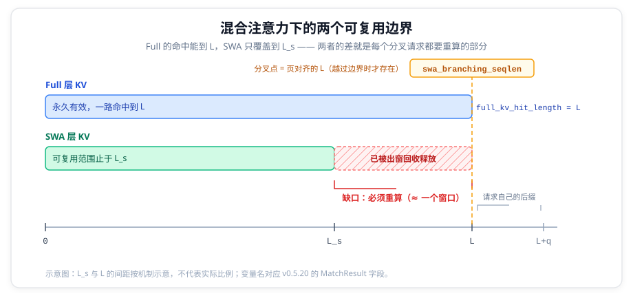
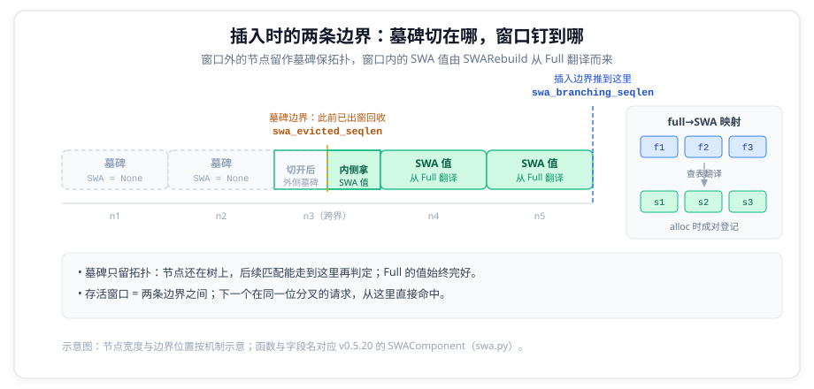
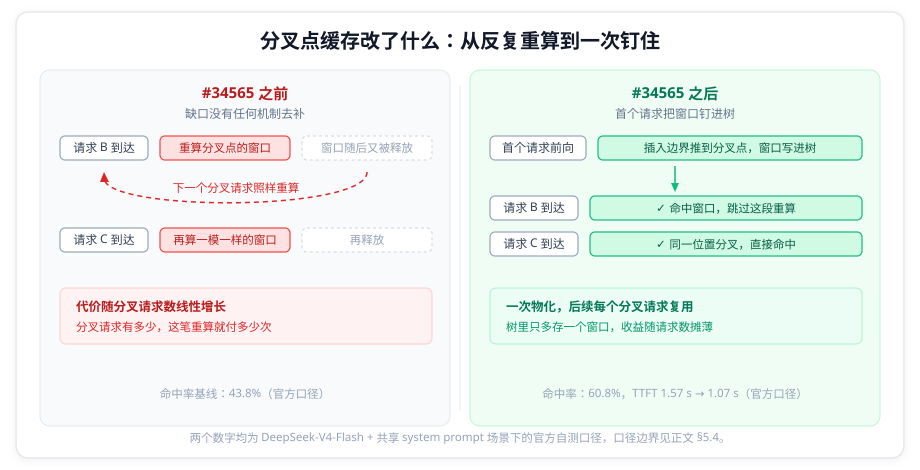

# SGLang 分叉点缓存源码解析：从 43.8% 到 60.8% 的命中率是怎么来的

> 2026-09-19 | 对照 SGLang v0.5.20（`94602c9c2b`）源码，覆盖 Python 核与 Rust 核两条实现路径
>
> **数字口径**：43.8% → 60.8%、平均 TTFT 1.57 s → 1.07 s 出自官方 v0.5.20 release notes，测试条件是 DeepSeek-V4-Flash + 共享 system prompt，属**厂商自测口径**。本文不重复测量，也不外推这个数字到其他模型或负载；它的边界在 §5.4 说明。
>
> 相关文章：[SGLang UnifiedRadixTree：一棵树，四种注意力](sglang-unified-radix-tree.md)——那篇讲统一树如何把四种注意力收进一棵树，结尾 §6.4 提到「树核心用 Rust 重写」的路线；本文是这条路线上的一个具体落地。

---

## 一、混合注意力让前缀缓存有了两个边界

推理服务里，大多数请求共享同一段开头：system prompt、角色设定、挂载的长文档。前缀缓存的价值全在这上面——共享开头只要算过一次，后续请求复用它的 KV，跳过这段 prefill，首字延迟（TTFT）随之下降。反过来，命中每缺一段，就有一段本可跳过的 prefill 被重算一遍。命中率是直接换算成延迟和成本的指标，标题里那 17 个百分点的落差，量的就是这个此前没人处理的重算。

在 DeepSeek-V4 这类混合注意力模型里，一部分注意力层是**滑动窗口注意力**（SWA）：每个 token 只对最近 W 个 token 做注意力，窗口之外的 KV 不再参与任何后续计算。这类层在 KV pool 里单独建池、单独回收，树上的索引也单独一份。一棵基数树按 token 组织索引、请求带着 token 序列去匹配的旧语义，从这里开始要同时回答两个问题：Full 层能复用到哪，SWA 层能复用到哪。这就是标题里「两个边界」的来源。

### 1.1 同一个节点上，两个独立的数

统一树（UnifiedRadixTree）把每个缓存状态做成一个组件，节点上的状态按组件类型分开存放。SWA 组件在这个模型里的位置，它自己的类文档写得很清楚（`unified_cache/components/swa.py:60-68`）：

> Each SWA node stores translated SWA pool indices as its component
> value, independent of the full attention indices on the same tree node.
> When SWA data is evicted from an internal node the node is tombstoned
> — its SWA component value becomes `None` while the full attention
> value stays intact.

一个树节点因此可以同时持有两种值：Full 注意力的 KV 索引，和 SWA 的池索引。**两者的生命周期互相独立**：Full 的值还在，SWA 的值可以已经是 `None`（代码里叫 tombstone，墓碑）。注意这里说的是生命周期——两种索引在同一时刻成对分配，SWA 索引随时可以从 Full 索引查出来，直到 SWA slot 被回收为止，这一点在 §3.3 展开。

这意味着「这个前缀命中了多长」第一次有了两个答案。

### 1.2 SWA 只保留一个窗口

第二个答案是短的那个，原因在池的回收策略。SWA 的 KV 池是一个滚动窗口：只要序列往前推进，窗口外的 KV 对后续计算就再没有用处，留着只是占显存。

回收动作在 `mem_cache/common.py:55-100`，阈值定在 `common.py:86`：

```python
# Radix cache: keep max(window, page). The trailing floor page-aligns the
# frontier, and subtracting at least one page keeps it below the insert
# boundary (page_floor(seq_len)) so the last leaf is never all-tombstone.
# No extra page margin is needed.
evict_threshold = pre_len - max(sliding_window_size, page_size)
```

`pre_len` 是当前序列长度。**比「最后一个窗口」更早的 SWA KV 一律释放**。这个回收在解码期间周期性发生，间隔由 `SGLANG_SWA_EVICTION_INTERVAL` 控制（`environ.py:666`，默认 128 个 decode batch）。

于是树节点上就出现了墓碑：节点还在拓扑里、Full 的值还在，但 SWA 的值已经变成 `None`。

### 1.3 缺口就是这么来的

把前面两件事叠起来，会得到这样一个状态：



*图 1｜两个可复用边界：Full 的命中延伸到 L，SWA 只覆盖到 L_s，两者的差就是每个分叉请求都要重算的部分；分叉点是页对齐后的 L，越过边界时才存在。*

Full 组件能命中的前缀长度（代码里叫 `full_kv_hit_length`）**可以一直延伸到 L**，而匹配的实际落点 `L_s` 由 SWA 决定——它只有一个窗口。两者之差，就是前向必须重新计算的那一段。

这个缺口是两种缓存语义差异的自然结果：Full 的 KV 只依赖它自己之前的所有 token，永久有效；SWA 的 KV 只在窗口内有意义。问题在于，**一个请求从共享前缀上分叉出去之后，分叉点附近那个 SWA 窗口本来是算过的，却被当作出窗数据释放掉了**，下一个在同一个点分叉的请求只能从头再算一遍。

在 #34565 之前，这个缺口没有任何机制去补：每个分叉请求都要重算那一个窗口，哪怕它的前一个请求刚刚算过一模一样的 token。负载里分叉请求有多少，这笔重算就付多少次。官方口径下 43.8% 到 60.8% 的提升，落的就是这类重算。

---

## 二、分叉点：把缺口算准（匹配侧）

代码里解决这件事的第一步，是把缺口的位置精确地表示出来。这个位置叫**分叉点**，在 `MatchResult` 里是一个整数 `swa_branching_seqlen`。

### 2.1 定义

定义写在 `base_prefix_cache.py:238-240`：

> `swa_branching_seqlen`: The SWA radix cache branching point, which is the longest
> page-aligned position that could've been cache hit if there exists an SWA window.

「假如有 SWA 窗口的话，本可以被命中的最长页对齐位置」。这句话反过来说就是：**分叉点标记的是 SWA 的缺席**。它是 `None` 的时候，说明 SWA 已经覆盖了 Full 能命中的全部范围，没有缺口。

### 2.2 计算

真正的计算在 `unified_cache/components/swa.py:344-386` 的 `finalize_match_result_in_tree_core`，它是匹配流程的最后一步：

```python
ct = self.component_type
swa_boundary_len = len(result.device_indices) + result.host_hit_length

# Full KV may extend beyond the latest reusable SWA window. The branching
# point is the last page-aligned position within the Full-KV hit that lies
# beyond the current SWA boundary.
aligned_seqlen = (
    result.full_kv_hit_length // self.tree_core.page_size
) * self.tree_core.page_size
branching_seqlen = aligned_seqlen if aligned_seqlen > swa_boundary_len else None
```

读法很直接：把 `full_kv_hit_length` 向下对齐到页边界，得到一个候选位置；**只有它严格超过实际到达的边界时**，才成为分叉点。

Rust 核里是同一件事，注释写得更短（`rust/sglang-radix-tree/src/components/swa.rs:427-433`）：

```rust
// Branch at the last page-aligned Full-KV position past the SWA boundary.
let page_aligned_full_hit_len =
    result.full_kv_hit_length / tree_core.page_size * tree_core.page_size;
result.swa_branching_seqlen =
    (page_aligned_full_hit_len > swa_boundary_len).then_some(page_aligned_full_hit_len);
```

### 2.3 为什么必须页对齐

页对齐不是保守估计，是硬约束。SWA 池按页分配，一个页要么整页有效要么整页无效；分叉点如果落在页中间，插入时就会出现「半个页在窗口内、半个页在窗口外」的状态，无法用一个页索引表达。

这个约束在插入侧有断言兜底（`swa.py:410-412`）：

```python
assert swa_evicted_seqlen % self.tree_core.page_size == 0, (
    f"{self.component_type}: swa_evicted_seqlen must be page-aligned, {swa_evicted_seqlen=}"
)
```

向下对齐而不是向上，是因为向上会越过 Full 能命中的范围，那边没有 KV 可以复用。

### 2.4 从匹配结果到插入回执

分叉点算出来之后，要穿过四个层次才能变成实际的缓存写入。这条链在代码里是可以完整追下来的：

| 位置 | 字段 | 含义 |
| --- | --- | --- |
| `base_prefix_cache.py:256` | `MatchResult.swa_branching_seqlen` | 匹配结果里带出来 |
| `managers/schedule_policy.py:212` | `req.swa_branching_seqlen` | 挂到请求上 |
| `base_prefix_cache.py:90` | `InsertParams.swa_branching_seqlen` | 传给插入流程 |
| `base_prefix_cache.py:112` | `InsertResult.swa_branch_inserted` | 插入回执（布尔） |

注意第三段的字段名和第一段相同、但语义不同：匹配侧它是「缺口在哪」，插入侧它是「把窗口钉在哪」。同一个整数，从观察变成了指令。

---

## 三、把窗口钉在分叉点上（插入侧）

匹配侧只负责发现缺口。真正提高命中率的动作发生在请求**把自己的 KV 写回树**的时候。

### 3.1 改写插入长度

请求前向结束、准备把 KV 插入树时，SWA 组件会拿到一次改写插入长度的机会（`swa.py:925-952`）：

```python
def prepare_for_caching_req(
    self,
    req: Req,
    insert_params: InsertParams,
    token_ids_len: int,
    is_finished: bool,
) -> Optional[int]:
    # Unfinished requests can already have an SWA-evicted prefix; preserve
    # that boundary so insertion creates a tombstone instead of live SWA KV.
    insert_params.swa_evicted_seqlen = req.kv.swa_evicted_seqlen

    # A recurrent checkpoint must stay attached to its exact token prefix.
    # Let MambaComponent select the insertion length for hybrid caches.
    if self.cache.is_mamba_enabled:
        return None

    branching_seqlen = req.swa_branching_seqlen
    if branching_seqlen is None or branching_seqlen <= req.kv.cache_protected_len:
        return None

    # An EAGLE key with N bigrams spans N + 1 raw tokens.
    effective_cache_len = branching_seqlen + int(self.tree_core.is_eagle)
    if effective_cache_len > token_ids_len:
        return None

    # Record the logical SWA branch boundary for insertion.
    insert_params.swa_branching_seqlen = branching_seqlen
    return effective_cache_len
```

返回的 `effective_cache_len` 就是这次插入要覆盖的长度。不去改写的话，插入只覆盖到「已保护长度」为止；改写之后，**插入边界被推到分叉点**，正好把以分叉点结尾的那个 SWA 窗口也写进树里。

三个提前返回各自有理由：

- 分叉点不存在，或者已经落在已保护范围之内（`branching_seqlen is None or branching_seqlen <= cache_protected_len`），没有新的东西要写。
- 请求自己的 token 不够长（`effective_cache_len > token_ids_len`），分叉点超出了这次前向的范围，没有数据可写。这里比较的是 EAGLE 修正之后的长度。
- 那处 `+1` 来自 EAGLE 的缓存键：投机解码下键是 bigram，N 个 bigram 跨越 N+1 个原始 token，所以要向上修正一位。

### 3.2 写入时的三种节点

真正落到树上的是 `commit_insert_component_data`（`swa.py:509-544`）。它先记回执：

```python
branching_seqlen = params.swa_branching_seqlen
if branching_seqlen is not None:
    assert params.key is not None
    result.swa_branch_inserted = len(params.key) >= branching_seqlen
```

然后按节点相对 SWA 窗口的位置分三类处理（`swa.py:525-535`）：

```python
node_start = result.prefix_len
node_end = node_start + len(node.key)
split_pos = params.swa_evicted_seqlen - node_start
if split_pos >= len(node.key):
    # Entire leaf is outside the SWA window — left as a tombstone.
    return
result.record_adopted_range(
    self.component_type,
    max(node_start, params.swa_evicted_seqlen),
    node_end,
)
```

窗口外的整节点留作墓碑，窗口内的节点登记为「已采纳」，跨越边界的节点被切开（`swa.py:536-540`）：外侧是墓碑，内侧拿 SWA 值。墓碑不是冗余状态：它保留了节点的拓扑位置，让后续匹配能走到这里再判定，不会在中途断开。

上面这段是新叶子的处理路径。如果插入命中的是一个已经存在的节点（`is_new_leaf` 为假），走的是另一个函数 `update_component_on_insert_overlap`（`swa.py:388-466`），它按 `swa_evicted_seqlen` 把节点分成「整段在窗口内」「跨越边界」「整段在窗口外」三支处理，第三支直接不消费这段数据。两条路径的判定标准一致，只是节点是新建还是复用。

### 3.3 SWA 的值从哪来

节点上的 SWA 值由 `SWARebuild` 这个动作写入，它做的是把同一个节点的 Full 值**翻译成** SWA 索引（`swa.py:1501-1507`）：

```python
if isinstance(action, SWARebuild):
    # Translate the node's source full value to SWA and store it on the node.
    swa_value = self._translate_full_to_swa(action.source_value)
    self.tree_core.set_component_device_value(
        action.node_id, self.component_type, swa_value
    )
    return
```

翻译本身是一次查表（`swa.py:221-224`），查的是分配器维护的 full→SWA 映射：

```python
def _translate_full_to_swa(self, full_indices: torch.Tensor) -> torch.Tensor:
    return self.cache.token_to_kv_pool_allocator.translate_loc_from_full_to_swa(
        full_indices
    )
```

这个映射在分配时就建立了。SWA 池的 `alloc` 一次分配两块空间，并登记两者的对应关系（`allocator/swa.py:219-232`）：

```python
alloc_full_indices = self.full_attn_allocator.alloc(need_size)
alloc_swa_indices = self.swa_attn_allocator.alloc(need_size)
assert alloc_full_indices is not None
assert alloc_swa_indices is not None

self.set_full_to_swa_mapping(alloc_full_indices, alloc_swa_indices)
return alloc_full_indices
```

于是分叉点缓存能省下的是**本就已经算好、而且 slot 还活着的那一段 SWA KV**。机制做的事是在回收之前把它的索引记到树节点上。`swa_evicted_seqlen` 标记的正是「从哪个位置起 slot 还活着」，`SWARebuild` 只对这个位置之后的部分生效。



*图 2｜插入时的两条边界：`swa_evicted_seqlen` 左侧留墓碑保拓扑，两条边界之间的存活窗口由 `SWARebuild` 从 Full 翻译而来，插入边界推到分叉点。右侧的翻译查表即本节的 full→SWA 映射。*

### 3.4 两条调用路径与释放时机

释放出窗 slot 的时机在两条调用路径上并不相同，这一点容易读错。

请求正常结束走 `cache_finished_req`，顺序是「prepare → insert → cleanup」，释放发生在插入之后的 `cleanup_after_caching_req` 里（`swa.py:973-991`）：

```python
if insert_result is not None and insert_result.swa_branch_inserted:
    req.swa_branching_seqlen = None

# Free unused SWA slots after inserting the branch.
if (
    not is_finished
    and insert_result is not None
    and insert_result.swa_branch_inserted
    and envs.SGLANG_OPT_UNIFIED_CACHE_FREE_OUT_OF_WINDOW_SLOTS.get()
):
    forward_key_len = len(req.get_fill_ids()) - int(self.tree_core.is_eagle)
    self._free_out_of_window_slots(req, forward_key_len - 1)
```

chunked prefill 中途的 `cache_unfinished_req` 则相反，释放发生在插入**之前**（`unified_radix_cache.py:1141-1148`），而且这一步同时决定了插入停在哪里：

```python
if envs.SGLANG_OPT_UNIFIED_CACHE_FREE_OUT_OF_WINDOW_SLOTS.get():
    # The frontier lands a page below page_floor(pre_len + 1), which has to
    # be where the insert stops, or the leaf it creates keeps less than a
    # sliding window of live SWA and the match after the insert rejects it.
    # The insert stops at page_floor(len(radix_key)), and a bigram key is
    # one shorter than the tokens it spans, so measure the key.
    for comp in self._components_tuple:
        comp.free_out_of_window_slots(req, len(radix_key) - 1, insert_params)
```

先释放再插入不是笔误。释放函数除了回收 slot，还会把回收进度写进 `insert_params.swa_evicted_seqlen`（`swa.py:967-971`），而插入正是靠这个值来决定哪些节点留作墓碑、哪些节点能拿 SWA 值。上游注释说明了这条约束的代价：**如果插入停下的位置让新叶子剩下的存活 SWA 不足一个滑窗，插入之后紧接着的那次匹配就会拒绝它**。

两条路径里的释放都受同一个开关门控（`SGLANG_OPT_UNIFIED_CACHE_FREE_OUT_OF_WINDOW_SLOTS`，`environ.py:664`，默认开启）。这个开关不是本次引入的，分叉点缓存只是开始使用它。

---

## 四、复用闭环与收益来源

### 4.1 下一次匹配

机制的闭环在匹配侧就能看到：窗口写进树之后，下一个在同一个点分叉的请求再做匹配，`swa_boundary_len` 已经覆盖了分叉点，于是 `aligned_seqlen > swa_boundary_len` 不成立，`swa_branching_seqlen` 变成 `None`，插入侧的三段逻辑全部提前返回——**没有缺口需要补了**。



*图 3｜修复前后的对比：缺口从「每个分叉请求重算一遍再释放」变成「一次物化、后续复用」。图中数字为官方自测口径，边界见 §5.4。*

测试把这个闭环写成了显式断言（`test/registered/unit/mem_cache/test_unified_radix_cache_unittest.py:6506-6524`）：

```python
result = cache.match_prefix(MatchPrefixParams(key=RadixKey(array("q", tokens))))

self.assertEqual(result.full_kv_hit_length, len(tokens))
self.assertEqual(result.swa_branching_seqlen, len(tokens))
self.assertEqual(result.swa_branching_seqlen % self.cfg.page_size, 0)

# Simulate forward producing fresh SWA KV at the branching point.
self._insert(
    cache,
    allocator,
    req_to_token_pool,
    tokens[: result.swa_branching_seqlen],
)

rematch = cache.match_prefix(
    MatchPrefixParams(key=RadixKey(array("q", tokens)))
)
self.assertEqual(len(rematch.device_indices), result.swa_branching_seqlen)
self.assertIsNone(rematch.swa_branching_seqlen)
```

最后两行是这套机制的落点：复用的设备 KV 长度增长到分叉点，分叉点本身消失。

测试里那句注释 `# Simulate forward producing fresh SWA KV at the branching point.` 说明了这些 SWA KV 的来源：请求自己的前向已经把 Full 和 SWA 两块都算出来了（§3.3 的 full→SWA 映射就是这一次前向留下的）。机制做的事，是在它们被回收之前把索引记到树节点上。

### 4.2 收益从哪里来

按上面的机制，一个请求能省下的量是**有限的**：不是整段共享前缀，而是分叉点结尾处那一个 SWA 窗口。树里保存的也只有这一个窗口，写入时窗口外的节点一律留作墓碑（§3.2）。

官方选的场景是**共享 system prompt**，这类负载把收益放到了最大。所有请求在同一位分叉，一个持久化的窗口能服务后续每一个请求；系统提示词很长而各请求自己的追问很短，省下的窗口在单请求总输入里占比不小；请求数又足够多，首次到达分叉点的那个请求（它匹配时树里还没有这个窗口，仍要重算）付出的成本会被后续请求摊薄。测试模型本身也对得上：DeepSeek-V4-Flash 在统一树里就是 FULL+SWA 的组合（lmsys 架构博客），恰好落在这个机制覆盖的形态上。

反过来，如果请求之间几乎不共享前缀，或者共享部分的长度只有一个窗口左右（那时分叉点本来就是 `None`），这个机制不起作用。

这里给的是机制层面的说明，不是对 43.8% 和 60.8% 的验算。官方没有给出窗口大小、共享前缀长度和请求数，那些数字无法反推（§5.4）。

### 4.3 双后端夹具

`#34565` 给测试加了一个细节：Python 核和 Rust 核共享同一套夹具，测试在两个后端上跑同样的断言。这个设计在 `#37584`（Rust 移植）之后才真正生效：移植之前，`swa_branching_seqlen` 相关的用例在 Rust 后端下是跳过的，跳过门禁里写着：

```python
-    def _skip_swa_branching_on_rust(self) -> None:
-        # TODO(alphabetc1): drop this gate once #37584 ports SWA branching-point
-        # caching to the Rust tree core.
-        if _selected_tree_core_test_backend() == "rust":
-            self.skipTest("SWA branching-point caching is Python-core only")
```

移植提交删掉了这个门禁。这行 `TODO` 是判断两个提交关系的直接证据：**Python 侧先有实现，Rust 侧后补对齐**。

---

## 五、机制之外：三处边界与一处口径

### 5.1 mamba 混合时的早退

`prepare_for_caching_req` 里有一行看起来无关的提前返回（`swa.py:936-939`）：

```python
# A recurrent checkpoint must stay attached to its exact token prefix.
# Let MambaComponent select the insertion length for hybrid caches.
if self.cache.is_mamba_enabled:
    return None
```

Full + SWA + Mamba 三种状态共存的模型（Inkling 是这种组合）里，SWA 组件放弃改写插入长度的权力，交给 Mamba 组件决定。原因是 Mamba 的循环状态是一个「整段前缀的摘要」，它必须挂在**确切的那一个 token 前缀**上。如果 SWA 把插入边界推到分叉点，Mamba 检查点就会落到一个错误的位置上。

### 5.2 HiCache 的增量备份

分叉点窗口写进设备之后，还要考虑它会不会被备份到主机侧。`_collect_unbacked_swa_nodes`（`swa.py:92-131`）沿父链回溯**一个滑窗**，收集「在设备上、主机上没有」的节点（Rust 侧的对应实现是 `collect_unbacked_swa_nodes_in_window_`）：

```python
while (
    cur is not self.tree_core.root_node and covered < self.sliding_window_size
):
    if cur.write_through_pending_id is not None:
        break
    cd = cur.component_data[ct]
    value = cd.value if cd.value is not None else cd.host_value
    if value is None:
        break
    covered += len(value)
    if cd.value is not None and cd.host_value is None:
        unbacked.append(cur)
    cur = cur.parent
```

`write_through_pending_id` 的检查是关键：遇到已经挂起写穿的节点就停，保证两个 ack 不会认领同一个节点（Rust 侧注释：`that ack owns everything above it, so two acks can never claim the same node`）。

### 5.3 Rust 核默认是关的

`#37584` 的标题是「Port SWA Branching-Point Caching to the Rust TreeCore」——**「Port」是把已有实现搬到另一个核，不是一次优化**。当前默认后端仍然指向 Python 核（`environ.py:672`）：

```python
SGLANG_UNIFIED_RADIX_TREE_CORE_BACKEND = EnvStr("python")
```

也就是说，默认配置下走的是 Python 路径，Rust 核是可选后端。

而且这次移植也**不是纯机械搬移**，顺带带了三处改动：

1. `prepare_for_caching_req` 里新增了 §5.1 那段 mamba 早退，父提交里没有 `is_mamba_enabled` 这个判断。
2. `host_memory_mode == "buffer_only"` 的下沉：从直接读 `self.cache` 改成读核上的标志位 `is_host_memory_buffer_only`（`swa.py:102`），因为 Rust 核够不到 Python 侧的 `cache` 对象。
3. Rust 侧补齐了 `TreeComponent::needs_incremental_backup` 的实现：这个 trait 方法在父提交里已存在但默认返回 `false`，`SwaComponent` 没有实现。

有一件事需要如实说明：**移植提交的 message 只有标题、没有正文**，仓库里也没有对应的 PR 描述文本。所以「Rust 化是为了性能」这个说法在当前证据下**没有依据**；从结构性证据（双后端对齐、默认关闭）看，它是一次功能对齐。本文不猜测它的动机。

### 5.4 数字的口径

回到标题里的数字。官方 release notes 的原文是：

> Branching-point caching for the SWA component keeps the sliding-window state at the point where requests fork from a shared prefix, so branches reuse it instead of recomputing. On DeepSeek-V4-Flash with a shared system prompt, token hit rate rises from 43.8% to 60.8% and mean TTFT falls from 1.57 s to 1.07 s (#34565).

三件事需要标明：

1. **这是厂商自测**。SGLang 官方在 release notes 里给出的结果，不是独立第三方测量。本次核对在 v0.5.20 的代码树（`python/`、`rust/`、`docs/`）里搜过这两个数字，**没有任何一处是作为命中率记录的**（子串匹配到的都是 cookbook 里的 `443.84 ms`、`143.89 ms` 这类无关数字）——这两个数字只存在于 release notes 与 PR 页面。
2. **条件是具体的**：DeepSeek-V4-Flash、共享 system prompt 的负载形态。
3. **release notes 里没有给出窗口大小、共享前缀长度、请求数**这些能复算的中间量，所以无法从 43.8% 和 60.8% 反推测试配置。

另外，release notes 里「branches reuse it instead of recomputing」这句话在源码里**没有对应的注释原文**。「分叉点状态被反复重算」是从 `full_kv_hit_length` 与 `swa_boundary_len` 的差值推出的，属于对机制的合理描述，但不是代码里的原话。本文 §1.3 的图示同理，是解释性重构。

---

## 六、小结

分叉点缓存补的是混合注意力引入的一个结构性缺口：

1. 统一树上，同一个节点的 Full 值和 SWA 值**各自回收、生命周期互相独立**，前缀命中长度因此有两个答案。
2. SWA 池只保留一个窗口，更早的 KV 一律释放，于是 Full 的命中可以越过 SWA 的可复用边界。
3. 缺口的位置被精确表示为 `swa_branching_seqlen`：**最长的、页对齐的、越过 SWA 边界的 Full 命中位置**。
4. 插入时把边界推到分叉点，让以它结尾的那个 SWA 窗口落进树里；下一个在同一位置分叉的请求命中它，缺口消失。
5. 能省下的是一个窗口的量，所以「长共享前缀 + 短分叉后缀」的负载收益最大。

它接在统一树这条线上：`#34565` 在 Python 核里实现，`#37584` 对齐到 Rust 核，而 Rust 核目前仍是可选后端。这两步都发生在 v0.5.20 里。

---

## 源文件索引

| 文件 | 关键内容 | 引用点 |
| --- | --- | --- |
| `python/sglang/srt/mem_cache/base_prefix_cache.py` | `MatchResult` / `InsertParams` / `InsertResult` 中分叉点字段的定义 | `:90`, `:112`, `:238-240`, `:256` |
| `python/sglang/srt/mem_cache/unified_cache/components/swa.py` | SWA 组件：匹配终局计算、插入改写、重叠分支处理、写回、SWA 值翻译与重建、清理、HiCache 备份采集 | `:60-68`, `:92-131`, `:102`, `:221-224`, `:344-386`, `:388-466`, `:410-412`, `:509-544`, `:925-952`, `:967-971`, `:973-991`, `:1501-1507` |
| `python/sglang/srt/mem_cache/unified_radix_cache.py` | 两条插入路径的调用顺序与释放时机 | `:959-1090`（finished）、`:1098-1160`（unfinished，释放在前） |
| `python/sglang/srt/mem_cache/allocator/swa.py` | SWA 池分配与 full→SWA 映射的建立 | `:202-204`, `:219-232` |
| `python/sglang/srt/mem_cache/common.py` | SWA 出窗释放阈值 | `:55-100`（阈值在 `:86`） |
| `python/sglang/srt/managers/schedule_policy.py` | 分叉点从匹配结果挂到请求上 | `:212` |
| `python/sglang/srt/environ.py` | 树核后端默认值、出窗释放开关、SWA 逐出间隔 | `:664`, `:666`, `:672` |
| `rust/sglang-radix-tree/src/components/swa.rs` | Rust 侧的分叉点计算与插入回执 | `:427-433`, `:606-608` |
| `test/registered/unit/mem_cache/test_unified_radix_cache_unittest.py` | 复用闭环的显式断言 | `:6482-6524`, `:6526-6584` |

## 参考

- [SGLang v0.5.20 Release Notes](https://github.com/sgl-project/sglang/releases/tag/v0.5.20)——43.8% / 60.8% 与 TTFT 数字的唯一出处
- [PR #34565：Support Branching-Point Caching for the SWA Component](https://github.com/sgl-project/sglang/pull/34565)——Python 核实现
- [PR #37584：Port SWA Branching-Point Caching to the Rust TreeCore](https://github.com/sgl-project/sglang/pull/37584)——Rust 核移植
- [Unified Radix Cache: One Tree for Hybrid Model Prefix Caching](https://www.lmsys.org/blog/2026-08-11-unified-radix-cache/)——统一树的架构背景（2026-08-11，不含分叉点缓存）
- [SGLang UnifiedRadixTree：一棵树，四种注意力](sglang-unified-radix-tree.md)——统一树的设计与 0.5.16 默认化
