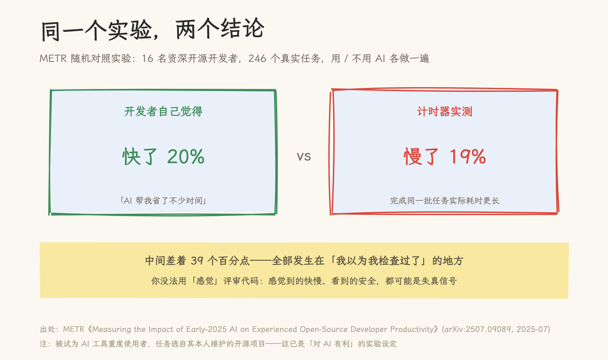
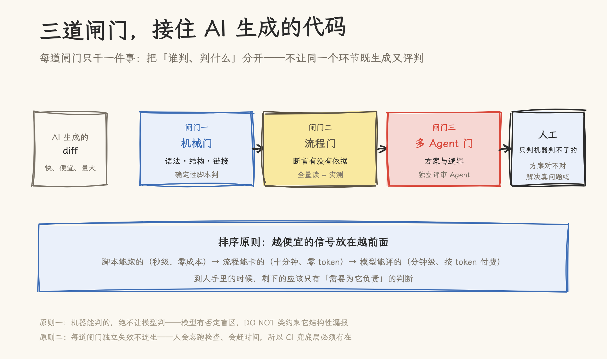
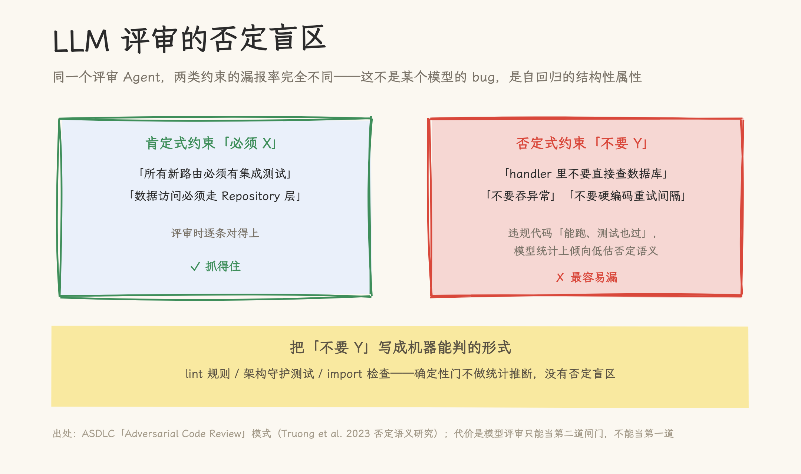
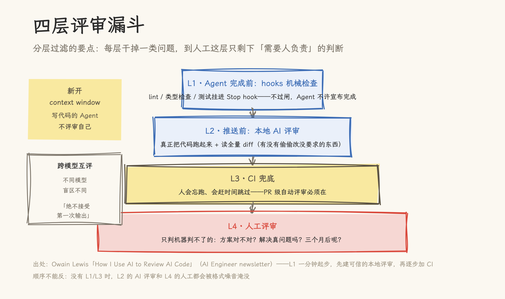
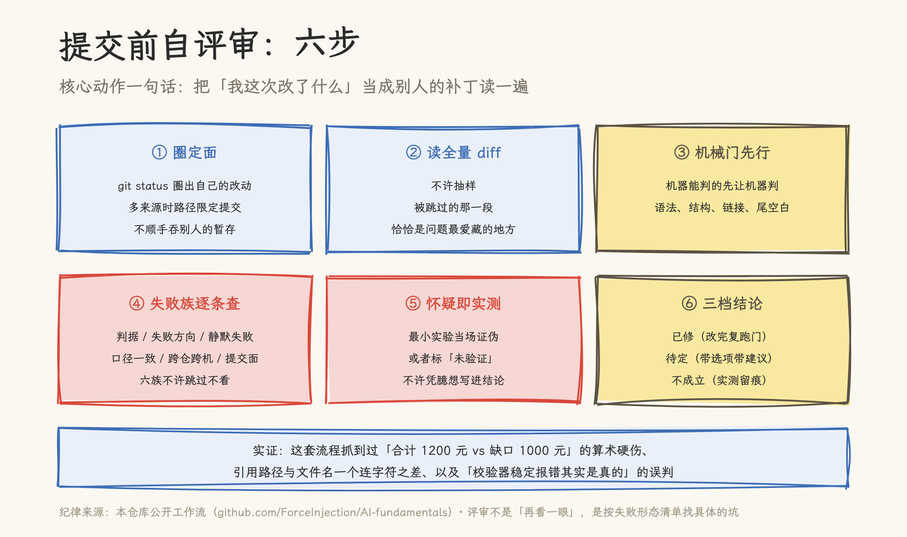
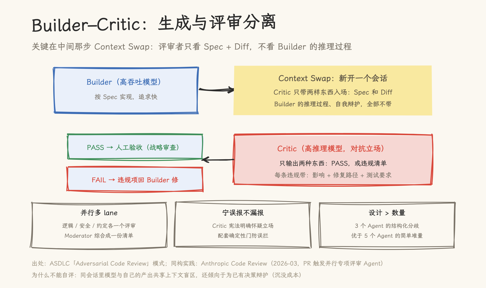

# 别让写代码的 Agent 评审自己：AI 代码评审的三道闸门

> **元信息**：写作日期 2026-10-06。文中数据均标注口径与 as-of 日期：独立研究（METR、GitClear）可直接引用；Google/Microsoft 数字为 CEO 公开发言的媒体转述；CodeRabbit 数据为厂商口径。AI 领域数据变化快，引用前建议复核。

2025 年 7 月，独立研究机构 METR 做了一组实验：招募 16 名资深开源开发者，从他们自己维护的项目里挑出 246 个真实任务，随机分成「用 AI 工具」和「不用 AI 工具」两组各做一遍。结果出来后，两组人都不太相信自己的眼睛。

用 AI 的那组开发者觉得，AI 帮他们省了大约 20% 的时间。计时器的读数是：慢了 19%。

中间差着 39 个百分点。这 39 个点落在哪？落在「我以为我检查过了」的地方：写的时候觉得对，读的时候觉得顺，提交的时候觉得稳。感觉与事实的偏差，正是评审要处理的对象。这篇文章讨论一个问题：当 AI 把写代码的成本降到接近零之后，评审该按什么原则组织。

## 一、生成成本归零，评审成了新瓶颈

先看两组数字。

Google CEO Pichai 在 2026 年 4 月公开表示，公司 75% 的新代码由 AI 生成、人工评审后合入（2024 年这个数字是 25%，2025 年秋是 50%；以上为媒体转述口径）。Microsoft 的 Nadella 也在 2025 年给出过 30% 的数字，并强调每一行仍然由工程师评审。

代码质量的变化同步出现。代码分析公司 GitClear 基于累计超过 2 亿行变更代码的系列研究，给出了一个有名的发现：**2024 年是有记录以来第一次，「复制粘贴」的代码行数超过了「移动」（重构）的代码行数**，重复代码块自 ChatGPT 与 Copilot 普及以来成倍增长。重构意味着把公共逻辑抽出来复用，复制粘贴意味着同样的逻辑散落在多处。AI 生成的代码显著更愿意复制一段相似的块，而不是抽象。

生成端越快，评审端越堵。这个现象在 2026 年有了名字：「diff 税」「验证瓶颈」。Anthropic 在 2026 年 3 月发布 Code Review 工具时，官方给出的理由就是「AI 生成的 PR 洪水」：PR 的产生速度超过了人工评审能力，需要一个工具并行派多个评审 Agent 分头查。

面对洪水，常见的反应是「评审更勤一点」。这篇文章想说明的是：评审难，不是因为评审的人不够勤，而是因为**评审所依赖的信号在三个地方失真了**。对策不是更勤，是换一套闸门。

## 二、评审为什么难：三个失真的信号

**失真一：自评不可信。** METR 实验展示的是人对「效率」的自评失真。对「正确性」的自评失真更严重：让同一个 Agent 检查自己刚写的代码，它倾向于给自己找理由。它共享同一份上下文盲区，也被训练得乐于助人，很难转身挑战自己刚做出的决策。英文世界给这个现象起了个准确的名字：sunk-cost bias（沉没成本偏差）。这和人在 code review 里「舍不得否决自己写的代码」是同一个机制，只是 AI 把它放大了：人至少还会忘掉一部分自我，模型对上下文的记忆是逐字精确的。开源评审项目 OpenCodeReview 的分析还指出一层：通用评审 Agent 对同一份 diff 跑两次，工具调用路径不同、产出的评论都可能不同：非确定性让「这次评审通过了」这个信号进一步贬值。

**失真二：单模型评审有结构性盲区。** 把评审交给另一个模型就可靠了吗？研究文献（如 arXiv:2412.05579 的 LLM-as-a-judge 综述）记录了评审模型的几种系统性偏差：位置偏差（答案的呈现顺序影响评判）、冗长偏差（更长的答案更容易得高分）、自我偏好（模型偏袒与自己风格相似的输出）。这三种偏差在代码评审里都有对应物。其中最值得单独说的是**否定盲区**：评审模型对「不要做 Y」类约束的漏报率，显著高于「必须做 X」类。「不要在 handler 里直接查数据库」「不要吞异常」这类约束，违规代码往往能跑通全部测试，而模型在统计上倾向于低估否定语义。这是自回归生成的结构性属性，不是某个模型的 bug，换更强的模型只能缓解，不能根除。

**失真三：二手统计污染判断。** 2026 年流传甚广的一个说法是「微软研究：开发者评审 AI 代码时会多漏掉约 40% 的 bug」。多家媒体转述，引用者众。我们去 arXiv 检索原始研究，没有找到。这条统计大概率是编造或误传的，但它的传播路径值得警惕：先有一个听起来合理的数字，再有一个大机构的名字，就能在工程师的转发里活很久。评审决策如果建立在这类数字上，闸门的设计就会跑偏：比如把资源全押在「让 AI 评审更准」上，而忽略人本身的流程缺陷。

三个失真指向同一个结论：**评审体系里，任何单一环节的「我觉得没问题」都不能当信号用**，无论这个环节是人、是写代码的模型、还是评审模型。剩下的可靠信号只有两类：确定性检查（机器跑出来的），和独立于生成过程的检查（另一个会话、另一个模型、另一个人）。三道闸门就是围绕这两类信号组织的。

## 三、闸门一：机械门——机器能判的绝不让模型判

第一道闸门处理「机器能判」的问题：语法错误、结构损坏、链接失效、尾随空白、格式偏离。这些检查的共同点是：判定规则完全确定，不需要理解语义。

原则只有一句话：**机器能判的，绝不让模型判。** 理由就是第二节说的否定盲区：让一个有统计盲区的评审者去做确定性判定，是用最贵、最不可靠的工具干最便宜、最可靠的活。一个 lint 规则判定「禁止 import 内部模块」，准确率是 100%；让模型看着 diff 说「有没有违规 import」，它可能漏，而且每次漏的地方还不一样。

实践形态已经很成熟。工程师 Owain Lewis 描述的四层评审漏斗，第一层就是 hooks：在 Claude Code 的 Stop hook 里挂上 lint、类型检查、测试脚本，检查不过，Agent 就不许宣布任务完成。格式噪音在进入任何「评审」环节之前就被拦下。顺序不能反：没有机械门时，人工评审和 AI 评审都会被「少个分号」这类噪音淹没，真正要看的逻辑问题反而没时间看。

机械门还有一个经常被忽略的职能：**它是对否定盲区的唯一根治手段。** 团队的架构约束里那些「不要 Y」——不要绕过数据访问层、不要引入新的直接依赖、不要在循环里做 IO——最可靠的去处不是评审提示词，而是一条 lint 规则、一个架构守护测试（architecture test）、一个 import 检查脚本。把约束从「写给模型看的散文」变成「写给解释器看的代码」，它就从概率问题变成了断言问题。

Google 内部对自动评审工具有一条量化标尺值得参考：一次评审检查的「有效误报率」要低于 10%：开发者看到提示后不采取行动的发现，算无效发现（此为第三方分析转述的内部口径）。机械门的规则天然满足这条；模型评审的发现，应该按同样的标尺校准，误报持续偏高的评审 Agent 等于在训练人忽略它。

## 四、闸门二：流程门——不信任任何一次输出

第二道闸门处理「机器判不了、但单次检查也不可靠」的问题：断言有没有依据、口径是否一致、失败是静默的还是显式的。这些问题需要一套流程纪律，而不是一次聪明的检查。

我们在公开的知识库仓库（github.com/ForceInjection/AI-fundamentals）里维护一套提交前自评审流程，六步，这里完整给出：

**第一步，圈定面。** git status 圈出本次改动的完整清单。多来源改动时（自己改的加上用户改的），列出属于本次任务的路径，之后每一步只对这组路径负责，提交时路径限定，不顺手吞掉别人的暂存。零改动也是个需要警惕的信号：在跨目录工作的时候，「clean」可能只是看错了地方。

**第二步，读全量 diff，不许抽样。** 大 diff 分片读也要读完。经验是：被跳过的那一段，恰恰是问题所在。我们抓到过一条用法串漏了参数、一处计数口径过时，都只在全量读时露头。

**第三步，机械门先行。** 自审之前先跑一遍机器能跑的：shell 语法检查、Python AST 解析、冲突标记、尾空白。机器的归机器，人只读机器读不出来的。

**第四步，按失败族逐条查。** 这是六步里最核心的一步。常见的缺陷不是随机分布的，它们聚成几族：判据族（检查的依据本身错了）、失败方向族（该报错的地方静默通过）、静默失败族（失败被吞掉不留痕）、口径一致族（两处口径对不上）、跨仓跨机组（改了 A 仓，B 仓的引用没跟上）、提交面族（提交范围混入了不相关改动）。逐族过一遍，不许跳过不看。

**第五步，怀疑即实测。** 对任何一个「我怀疑这里有问题」的念头：要么当场用最小实验证伪或证实，要么标成「未验证」。不许凭臆想写进结论。这条纪律有个实证：我们曾把链接校验器连续报的 20 处错误判成「沙盒假阴性」，后来发现是引用路径与文件名差一个连字符：校验器一直是对的。反过来也踩过坑：一次 grep 搜索对中文长文本稳定「零命中」，我们差点据此断言「素材不在原文里」，换 Read 通读全文才发现内容都在，是工具匹配方式的问题。**工具的稳定输出，无论报错还是零命中，都需要第二条独立路径取证后再下结论。**

**第六步，三档结论。** 已修（改完复跑机械门）、待定（需要拍板，附事实、选项和建议）、不成立（怀疑过但实测否掉，留痕防止反复怀疑同一处）。不许出现「建议关注」这类模糊话。

这套流程的成本不高：一次彻底的自审通常十几分钟。它抓住的问题有算术硬伤（合计 1200 元对不上缺口 1000 元）、引用路径一个连字符之差、以及上面说的两类工具误判。这些都是机械门抓不住、单次模型评审也未必抓得住的问题：它们需要的是「换一双眼睛再看一遍」的纪律，而这双眼睛可以是人，也可以是下一节说的独立 Agent。

在我们自己的工作流里，这六步已经固化成了 Claude Code 的自定义技能：提交前敲一条 `/self-review`，Agent 就按流程执行：先跑机械门脚本（shell 语法检查、Python AST 解析、冲突标记、尾空白），再读全量 diff，然后按失败族清单逐族过，最后强制给出三档结论之一。技能化的价值不在流程本身，在于把「纪律」变成「默认动作」：失败形态写成检查清单之后，不依赖某个人记得住全部条目，也不会因为赶时间而悄悄跳步。原则谁都会说，能被触发的原则才是闸门。

## 五、闸门三：多 Agent 门——生成与评审分离

第三道闸门处理语义与方案层面的判断，做法是把生成和评审拆成两个独立的角色。

ASDLC 模式库把这个形态总结为 Builder–Critic 模式，要点有三个。

**第一，Context Swap。** Builder 写完代码后，评审者在新开的会话里工作，入场只带两样东西：Spec 和 Diff。Builder 的推理过程、自我辩解，全部不带。这一步是对「失真一」的直接防御：评审者与生成者共享的上下文越少，独立判断越真实。实践中它的最小版本是零成本的：评审提示词里不粘贴「我为什么这么写」的解释，只给需求和结果。

**第二，Critic 只做守门员。** 它输出两种东西之一：PASS，或一份违规清单。每条违规带影响分析和修复路径，但不写替代实现。让 Critic 顺手改代码是常见的错误用法：那样它就从评审者变成了第二个 Builder，两份实现的合流点成了新的无人区。配套的组织约定是「宁可误报不可漏报」的怀疑立场，同时靠确定性门兜住误报，避免评审信号被人逐渐忽略。

**第三，并行多 lane 加综合。** Anthropic 2026 年 3 月发布的 Code Review 是这个形态的产品化：PR 打开时并行派出多个专项评审 Agent，逻辑错误、边界条件、API 误用、认证缺陷、项目约定各查一类，带置信度过滤（低置信发现不发布，避免噪音），最后汇总为一份评审意见。多条 lane 产生冲突发现时，由一个综合角色去重、排优先级，给 Builder 一份统一清单，而不是一串互相矛盾的反馈。

Agent 的数量不是越多越好。有 ICML 2026 的研究报道（媒体转述口径）显示，三个带结构化分歧机制的评审 Agent，效果优于五个简单并列的评审 Agent。**评审设计里，分歧的结构化程度比 Agent 数量更重要。**三个各自独立、被要求从不同立场进攻的评审者，覆盖面超过五个共享同一套假设的评审者。

**Context Swap 有一个容易读过头的推论：评审者的上下文是不是越少越好？不是，关键是分清隔离什么、带足什么。** 上下文里混着两种性质不同的东西：一种是生成者的主观过程——推理链、自我辩解、「我为什么这么写」——它污染判断，必须隔离；另一种是代码库的客观结构——调用方、被调方、类型定义、并发模型——它是判断的原料，缺了就会瞎。

开源项目 OpenCodeReview 的源码深读（见[《确定性工程驯服不确定的 Agent：OpenCodeReview 三阶段架构深度解析》](../../../08_agentic_system/agent_design/docs/open-code-review-deep-dive.md)）把这两个方向的问题都点名了。通用评审 Agent 有两个结构性弱点：一是**非确定性**，同一份 diff 跑两次结果不同，评审作为质量活动最难接受这个；二是**上下文局部性**，评审者被限制在 diff 里，而真实缺陷往往藏在调用方和被调方。它的解法不是「多喂上下文」，而是**有界的探索**：每个文件的评审 Agent 只拿到六个受控工具，可以跳出 diff 查调用关系，但每一步有界、评论行号有三级回退校验，探索不会膨胀成全库漫游。

同一个项目还给出了「正反面评审」最精致的一手实现。它的阶段三叫 Independent Reflection：独立反思者只看到 diff 和评论列表，看不到评审 Agent 通过工具获得的仓库上下文。它无法验证一条评论的正确性（没有那个上下文），但可以、也只需要**证伪**：diff 里存在直接反证的评论，删；引用了 diff 之外上下文的，不标记（因为它无法证伪）。反思阶段只能删评论、不能生成评论，反思模型调用失败时保留全部评论（fail-open，优先保召回）。用那篇深读里的话说：**判断的独立性，取决于它看到什么，而不是它是什么。** 不需要另一个更强的模型，同一个模型在更少的信息下天然具备不同的视角。这正是「别让写代码的 Agent 评审自己」的架构化表达：分离的本质是信息边界，不是模型身份。

我们在写文章这类非代码交付物时用的也是同一形态：多个子 Agent 分头深读源材料，各自带着自己的发现回来对质，再用独立的评审 pass 做正反两面的检查。生成者与评审者的分离、每个评审者只带必要上下文入场，这两点在文档工作流和代码工作流里完全同构。

## 六、边界：闸门的成本与责任的归属

三道闸门不是免费的，说清楚代价和适用边界。

**成本。** 机械门是秒级、零 token；流程门是分钟级、零 token 但占人的注意力；多 Agent 门是分钟级、按 token 付费。Anthropic 的 Code Review 按次计费，一次全量评审的成本远高于跑一遍 lint。所以闸门的顺序就是成本的顺序：越便宜的信号放在越前面，让昂贵的评审只处理便宜的信号漏掉的部分。确定性与成本也不对立：OpenCodeReview 的基准测试显示，确定性流水线在 token 消耗只有无约束 Agent 的 1/5 到 1/15 的情况下，评审质量指标反而高出 1.3 到 2.2 倍（论文口径，SEM-F1）。省出来的钱，正是无界探索和重复扫描浪费的。

**什么时候可以降级。** Simon Willison 反复澄清过一个概念：vibe coding 在他最初的定义里就是「不评审、全盘接受」，这种方式对一次性脚本、个人玩具、探索性原型完全成立。他另造了一个词 vibe engineering 指认真的工程实践。本文的三道闸门属于后者。判断标准很简单：这个产物出错时的代价由谁承担？只由现在的你承担（玩具），可以只过机械门；由未来的协作者或用户承担（入库、上线），三道闸门一个都不能少。

**责任不转移。** AI 分担了生成，也只分担生成。Microsoft 在 Windows 开发的官方安全指引里写得很直接：「AI Agent 生成的代码就是你发布的代码，无论它是怎么写出来的，你都要为它负责。」行业的政策模板也在向同一句话收敛：提交或批准 AI 辅助工作的开发者，对结果负全责。闸门的意义正在于此：它不是对 AI 的不信任表演，而是把「责任」落到可执行的检查上，让签字的人真正知道自己签了什么。

---

## 写在最后

回到第二节那三个失真。这篇文章的立场可以压成三句话：感觉不能当信号，所以要有机械门；单次检查不能当信号，所以要有流程门；同会话的自评不能当信号，所以要有生成与评审的分离。三道闸门的共同前提只有一条：**评审体系里的每个结论，都应该有出处**：一次能复现的运行、一条能重跑的规则、一份能追溯到 Spec 的违规记录。没有出处的「检查过了」，和没检查是一回事。

## 参考资料

- 本仓库深读：[确定性工程驯服不确定的 Agent：OpenCodeReview 三阶段架构深度解析](../../../08_agentic_system/agent_design/docs/open-code-review-deep-dive.md)
- METR, _Measuring the Impact of Early-2025 AI on Experienced Open-Source Developer Productivity_, 2025-07, [arXiv:2507.09089](https://arxiv.org/abs/2507.09089)
- GitClear, _AI Copilot Code Quality_ 系列研究（2025-02 发布）；报道与核心数据见 DevClass: [AI is eroding code quality, states new in-depth report](https://devclass.com/2025/02/20/ai-is-eroding-code-quality-states-new-in-depth-report/)（GitClear 官网有反爬限制）
- Owain Lewis, _How I Use AI to Review AI Code_, [AI Engineer newsletter](https://newsletter.aiengineer.co/p/how-i-use-ai-to-review-ai-code)
- ASDLC, _Adversarial Code Review_ 模式, [asdlc.io](https://asdlc.io/patterns/adversarial-code-review)
- Anthropic, _Code Review_（2026-03 发布），[官方文档](https://code.claude.com/docs/en/code-review) 与[开源插件](https://github.com/anthropics/claude-code/tree/main/plugins/code-review)
- Gu et al., _LLMs-as-Judges: A Comprehensive Survey_, [arXiv:2412.05579](https://arxiv.org/abs/2412.05579)
- Simon Willison, _Vibe engineering_, 2025-10, [simonwillison.net](https://simonwillison.net)
- Microsoft Learn, _Security and responsible AI for Windows development_, 2026-07
- 本文自评审流程的一手实践与案例（grep 假阴性、连字符路径、算术硬伤）来自公开仓库 [AI-fundamentals](https://github.com/ForceInjection/AI-fundamentals) 的写作工作流
